# Table of Contents:
- [Table of Contents:](#table-of-contents)
  - [Common Terms:](#common-terms)
  - [Relational Models](#relational-models)
  - [Motivation for NoSQL](#motivation-for-nosql)
  - [Object Relational Mismatch](#object-relational-mismatch)
  - [Working Example: LinkedIn Profile](#working-example-linkedin-profile)
    - [Relational Model Representation:](#relational-model-representation)
    - [JSON Document Model Representation:](#json-document-model-representation)
    - [Tradeoffs Discussion](#tradeoffs-discussion)
  - [Relational Versus Document Databases Today](#relational-versus-document-databases-today)
    - [Schema Flexibility](#schema-flexibility)
    - [Data Locality for Queries](#data-locality-for-queries)
    - [Support for Many-to-One and Many-to-Many relationships](#support-for-many-to-one-and-many-to-many-relationships)
    - [Convergence of Relational and Document Databases](#convergence-of-relational-and-document-databases)
      - [Relational Databases Converging to Document Databases](#relational-databases-converging-to-document-databases)
      - [Document Databases Converging to Relational Databases](#document-databases-converging-to-relational-databases)
  - [Query Languages For Data](#query-languages-for-data)
    - [MapReduce Querying](#mapreduce-querying)
  - [Graph-Like Data Models](#graph-like-data-models)
    - [Structuring and Querying Graph Data](#structuring-and-querying-graph-data)
  - [Property Graphs](#property-graphs)
    - [Design](#design)
    - [Cypher Query Language](#cypher-query-language)
    - [Querying with SQL](#querying-with-sql)
  - [Triple Data Stores](#triple-data-stores)
    - [Design](#design-1)
    - [SPARQL Query Language](#sparql-query-language)
  - [Datalog: The foundation of graph query languages](#datalog-the-foundation-of-graph-query-languages)


## Common Terms:
- Relational Model
- Document Model
- Impedance Mismatch
- Object Relational Mapping
- Normalization
- schema-on-read
- schema-on-write
- data locality
- schema flexibility
- MapReduce querying
- Property Graphs
- Cypher Query Language
- Neo4j
- Triple Data Stores
- Semantic Web
- RDF: Resource Description Framework
- SPARQL
- Datalog

## Relational Models
In relational models, data is organised into relations (called *tables* in SQL), where each relation is an unordered collection of tuples.

The query language used is SQL.

## Motivation for NoSQL

NoSQL was introduced for the following reasons:
- A need for greater scalability than relational databases can easily achieve, including very large datasets or very high write throughput.
- A widespread preference for free and open source software over commercial database products.
- Specialized query opertations that are not well supported by relational models
- Frustration with restrictiveness of relational schemas and a desire for a more dynamic and expressive data model


## Object Relational Mismatch

Most modern applications use object oriented programming languages, which leads to a common criticism of SQL data model:

If data is stored in relational tables, an awkward translation layer is required between the objects in the application code and the database model of tables, rows and columns, commonly referred to as impedance mismatch.

ORM frameworks reduce the amount of boilerplate code required for this translation layer, but they can't completely hide the differences between the 2 models.

## Working Example: LinkedIn Profile

Suppose that we want to construct a database to store resumes.

A linkedin profile is defined by the following:
```
- User name
- Summary
- Region
- Industry
- Photo
- Positions:
  - job title
  - organisation
- Education History:
  - School Name
  - start date
  - end date
- Contact info:
  - type
  - url
```

### Relational Model Representation:

In relational model, we would have the following tables:
- Users
- Positions
- Industries
- Regions
- Education
- Contact Info

We need to have separate tables *Positions*, *Education* and *Contact Info* because the one user can have several positions, education and contact infos (i.e. One to Many relationship).

We end up with something like the following:
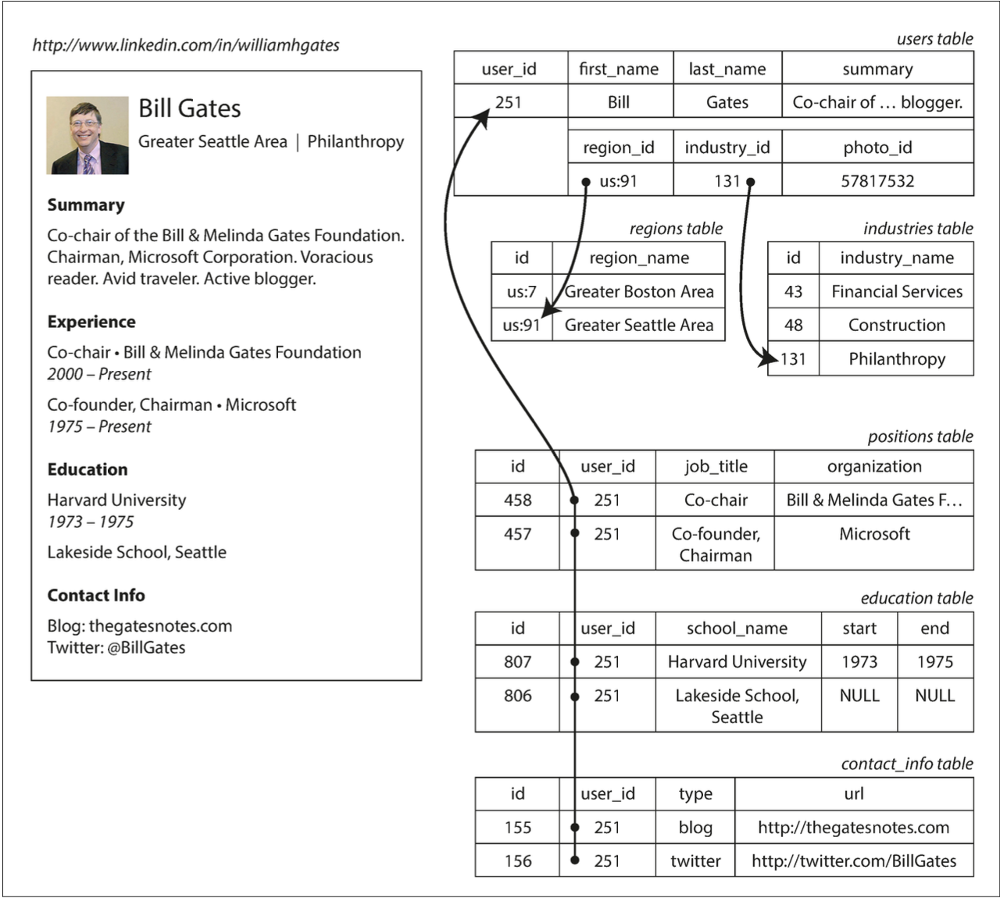

### JSON Document Model Representation:

For data like a résumé, which is mostly a self-contained document, a JSON representation can be quite appropriate. Document-oriented databases like MongoDB, RethinkDB, CouchDB and Espresso support this data model:

```
{
"user_id": 251,
"first_name": "Bill",
"last_name": "Gates",
"summary": "Co-chair of the Bill & Melinda Gates... Active blogger.",
"region_id": "us:91",
"industry_id": 131,
"photo_url": "/p/7/000/253/05b/308dd6e.jpg",
"positions": [
    {
        "job_title": "Co-chair",
        "organization": "Bill & Melinda Gates Foundation"
    },
    {
        "job_title": "Co-founder, Chairman",
        "organization": "Microsoft"
    },
],

"education": [
    {
        "school_name": "Harvard University", 
        "start": 1973, 
        "end": 1975
    },
    {
        "school_name": "Lakeside School, Seattle", 
        "start": null, 
        "end": null
    }],
"contact_info": {
    "blog": "http://thegatesnotes.com",
    "twitter": "http://twitter.com/BillGates".
    }
}
```

### Tradeoffs Discussion

- **Data locality**: 

In multi-table schema, it you want to fetch a profile you need to either perform multiple queries (query each table by user_id), or perform a messy multiway join between users table and its subordinate tables. In JSON representation, all the relevant information is in one place,and one query is sufficient.

- **Impedance Mismatch**: 

The one-to-many relationship implies a tree structure in the data, and the JSON representation makes this tree structure explicit.
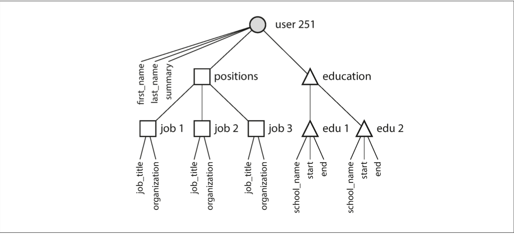.

- **Many-to-One Relationships**: 

In the preceding example, region_id and industry_id are given as IDs, not as plain-text strings like "Greater Seattle Area" and "Philanthropy". The advantage of doing this compared to storing them as plain-text:
  - Consistent styling and spelling across profiles
  - Avoiding ambiguity (several cities with the same name)
  - Ease of updating
  - Localization support (we can easily translate the industries and cities to other languages automatically based on the user's locale).
  - Better Search

The advantage of using an ID is that it has no meaning to humans, and thus doesn't need to change at all. If we store data as plain-text (instead of IDs), this results in data duplicaiton, and incurs write overheads and risks of inconsistencies if we need to update data.

Using IDs to remove such duplication is referred to as **normalization**, or *data deduplication*.

Normalizing data results in **Many-to-one** relationship (i.e. Many people live in one particular region, and many people work in the same industry). 

This is not very well supported in Document databases because they have weak support for joins.
We will have to emulate a join in application code by making multiple queries to the database, shifting the work making join from the database to the application code. This might be ok if the size of data is not very large.

-  **Many-to-Many Relationships**: 

Data has tendency to become more interconnected as features are added to applications.

For example:
- We might need to represent Organizations and schools as separate entities, which can allow us to have linkedin pages for these organizations, and include their urls and logo.
- We might need to add **Recommendations** feature which allows one user to write a recommendations for another user. The recommendation is shown on the profile of the user that was recommended, together with the name and photo of the recommending person. If the recommender updates their photo, it should reflect on the profiles of all users that were recommended by him.

These features require Many-to-Many relationships, and if we use a Document model, we end up with a very complex structure:
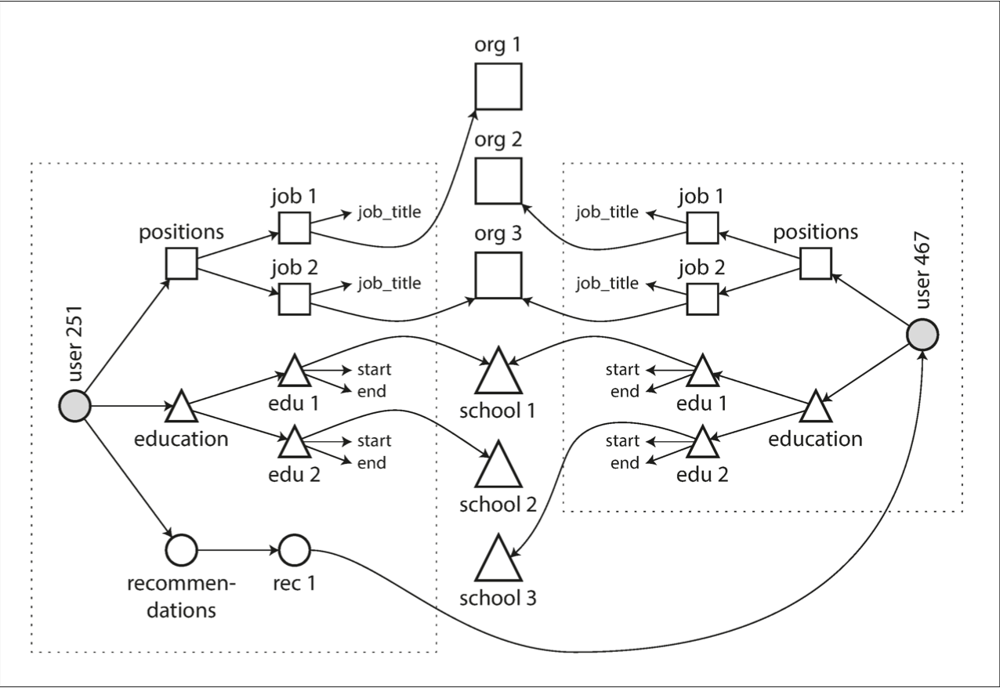

In such usecase, relational model can be more suited compared to Document models.

## Relational Versus Document Databases Today

### Schema Flexibility

Document databases provide better schema flexibility.


The schema is implicit and is only interpreter when the data is read (schema-on-read).


This can be useful in cases where:
- We want to modify the schema (no need to update big database tables)
- The structure of the data is detemined by external systems over which you have no control and which may change at any time.
- There are many different types of object, and it is not predictable to put each type of object in its own table.

Relational databases have very weak schema flexibility. The schema is explicit and enforced on write (schema-on-write).


This can be more suited for applications where all records are expected to have the same structure.

### Data Locality for Queries

In document databases, a document is usually stored as a single continuous string, encoded as JSON, XML or a binary variant.

This results in better data locality, which is useful for applications that often need to access the entire document.

If data is split across multiple tables, multiple index lookups are required to retrieve it all, which may require more disk seeks and take more time.

On updates, the entire document usually needs to be written. This is why it is important to keep the documents as small as possible.

Some relational databases offer a certain level of data locality, by:
- allowing the schema to decalre that a table's rows should be interleaved (nested) within a parent table. (Google Spanner database)
- Column-Family concept in Cassandra


### Support for Many-to-One and Many-to-Many relationships

Document databases have very weak support for many-to-one and many-to-many relationships due to the lack of join support.

Relational databases are more suited for applications that need such relationships.

### Convergence of Relational and Document Databases

#### Relational Databases Converging to Document Databases

Most relational databases have supported XML, incuding functions to make local modifications to XML documents and the ability to index and query inside XML documents.

Newer versions of PostgreSQL,MySQL and IBM DB2 also have a similar level of support for JSON documents.

#### Document Databases Converging to Relational Databases

RethinkDB supports relational-like joins in its query language.

Some MongoDB drivers automatially resolve document references (on the client-side, and is usually slower than a join performed in relational databases).

## Query Languages For Data

Relational databases use SQL which is a declarative query language.

SQL doesn't guarantee any particular ordering, so it doesn't care of the storage order changes.

Being a declarative language, SQL have a better chance of getting faster in parallel execution on multi-core CPU because they specify only the pattern of the results, not the algorithm that is used to determine the results. The database is free to use a parallel implementation of the query language, if appropriate.

### MapReduce Querying

Some databases support querying data with MapReduce to speed up the query.

An example is MongoDB which allows executing MapReduce queries:
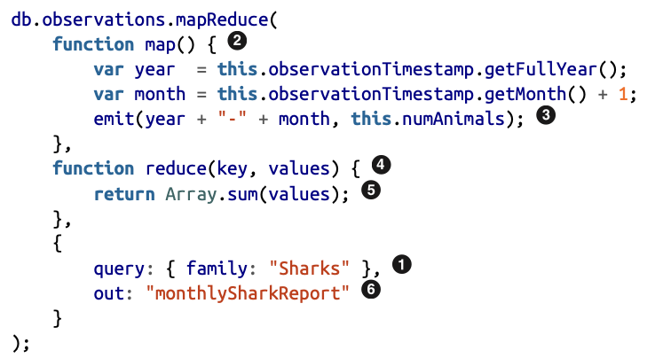

Higher-level query languages like SQL can be implemented as a pipeline of MapReduce operations (see Chapter 10), but there are also many distributed implementations of SQL that don’t use MapReduce. Note there is nothing in SQL that constrains it to running on a single machine, and MapReduce doesn’t have a monopoly on distributed query execution.

## Graph-Like Data Models

If Many-to-Many relationships are very common in our data, it becomes more natural to model your data as a graph.

Typical examples include:
- Social Graphs
- Web Graphs
- Rail or Road Graph

Well-known algorithms can be applied to such models:
- PageRank
- Shortest path algorithms

The nodes of a graph might be representing the same kind of entities, but can also represent heterogenous types.

As an example, Facebook models their social network as a graph where each node can be anything (e.g. person, location, city, country, etc.). The graph edges describe the connection between 2 entities. An example is shown in the figure below:

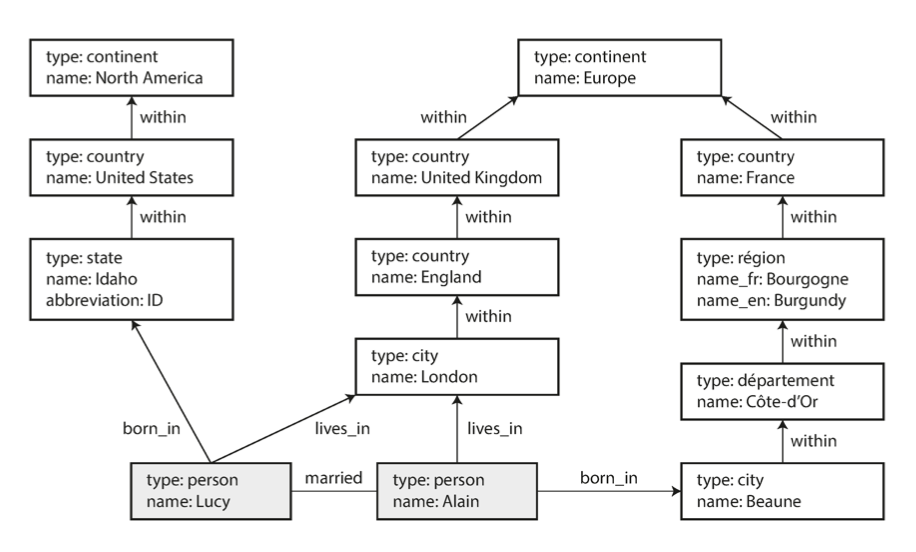

### Structuring and Querying Graph Data

## Property Graphs

### Design

In property graph, a node is represented by:
- unique identifier
- set of outgoing edges
- set of incoming edges
- collection of properties (key-value pairs)

An edge is described by:
- A unique identifier
- The vertex at which the edge starts (tail vertex)
- The vertex at which the edge ends (head vertex)
- A label describing the relationship between the 2 vertices
- A collection of properties (key-value pairs)

We can implement this model with relational database as follows:

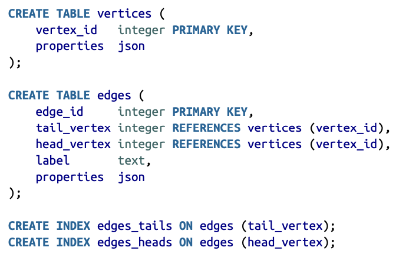

This modeling has some useful properties:
- Any vertex can have an edge connecting it to any other vertex with no restrictions.
- Given any vertex, we can efficiently find its incoming and outgoing edges
- By storing different labels for different edges, we can cleanly store different types of relations in the same graph.

This makes graph models much more flexible, and it is sometimes very difficult to use a traditional relational models to represent some usecases.

### Cypher Query Language

The Cypher language is a query language for property graphs, created for the Neo4j graph database.

The following example shows how we can create a part of the previous graph using Cypher query language.

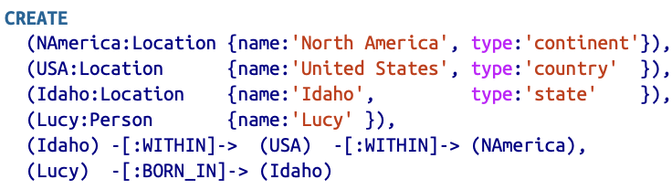

We can then run queries on the database such as: find the names of all the people who emigra‐ ted from the United States to Europe.

Here is how we can run this query:

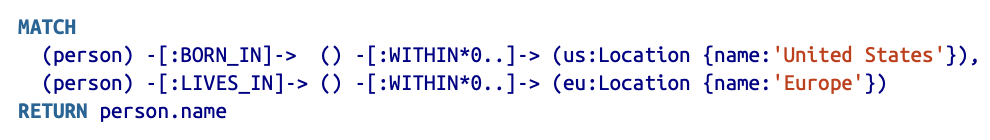

### Querying with SQL

Since the data are stored in a relational model, we can still use the SQL query language to query our database.

To run the same query as in the previous example, we need to write the following SQL queries:

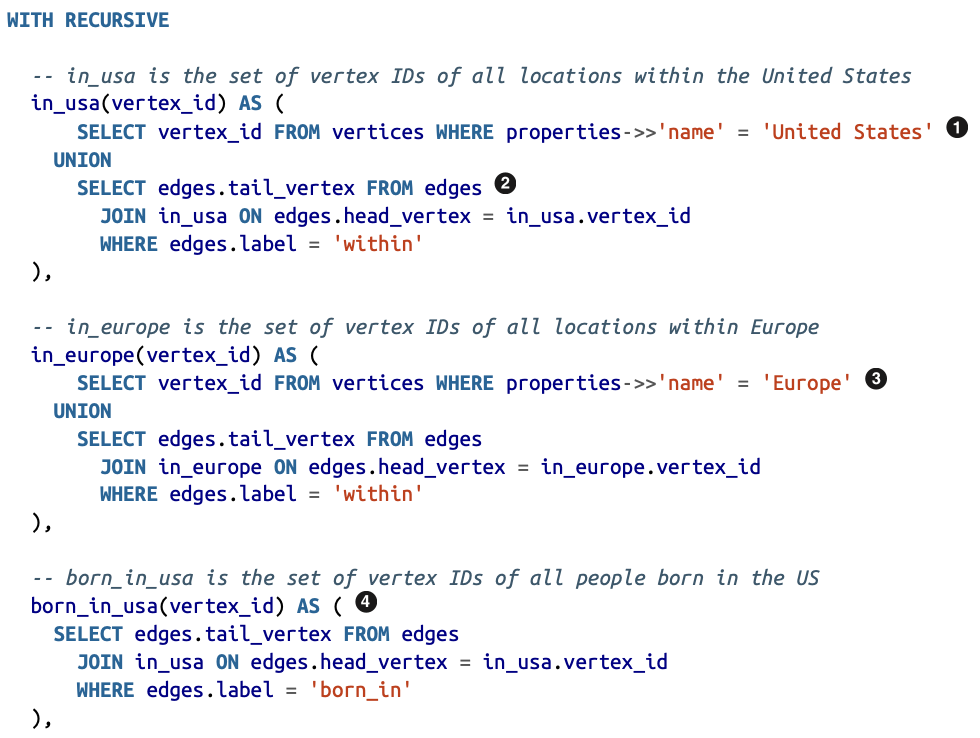
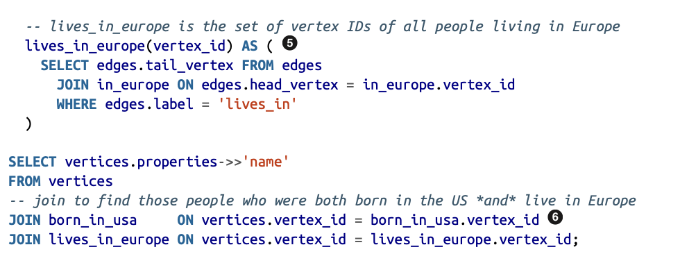

The reason why this gets so complex is that in graph models, we can't know in advance the depth of joins required in order to achieve the results. Different nodes require different join depth, and that's why we need a recursive SQL query.

This is a perfect example to show how different data models are designed to satisfy different use cases. It’s important to pick a data model that is suitable for your application.

## Triple Data Stores

### Design

Triple stores are similar to property graphs, but they use different terms and keywords to represent the same concepts.

In a triple-store, all information is stored in the form of very simple three-part state‐ ments: (subject, predicate, object). For example, in the triple (Jim, likes, bananas), Jim is the subject, likes is the predicate (verb), and bananas is the object.

The subject of a triple is equivalent to a vertex in a graph.

The object is one of two things:
1. A value in a primitive datatype, such as a string or a number. In that case, the predicate and object of the triple are equivalent to the key and value of a property on the subject vertex.
2. Another vertex in the graph. In that case, the predicate is an edge in the graph, the subject is the tail vertex, and the object is the head vertex.

Here is an example:

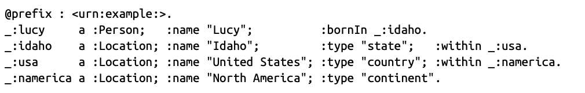

This has some common concepts with semantic web, which was an attempt to model the web in a format that can be understanded by machies.

The Resource Description Framework (RDF) was intended as a mechanism for different websites to publish data in a consistent format, allowing data from different websites to be automatically combined into a web of data—a kind of internet-wide “database of everything.”.

Here is an example of data represented as RDF:

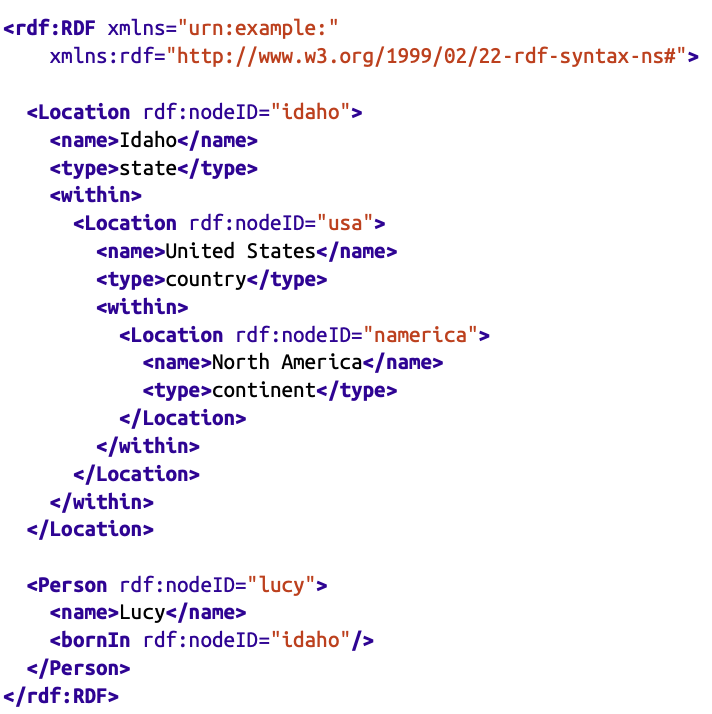

The semantic web was overhyped and ended up faiding. However, the concept of RDF was reused in triple data stored and all algorithms and models that were developed for the sake of RDF were fortunately reusable for the sake of triple data stores.

### SPARQL Query Language

SPARQL is a query language for triple data stores using the RDF data model.

Here is an example of a query in SPARQL:

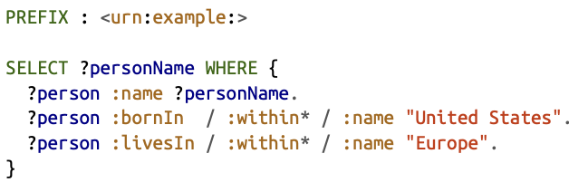

## Datalog: The foundation of graph query languages

Datalog is a much older language than SPARQL or Cypher.

It is less well known among soft‐ ware engineers, but it is nevertheless important, because it provides the foundation that later query languages build upon.

Datalog’s data model is similar to the triple-store model, generalized a bit. Instead of writing a triple as (subject, predicate, object), we write it as predicate(subject, object).

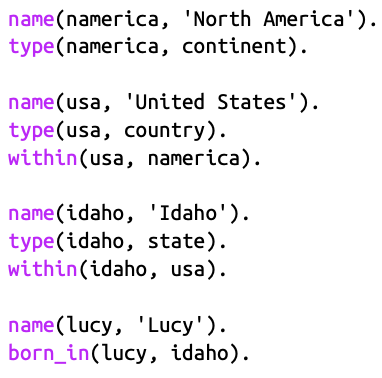

Here is an example of a query in Datalog:

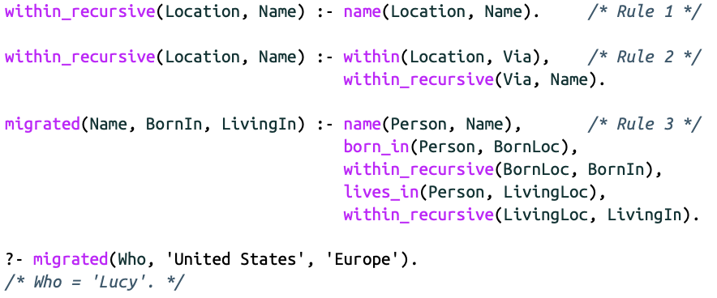

This is a subset of Prolog.

By repeated application of rules 1 and 2, the within_recursive predicate can tell us all the locations in North America (or any other location name) contained in our database. This process is illustrated in the following figure:

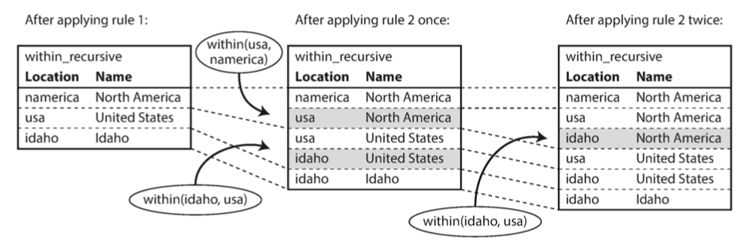


