- [Common Terms:](#common-terms)
- [Simplified Log-Structured Storage Engine](#simplified-log-structured-storage-engine)
- [Indexing Our Data](#indexing-our-data)
  - [Hash Indexing (log-structured)](#hash-indexing-log-structured)
    - [Compaction](#compaction)
    - [Merging](#merging)
    - [Some Implementation Issues](#some-implementation-issues)
    - [Advantages of Hash Table Index](#advantages-of-hash-table-index)
    - [Limitations of Hash Table Index](#limitations-of-hash-table-index)
  - [SSTables and LSM-Trees (log-structured)](#sstables-and-lsm-trees-log-structured)
    - [Implications](#implications)
    - [Constructing and maintaining SSTables](#constructing-and-maintaining-sstables)
    - [Crash Recovery](#crash-recovery)
    - [Making an LSM-Tree out of SSTables](#making-an-lsm-tree-out-of-sstables)
    - [Using Bloom Filters](#using-bloom-filters)
  - [B+ Trees (page-oriented)](#b-trees-page-oriented)
    - [Crash Resiliency](#crash-resiliency)
    - [Concurrency Control](#concurrency-control)
    - [More Pointers!](#more-pointers)
  - [LSM-Tree or B+ Tree?](#lsm-tree-or-b-tree)
  - [LSM-Tree Advantages:](#lsm-tree-advantages)
  - [Downsides of LSM-Trees:](#downsides-of-lsm-trees)
- [Other Indexing Structures](#other-indexing-structures)
  - [Storing values within the index](#storing-values-within-the-index)
  - [Multi-column indexes](#multi-column-indexes)
  - [Full-text search and fuzzy indexes](#full-text-search-and-fuzzy-indexes)
- [In-Memory databases](#in-memory-databases)
- [Transaction Processing vs Analytics](#transaction-processing-vs-analytics)
- [Data Warehousing](#data-warehousing)
- [Schemas for Analytics](#schemas-for-analytics)
  - [Snake](#snake)
  - [Snowflakes](#snowflakes)
- [Column-Oriented Storage](#column-oriented-storage)
- [Column Compression](#column-compression)
- [Sort Order in Column Storage](#sort-order-in-column-storage)
- [Several Sort Orders](#several-sort-orders)
- [Writing to Column-Oriented Storage](#writing-to-column-oriented-storage)
- [Aggregation: Data Cubes and Materialized Views](#aggregation-data-cubes-and-materialized-views)

## Common Terms:
- log-structured stirage engines
- page-oriented storage engines
- B-tree
- Hash index
- Compaction and Merging
- Tombstone
- memtable
- SSTable
- LSM-Tree
- Branching Factor
- Latches
- OLTP
- OLAP
- Data warehouse
- ETL
- snowflake, stars and dimensional modeling
- Data Cubes
- Materialized View

## Simplified Log-Structured Storage Engine

Suppose that we want to store key-indexed records in a database.

The simplest database storage engine can process get and set operations in the following way:
- on db_set: we simply write the key and record at the end of a file:
  -  `echo "$1,$2" >> database`
- on db_get: we scan the file and return the last occurence of the key:
  - `grep "^$1, " database | sed -e "s/^$1,//" | tail -n 1`

With this design, the **db_set** operation is very efficient because it only appends the record into an append-only file ( O(1) operation ).

However, **db_get** is slow because each time we need to scan all the file ( O(N) operation ), which makes the operation increasingly slower as the database grows.

## Indexing Our Data

In order to efficiently find the value of a particular key in the database, we need to have an index.

An index is an additional structure that is derived from the primary data allowing to improve the performance of queries. However, this incurs a cost on writes. Append-only writes are always faster than using indexes. Any kind of index slows down writes because the index needs to be updated every time the data is written.

As a rule of thumb: **well-chosen indexes speed up read queries, but every index slows down writes**.

For this reason, we don't index everything by default. We choose the indexes that give our application the greatest benefit without introducing more overhead than necessary.

### Hash Indexing (log-structured)

Suppose our data storage consists of only appending to a file.

Hash indexing can be done by keeping an in-memory hash map where every key is mapped to a byte offset in the data file.

Whenever a new key-value pair is appended to the file, we also update the index hash map.

When we want to lookup a value, we use the hash map to find the offset in the data file.

This concept is visualised in the figure below:
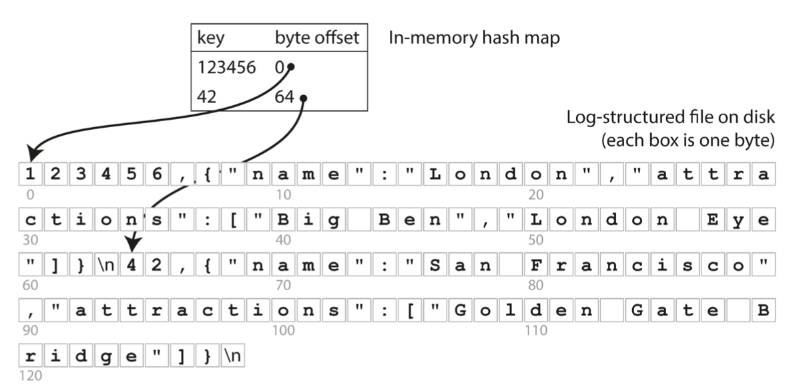

This works efficiently under the constraint that all keys should fit in memory.

Thus, this approach is adequate for application where we have a limited number of distinct keys that are updated very frequently. As an example, the key can be the URL of a cat video, and the value might be the number of times it has been played (too many writes, but limited number of distinct keys).

#### Compaction

As we are only appending to the end of a file, the file size will be always growing with time. So, we need a way to avoid eventually running out of disk space.

This problem can be solved by *compaction*.

We break the log into segments of certain size by closing a segment file when it reaches a certain size, and making subsequent writes to a new segment file, We can then perform compaction of these segments by throwing away duplicate keys in the log and keeping only the most resent update of each key.

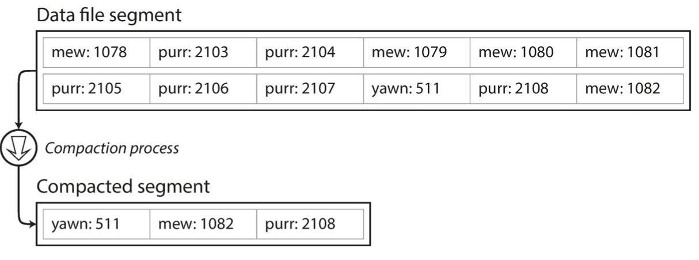

#### Merging

Morever, since compaction often maks segments much smaller, we can also merge several semgemnts together at the same time as performing compaction.

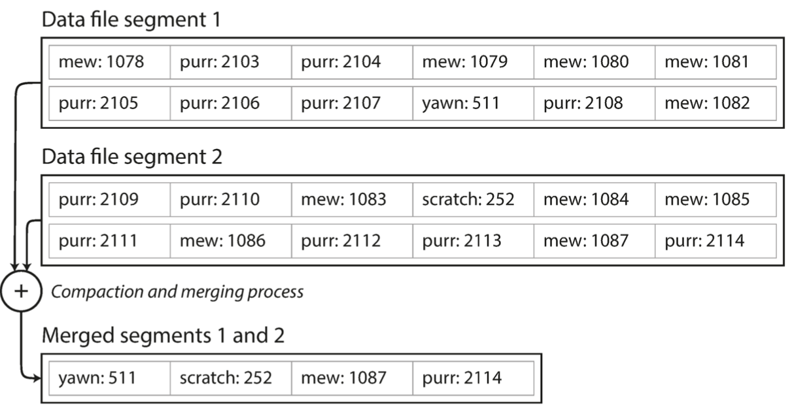

Segments are never modified after they have been written, so the merged segment is written to anew file. The compaction and merging of frozen segments can be done in a background thread so that we can still continue to serve read and write requests as normal using the old segment files. After the merging process is complete, we switch read requests to using the new merged segment instead of the old segments and then the old segment files can simply be deleted.

Each segment now has its own in-memory hash table, mapping keys to file offsets. In order to find the value for a key, we first check the most recent segment’s hash map; if the key is not present we check the second-most-recent segment, and so on. The merging process keeps the number of segments small, so lookups don’t need to check many hash maps.

#### Some Implementation Issues

- File Format: instead of using CSV, it is faster and simpler to use a binary formart that encodes the length of a string in bytes, followed by the raw string.
- Deleting records: we need to allow appending a special deletion record (usually called tombstone).
- Crash Recovery: since we are storing the hash maps in-memory, and to avoid painful restarts, we can store a snapshot of each segment's hash map on disk.
- Partially written records: we can use checksums to allow corrupted parts of the log to be detected and ignored
- Concurrency control: a common implementation is to have only one writer thread. As for reads, they can be processed concurrently by mutliple threads since frozen segments are append-only and immutable.

#### Advantages of Hash Table Index

- Based on sequential write operations when appending and performing segment merging. Sequential write operations are faster than random writes whether on HDD or on SSD.
- Concurrency and crash recovery are much simpler if segment files are append only or immutable. We don't have to worry about the case where a crash happened while a value was being overwritten, leaving you with a file containing part of the old and part of the new value spliced together.
- Merging old segments avoids the problem of data files getting fragmented over time.

#### Limitations of Hash Table Index

- The hash table must fit in memory. So, it is not suitable for applications that have a very large number of keys.
- Range queries are not efficient. We can't easily scan over all keys between kitty00000 kitty99999. We'd have to lookup each key separately.

### SSTables and LSM-Trees (log-structured)

Hash table indexing can be optimised by using SSTables. This is possible by adding the requirement that the sequence of key-value pairs is sorted by key.

We call this format *Sorted String Table*, or *SSTable*.

Thanks to the compaction process, each key appears once within each segment file.

#### Implications

- Merging segments is simple and efficient, even if the files are bigger than available memory. This is possible using the same approach as mergesort algorithm shown in the figure below.
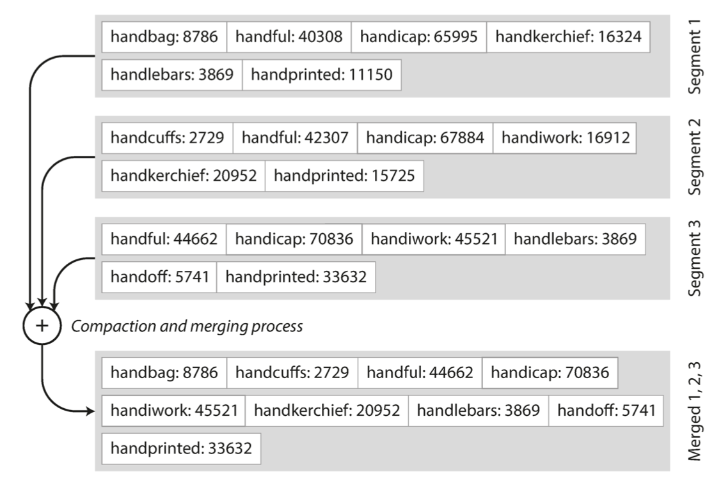
- To find a particular key, we no longer need to keep an index of all keys in memory. We only need an in-memory index to tell us the offsets for some keys, but it can be sparse: one key for every few kilobytes of segment file is sufficient because a few kilobytes can be scanned very quickly.
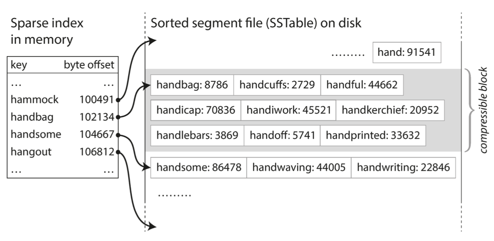
- Since read requests need to scan over several key-value pairs in the requested range anyway, it is possible to group those records into a block and compress it before writing it to disk. Each entry of of the sparse in-memory index then points at the start of a compressed block,. This saves disk spaces and reduces the I/O bandwidth use.

#### Constructing and maintaining SSTables

In order to construct an SSTable, we can use red-black trees or AVL trees.

We maintain this data structure in memory to represent the most recent SSTable.

We write new records to this data structure, and once it reaches the size limit, we flush it to disk as an SSTable file.
After that, the new SSTable file becomes the most recent segment of the database. While the SSTable is being written out to disk, writes can continue to a new memtable instance.

To serve a read request, we first try to find the key in the memtable, then in the most recent on-disk segment, then in the next-older segment, etc.

From time to time, we run a merging and compaction process on the background to combine segment files and to discard overwritten or deleted values.

#### Crash Recovery

To make crash recovery possible, we can keep a separate log on disk to which every write is immediately appended, just like in the previous section.

The log is not in sorted order, but it is fine because its only purpose is to restore the memtable after a crash.

Every time we write a memtable out to an SSTable, the corresponding log can be discarded.

#### Making an LSM-Tree out of SSTables

Originally this indexing structure was described by Patrick O’Neil et al. under the name Log-Structured Merge-Tree (or LSM-Tree), building on earlier work on log-structured filesystems. Storage engines that are based on this principle of merging and compacting sorted files are often called LSM storage engines.

#### Using Bloom Filters

We can use a bloom filter to avoid needing to search through all SSTables for keys that don't exist in the database. A bloom filter is a memory efficient data structure for approximating the contents of a set. If an item is in the set, the bloom filter will definitely return true. If an item is not in the set, the bloom filter might return true with a probability p that can be controlled (e.g. p = 0.01).

### B+ Trees (page-oriented)

This is the most widely used indexing structure.

B-trees break the database down into fixed-size blocks or pages (usually 4KB, but sometimes bigger), and read or write one page at a time.

Each page can be identified using an address or location, which allows one page to refer to another, similar to a pointer but on disk instead of in memory.

The figure below shows how this looks:

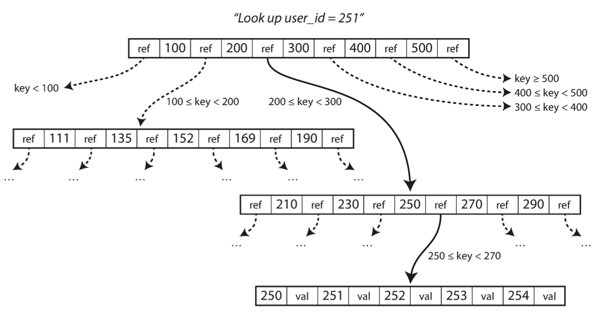

To lookup up a key, you start from the root, and you traverse the tree based on the references and the key you're looking for.

The number of references to child pages in one page of the tree is called the *branching factor*. (Typically it is several hundreds).

To update the value of an existing key in a tree, we search for the leaf containing that key, change the value in that page, and write the page back to disk.

To write a new key, we need to find the page whose range encompasses the new key and add it to that page.
If there isn't enough free space, it is split into 2 half-full pages and the parent page is updated to a account for the new subdivision of the key ranges.
This is repeated recursively if needed.

It is important to know that B-tree indexing modifies pages in place (the page location in hard disk is not changed in order not to break references to other pages).

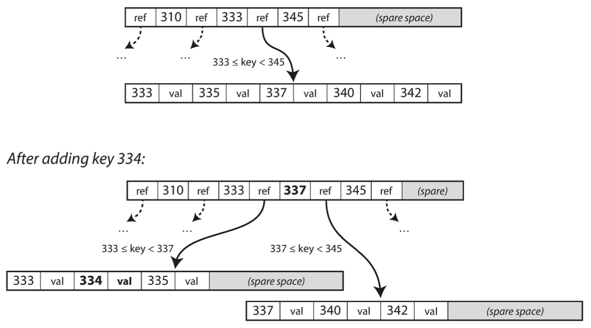

This ensures the tree remains balanced.

Most databases can fit into a B-tree that is 3 or 4 levels deep. A 4-level tree of 4KB pages with a branching factor of 500 can store up to 256TB.

#### Crash Resiliency

To make the database resilient to crashes, it is common to use a write-ahead-log (or redo log). This is an append-only file to which every modification to the tree must be written before it can be applied to the tree pages. This WAL can be used to restore the B-tree into a consistent state in case of crash.

#### Concurrency Control

If multiple threads are going to access the B-tree at the same time, and since we are performing modifications in place, a thread might see the database in an inconsistent state.

This is solved by protecting the tree with latches (lightweight locks).

#### More Pointers!

Additional pointers have been added from each leaf page to its siblings, allowing scanning keys in order without jumping back to parent pages and making range queries much faster.

### LSM-Tree or B+ Tree?

As a rule of thumb, LSM-trees are typically fatser for wites, whereas B-trees are thought to be faster for reads. Reads are typically slower on LSM-trees because they have to check several different data structures and SSTables at different stages of compaction.

However, the best way to choose is to run some benchmark tests on your wokloads to evaluate which choice is better for your usecase.

### LSM-Tree Advantages:
- Sustains higher throughput:
  - No need to write every piece of data at least twice (WAL, page splits, in-place modification). But it still needs to rewrite data multiple times due to repeated compaction and merging of SSTables.
  - The higher the write amplification, the more the database engine needs to write to disk, and thus the fewer writes per second it can handle within the available disk bandwidth. (This is important in write-heavy applications).
  - They sequentially write compact SSTable files rather than having to overwrite several pages in the tree.
- Better compressibility, and thus produces smalled files.
- No fragmentation, thanks to compaction and merging.
- Lower storage overhead.

### Downsides of LSM-Trees:

- Compaction and merging may interfere with the performance of ongoing reads and writes because compaction and merging needs to consume a part of the disk bandwidth, which might force a read or write request to wait until disk resources are available.
- Compaction and merging may not be able to keep up with very high write throughput, leading to running out of disk storage. (The full disk bandwidth needs to be shared between compaction process and request processing processes). In B-trees, we don't have this problem because each key exists only in one place.

## Other Indexing Structures

In addition to primary key indexes which were discussed in the previous section, it is also common to have a *secondary index*.

In a database table, we can create only one primary index, but we can create several secondary indexes.

Secondary indexes are not unique, thus we have to do one of 2 things:
- making each value in the index a list of matching row identifiers
- making each key unique by appending a row identifier to it

### Storing values within the index

We have several types of indexes:
- Clustered Index: stores values directly within the index key. We can have only 1 clustered index per table.
- Non-Clustered Index: we store references to records as a value in the index key. The actual records are stored in a heap file (not necessarily ordered). Or, we can store the primary keys as values for the indexes.
- Coverring index or index with included columns: stores some of a table's columns within the index, allowing some queries to be answered by using the index alone.

As with any kind of duplication of data, clustered and covering indexes can speed up reads, but they require additional storage and can add overhead on writes.

### Multi-column indexes

Multi column indexes are useful if we want to define an index that can speed up queries that target multiple columns at the same time.

We have several types of such indexes:
- Concatenated Index: Simply combines several fields into one key by appending one column to another. The index definition specifies in which order the fields are concatenated.
- Multi dimensional indexes: a more general way of querying several columns at once, which is particularly important for geospatial data. Usually uses specialised spatial indexes such as R-trees. This is not limited for geospatial data. An example applied to a database of weather observations would be to have a 2 dimensional index on date and temperature in order to efficiently search for all the observations during tear 2013 where temperature was between 25 and 30 degrees.

### Full-text search and fuzzy indexes

These indexes allow you to do a search for records whose key is close to some target key, but not necessarily equal.

Example:
full-text search engines allow a search for one word to be expanded to include synonyms of the word, to ignore grammatical variations, search of occurrences of words near each other, etc.

These indexes have special techniques which we won't cover here.

## In-Memory databases

In some cases, datasets are simply not that bog, so it's quite feasible to keep them entirely in memory, potentially distributed across several machines.

Applications:
- Caching:  is intended for caching use only, and it's acceptable for data to be lost if machine is restarted. (example: Memcached).
- Durability: uses special hardware (such as battery-powered RAM) by writing a log of changes to disk, writing periodic snapshots to disk, or by replicating the in-memory state to other machines.

These databases can be faster because they can avoid the overhead of encoding in-memory data structures such as priority queues and sets.

Additionally, its implementation is comparatively simple because it keeps all data in memory.

## Transaction Processing vs Analytics

We have 2 types of applications when dealing with databases:
- OLTP:
  - online transaction processing
  - applies to most use cases where we need to handle interactive user requests (commercial transactions, recording payments, fetching record, etc.)
  - typically looks up a small number of records by some key, using an index
  - Records are inserted or updated based on the user’s input
- OLAP: 
  - online analytics processing
  - applies to data analytics applications that need to process data in large volumes
  - usually needs to scan over a huge number of records, only reading a few columns per column, and calculates aggregate statistics (sum, avg, etc.)

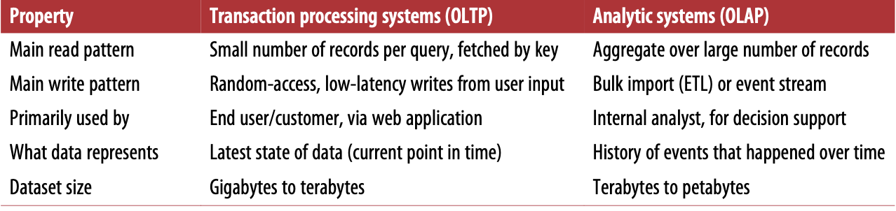

## Data Warehousing

A data warehouse is a separate database that analysts can query freely, without affecting OLTP operations.

Data warehouses usually contain a read-only copy of the data in all the various OLTP systems in the company. 

Data is extracted from OLTP databases (periodic data dumps or event streams), transformed into an analysis-friendly schema, cleaned up, and then loaded into the data worehouse. This process is known as ETL (extract transform and load).

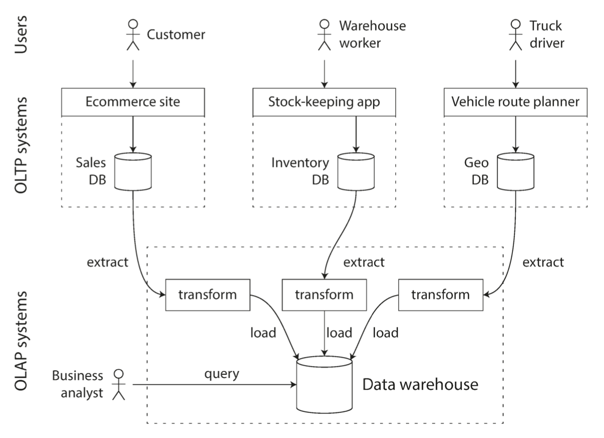

Data warehouses need special indexing techniques that are optimised for OLAP queries.

## Schemas for Analytics

In analytics, there is much less divesity of data models.
Many data warehouses are used in a fairly formulaic style, known as a star schema (dimensional modeling).

### Snake

Consists of a fact table, and dimension tables.

The fact table maintains foreign key references to dimension tables.

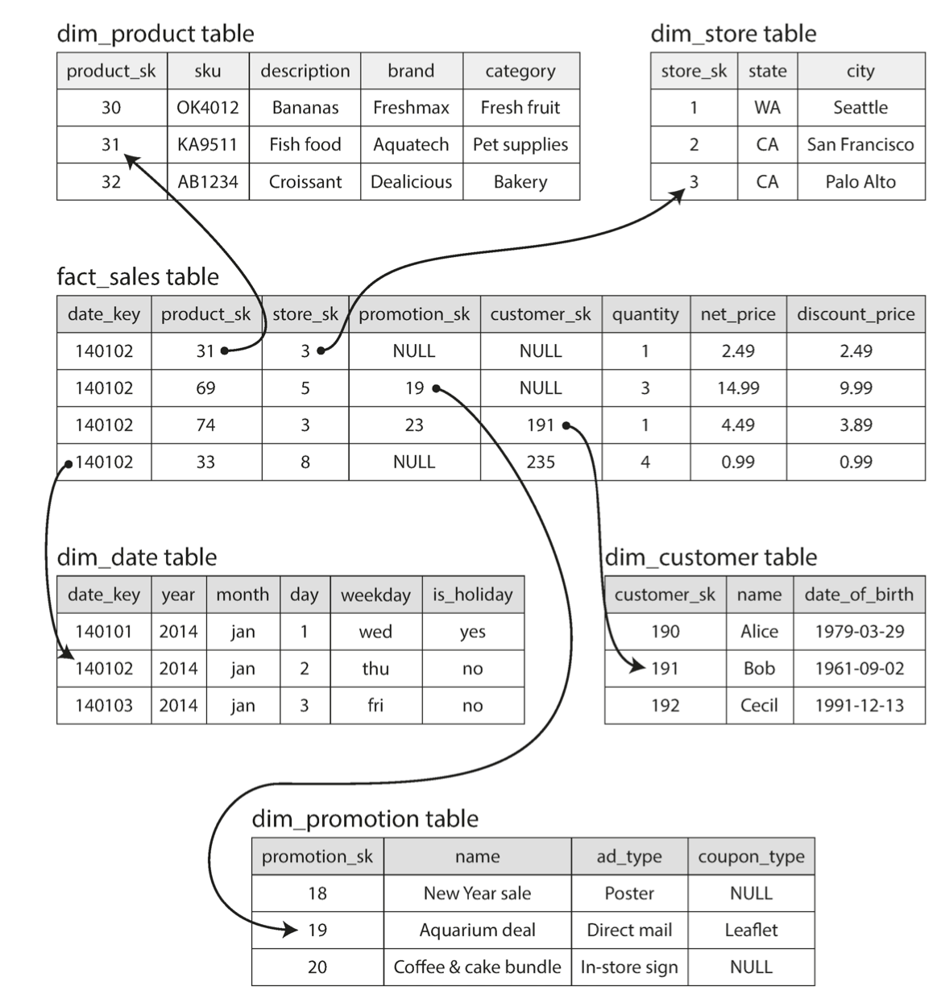

Each record in the fact table corresponds to an event (payment, weather record, etc.).

Each record in a dimension table gives more data about a certain property of an event (e.g. date, product category and description, etc.).

### Snowflakes

This is a variation of the star schema, where dimension tables are further broken down into subdimensions.

Such schemas are more normalised than star schemas, but star schemas are often preferred because they are simpler for analysts to work with.

## Column-Oriented Storage

Fact tables can have trillions of rows and petabytes of data, making it very challenging to query them.

Dimension tables are more manageable because they are usually much smaller.

OLAP queries are usually interested in a limited number of columns, and don't really need to scan the full records.

With column-oriented storage, we don’t store all the values from one row together, but store all the values from each column together instead. If each column is stored in a separate file, a query only needs to read and parse those columns that are used in that query, which can save a lot of work.

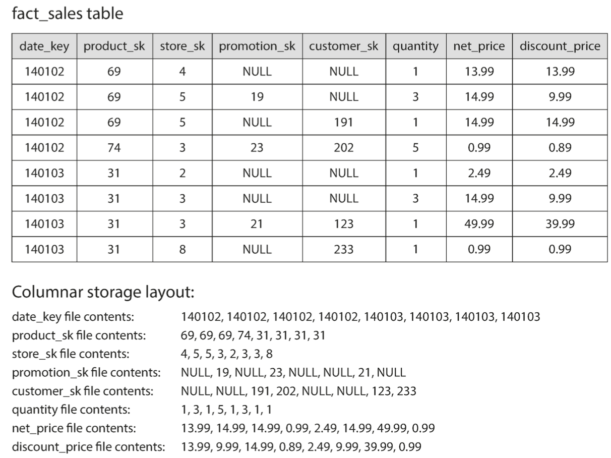

The column-oriented storage layout relies on each column file containing the rows in the same order. Thus, if you need to reassemble an entire row, you can take the 23rd entry from each of the individual column files and put them together to form the 23rd row of the table.

## Column Compression

It is possible to further reduce the demands on disk throughput by compressing data.

This can be efficient with colum-oriented storage because the number of unique values in a column is usually way smaller than the number of rows, resulting in good compression.

There are several techniques for compression such as bitmap encoding shown in the figure below:
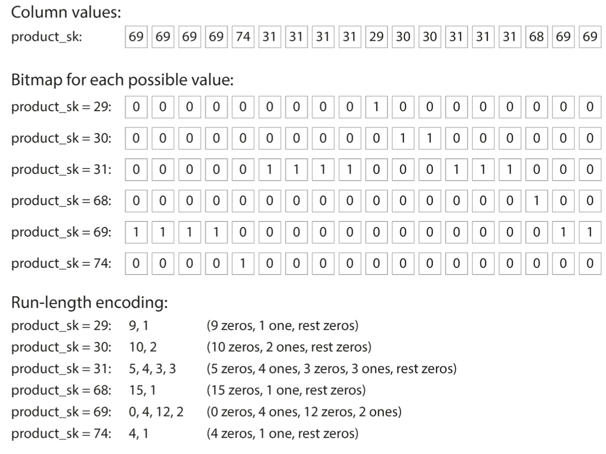

## Sort Order in Column Storage

We can choose to impose an order in column oriented storage and use that as an indexing mechanism.

It is not possible to sort each column independently because the relative order between columns should be the same.

The data needs to be sorted an entire row at a time, even though it is stored by column. We can choose by which column to sort the data based on the common queries.

We can then sort by a second column to determine the sort order of any rows that have the same value in the first column.

Sorting can also help with compression of columns because repeated values will be consecutive in a sorted column, resulting in smaller bitmaps.

## Several Sort Orders

Since data should be replicated anyways, we may define several sort orders that are applied to different data replicas, and then use the most efficient replica based on the query.

## Writing to Column-Oriented Storage

Column-oriented storage has the downside of making writes more difficult.

Since data is compressed, it is not possible to do updates in place. We should, however, rewrite all column files so that columns are updated consistently.

To solve this issue, we can use LSM-trees. All writes first go to an in-memory store where they are added to a sorted structured and prepared for writing to disk.

When enough writes have accumulated, they are merged with column files on disk and written to new files in bulk.

Queries need to examine both the column data on disk and the recent writes in memory, and combine the two. But this is hidden by the query optimizer.

## Aggregation: Data Cubes and Materialized Views

Since data warehouses often involve an aggregate function such as COUNT,SUM,AVG, etc., it can be useful to cache the counts or sums that queries use most often.

- Materialized View:
  - a table-like object whose contents are the results of some query
  - it is an actual copy of the query results, written to disk
- Virtual View:
  -  is just a shortcut for writing queries
  -  when reading from a virtual view, the SQL engine expands it into the view's underlying query on the fly and then processes the expanded query.

Materialized data needs to be updated when the underlying data changes because it is a denormalized copy of data.

This makes write queries more expensive, which is why materialized views are not used in OLTP. It can make more sense in case of OLAP depending on the individual case.

A special case of materialized views is known as a data cube or OLAP cube, which is a grid of aggregates grouped by different dimensions.

Here is an example:

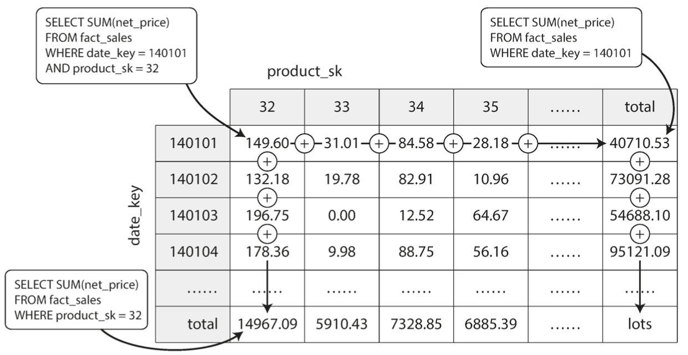

Advantages:
- makes read queries very fast because the result will have been already precomputed

Disadvantages:
- doesn't have the same flexibility as querying the raw data