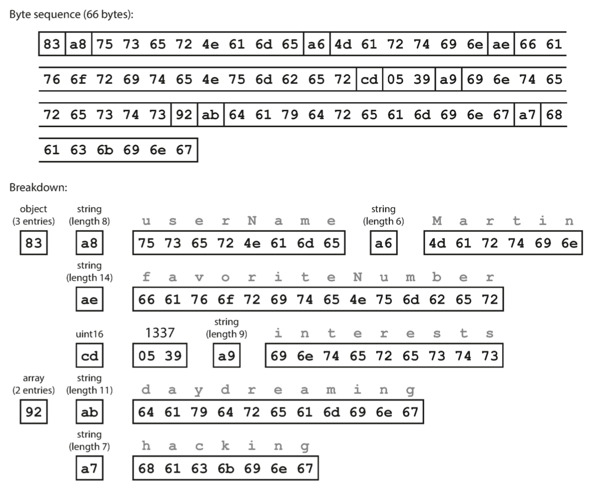
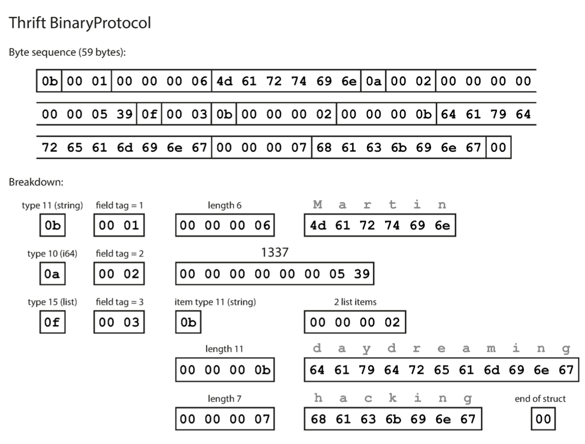
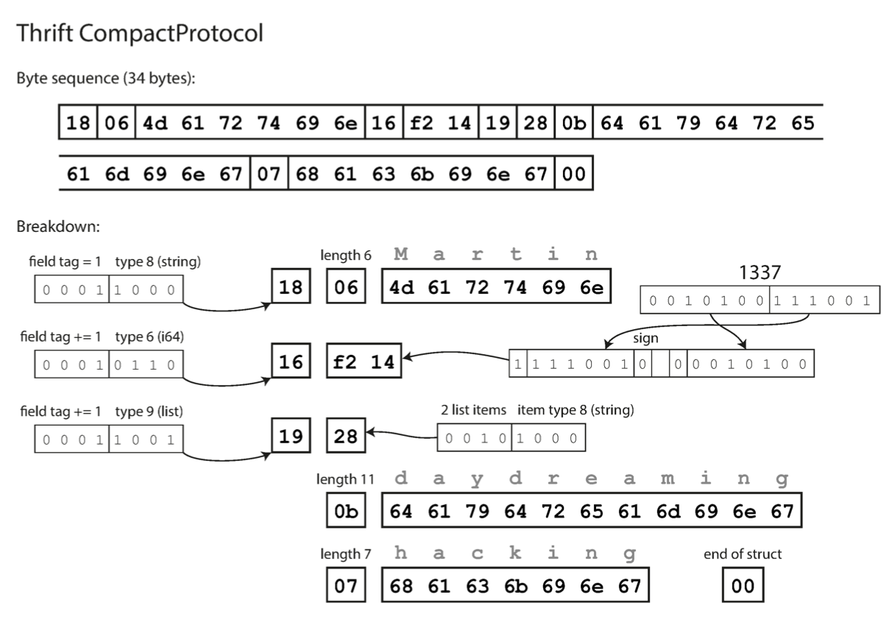
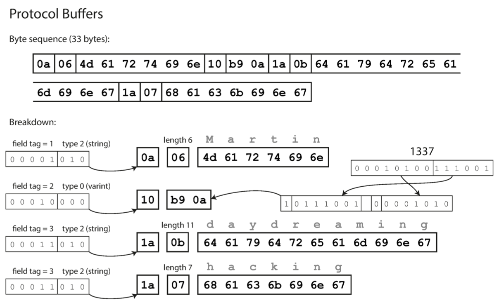
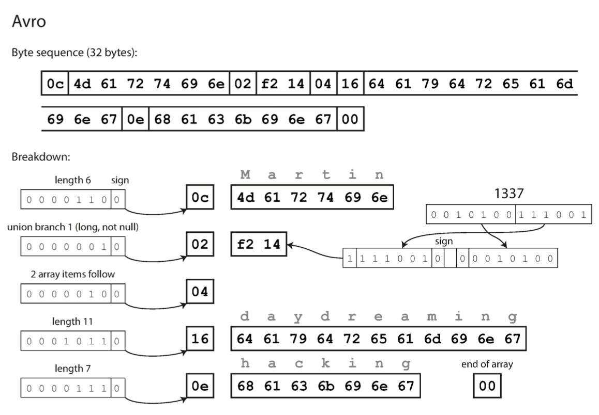
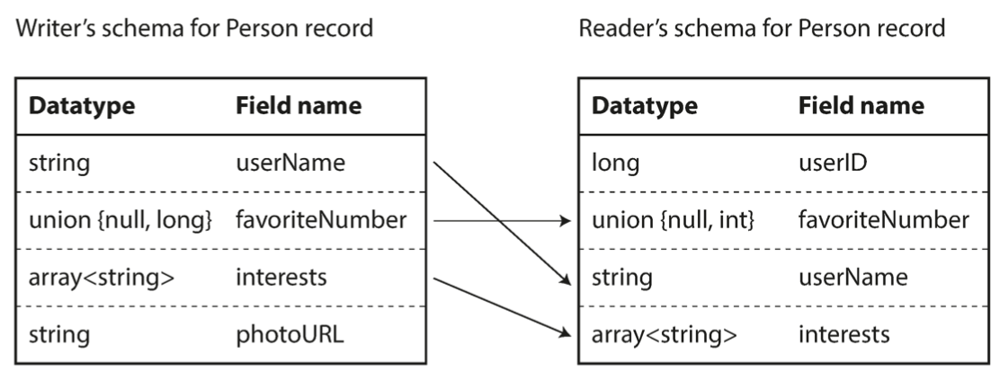
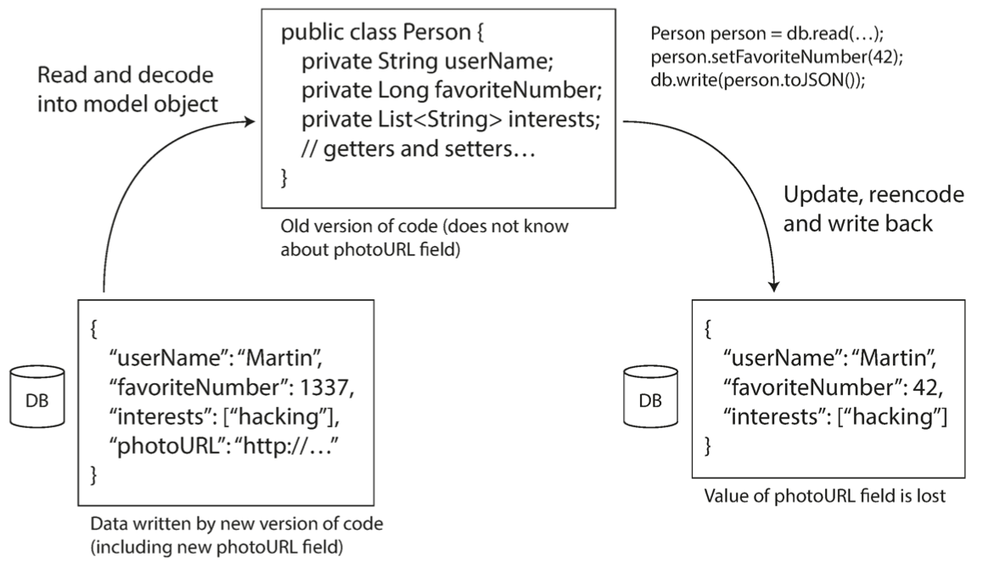

- [Common Terms](#common-terms)
- [Forward and Backward Compatibility](#forward-and-backward-compatibility)
- [Formats for Encoding Data](#formats-for-encoding-data)
  - [Language Specific Formats](#language-specific-formats)
  - [JSON, XML, CSV and Binary Variants](#json-xml-csv-and-binary-variants)
    - [JSON, XML and CSV](#json-xml-and-csv)
    - [Binary Encoding](#binary-encoding)
  - [Thrift and Protocol Buffers](#thrift-and-protocol-buffers)
    - [Core Concepts](#core-concepts)
    - [Field Tags and Schema Evolution](#field-tags-and-schema-evolution)
    - [Datatypes and Schema Evolution](#datatypes-and-schema-evolution)
  - [Avro](#avro)
    - [Model](#model)
    - [Encoding and Decoding](#encoding-and-decoding)
    - [Write's schema and Reader's schema](#writes-schema-and-readers-schema)
    - [Schema Evolution Rules](#schema-evolution-rules)
    - [Communicating the Writer's Schema](#communicating-the-writers-schema)
    - [Dynamically Generating Schemas](#dynamically-generating-schemas)
    - [Code Generation and Dynamically typed languages](#code-generation-and-dynamically-typed-languages)
  - [Advantages of Schema-Based Encoding](#advantages-of-schema-based-encoding)
- [Dataflow Through Databases](#dataflow-through-databases)
  - [Backward and Forward Compatibility](#backward-and-forward-compatibility)
  - [Protection from data-loss](#protection-from-data-loss)
  - [Data outlives code](#data-outlives-code)
- [Dataflow Through Services: REST and RPC](#dataflow-through-services-rest-and-rpc)
  - [Web services](#web-services)
  - [The problems with RPCs](#the-problems-with-rpcs)
  - [Data encoding and evolution for RPC](#data-encoding-and-evolution-for-rpc)
  - [API Versioning](#api-versioning)
- [Message-Passing Dataflow](#message-passing-dataflow)
  - [Concept](#concept)
  - [Advantages](#advantages)
  - [Difference from RPCs](#difference-from-rpcs)
  - [Message Brokers](#message-brokers)


## Common Terms
- Backward Compatibility
- Forward Compatibility
- Serialization
- Marshalling
- Encoding
- Thrift
- Protocol Buffers
- Binary and Compact Protocols
- Avro
- Avro IDL
- Write and Reader schemas
- Avro object container file
- RPC
- REST
- SOAP
- Web Service Framework (WS-*)
- WSDL (web services description language)
- OpenAPI
- asynchronous message-passing
- message broker


## Forward and Backward Compatibility

When a data format or schema changes, a corresponding change to application code often needs to happen (for example, you add a new field to a record, and the applica‐ tion code starts reading and writing that field). However, in a large application, code changes often cannot happen instantaneously:
- With server-side applications you may want to perform a rolling upgrade.
- With client-side applications you’re at the mercy of the user, who may not install the update for some time.

In order for systems to continue running smoothly,  we need to maintain compatibility in both directions:

*Backward Compatibility*: Newer code can read data that was written by older code.

*Forward Compatibility*: Older code can read data that was written by newer code.

## Formats for Encoding Data

### Language Specific Formats

Many programming languages come with built-in support for encoding in-memory objects into byte sequences. (e.g. `java.io.Serializable` in java and `pickle` in python).

These libraries have a number of deep problems:
- Encoding is often tied to a particular programming language (we can't use different languages for encoding and decoding).
- The decoding process needs to be able to instantiate arbitrary classes in order to restore data in the same object types. This is often a source of security problems.
- They often neglect backward and forward compatibility.
- Low efficiency due to performance overhead.

It is generally a bad idea to use such libraries, except for very transient purposes.

### JSON, XML, CSV and Binary Variants

#### JSON, XML and CSV
JSON, XML and CSV are liked before they are more human readable, but they are disliked because they are verbose and because of many other problems:
- Ambinguity around numbers
  - XML and CSV can't distinguish between numbers and a digit string.
  - JSON can distinguish number from a digit string since a string has surrounding double quotes, but can't distinguish between integers and floating point numbers and doesn't specify precision
  -  Numbers larger than 2^53 lose precision when parsed by a language that represents numbers in IEEE 754 double-precision floating point number (such as javascript).
- JSON and XML don't support binary strings, but this can be overcome by encoding binary data as text using base64, but this increases data size by 33%.
- Weak support for schema in XML and JSON
- CSV doesn't have any schema
- CSV is a vague format when it comes to encoding/decoding data that contain separators or new line, which makes it easy to introduce bugs in parsers.

JSON, XML and CSV remain good enough for many purposes as long as people agree on the format of exchanged data.

#### Binary Encoding

For data exchanged internally, we can choose a format that is more compact or faster to parse.

For datasets with at a size of the order of terrabytes or more the choice of data format can have a big impact.

We have many binary encodings for JSON and XML such as MessagePack, BSON, BJSON, WBXML.

Some of these encoding formats extend the set of datatypes (e.g. distinguishing between integers and floats, or adding support for binary strings).

But otherwise they keep JSON/XML data model unchanged.

An example of MessagePack is shown below:



This encodes the following message:
```
{
    "userName": "Martin",
    "favoriteNumber": 1337,
    "interests": ["daydreaming", "hacking"]
}
```

You can see that we still need to include the field names, making the message size big.

### Thrift and Protocol Buffers

#### Core Concepts

These are binary encoding libraries that are based on the same principle.

Thrift and Protobuf require schemas:

```
// thrift schema example:

struct Person {
    1: required string userName,
    2: optional i64 favoriteNumber,
    3: optional list<string> interests
}
```

```
// protobuf schema example
message Person {
        required string user_name       = 1;
        optional int64  favorite_number = 2;
        repeated string interests       = 3;
}
```

They come with a code generation tool that takes the schema definition and produces classes that implement the schema in various programming languages.

The idea here is that we don't need to care about field names and encode them, we only refer to field tags (e.g. 1, 2, 3 ...).

An example of thrift's Binary Protocol is shown in the figure below:



Thrift also supports the Compact Protocol which packs the type and field tag into a single byte and uses variable byte length to represent integers. An example is shown in the figure below:



Finally, an example of protobuf encoding is shown in the figure below:



#### Field Tags and Schema Evolution

- It is possible to change the field names as long as the field tags are maintained because the encoding schema includes only field tags.
- You can add new fields to the schema, provided that you give each field a new tag number.
  - If old code tries to read data written by new code, including the new field with a tag number it doesn't recognize, it can simply ignore that field.
  - This maintains Forward Compatibility.
- Backward compatibility is preserved since new code can always read data written by old code (old tag numbers will still have the same meaning).

To preserve forward and backward compatibility:
- If you add a new field, you can't make it required, else, the new code will not be able to read data written by old code.
- You can only remove an optional field, else, old code will not be able to read data written by new code.

#### Datatypes and Schema Evolution

This might be possible, but might come at the cost of losing precision (e.g. converting i32 to i64).

Note that protobuf doesn't have a list or array datatype, but instead has a `repeated` marker for fields. The encoding of a repeated field makes the same field tag simply appear multiple times in the record.

This means that it is okay to change an optional field (single-valued) into a repeated field (multi-valued). By doing this, new code sees zero or one value, and old code sees only the last item of the list.

### Avro

Avro is subproject of Apache Hadoop, as a result of thrift not being a good fit for Hadoop's use cases.

#### Model

Abro uses a schema to specify the structure of encoded data.

It provides 2 schema languages:
- Avro IDL: intended for human editing
- JSON-based: more easily machine-readable

Here are examples of each:

```
// Avro IDL
record Person {
    string userName;
    union { null, long } favoriteNumber = null; 
    array<string> interests;
}
```

```
// JSON-based
{
        "type": "record",
        "name": "Person",
        "fields": [
                    {"name": "userName", "type": "string"},
                    {"name": "favoriteNumber", "type": ["null", "long"], "default": null},
                    {"name": "interests", "type": {"type": "array", "items": "string"}}
                ]
}
```

#### Encoding and Decoding

Avro doesn't use field tags or names in the encoding schema. The encoding is simply composed of concatenated values, each preceded by its length.
Integers are encoded similar to how they are encoded in thrift's CompactProtocol (variable-length encoding).

In order to decode a message, Avro assumes the data are encoded in the same order defined by the schema.

Here is an example:



#### Write's schema and Reader's schema

Writer's schema is the schema used by the application that writes (encodes) the data.

Reader's schema is the schema used by the application that reads (decodes) the data.

Writer and reader schema's don't necessarily need to be the same, they only need to be compatible.

When Avro decodes a message, the library resolves the differences by looking at both schemas side by side and translating the data from the writer schema into the reader schema.

The exact translation process is defined by Avro specification.

For example:
- It is ok if the writer and reader schemas define the fields in different order as long as the field names are preserved.
- If a field name is found in the writer schema, but not in reader schema, it is ignored.
- If a field name is found in the reader schema, but not in the writer schema, the default value is used.



#### Schema Evolution Rules

Forward compatibility in Avro means that we can have a new version of the schema as a writer and an old version of the schema as a reader.

Backward compatibility means the opposite.

**To maintain compatibility, we may only add or remove a field that has a default value.**

If you were to add a field that has no default value, new readers wouldn’t be able to read data written by old writers, so you would break backward compatibility. If you were to remove a field that has no default value, old readers wouldn’t be able to read data written by new writers, so you would break forward compatibility.

#### Communicating the Writer's Schema

The reader can know the writer's schema in several ways depending on the context:
- Large file with lots of records (e.g. in Hadoop): writer's schema is included once at the beginning of the file.
- Database with individually written records: include a version number at the beginning of every record, and keep a list of schema versions in your database.
- Sending records over a network connection: negotiate the schema version on connection setup and then use that schema for the lifetime of the connection.

#### Dynamically Generating Schemas

Since Avro doesn't contain field tags, it is friendlier  to dynamically generated schemas.

It can be used to dump the content of a database into a file encoded with Avro. We can fairly easily generate a JSON-based Avro schema from the relational schema and encode the database contents using that schema, dumping it all to an Avro object container file.

If database schema changes, we can generate a new Avro schema from the updated database schema and export data in the new Avro schema without having to take into account the old schema and the diff. Anyone reading the new data files will see that the fields of the record have changed, but since the fields are identified by name, the updated writer's schema can still be matched up with the old reader's schema.

This is not easily feasible with thrift and protocol buffers because the field tags would like have to be assigned by hand in order to avoid using a tag that was used in an old schema to define a field that appears in a new schema.


#### Code Generation and Dynamically typed languages

Code generation based on schema is useful in statically types languages such as Java, C++, or C#.

In dynamically typed languages such as Javascript, Ruby, etc., there is no compile-time type checker to satisfy, so code generation is often frowned upon in these languages.

Avro provides optional code generation for statically typed languages, but it can be used as well without any code generation. We can read an object container file, and simply open it using the Avro library and look at the data in the same way as you could look at a JSON file.

### Advantages of Schema-Based Encoding
- Much more compact than the various "binary JSON" variants since they omit field names from the encoded data.
- Provides a valuable form of documentation by having to update the schema
- Allows checking forward and backward compatibility before anything is deployed by maintaining a database of schemas
- Enables type checking at compile time for statically typed languages

## Dataflow Through Databases

### Backward and Forward Compatibility
In a database, the process that writes to the database encodes the data, and the pro‐ cess that reads from the database decodes it.

Backward compatibility is necessary here:
- a process that wrote data to database won't be able to read in the future the data written in the past.

Forward compatibility is also needed:
- Multiple processes might be accessing the database at the same time. This means that a value in the database may be written by a newer version of the code, and subsequently read by an older version of the code that is still running. Thus, forward compatibility is also often required for databases.

### Protection from data-loss
It is important to pay attention to the following:

If we a add a field to the record schema, then if a newer version of the code writes a value for the new field, and then subsequently an older version of the code reads the record and ignores the field then writes the record back to the database, then the new field's value is lost. In such cases, the old code has to keep the new field intact, even though it couldn't be intetpreted.

This is taken care of in the encoding formats discussed previously, but we must also take care at an application level as illustrated in the figure below:



### Data outlives code

When you deploy a new version of your application (of a server-side application, at least), you may entirely replace the old version with the new version within a few minutes. The same is not true of database contents: the five-year-old data will still be there, in the original encoding, unless you have explicitly rewritten it since then. This observation is sometimes summed up as data outlives code.

Migrating data into a new schema is certainly possible, but it's an expensive thing to do on a large dataset, so most databases avoid it if possible. Most rela‐ tional databases allow simple schema changes, such as adding a new column with a null default value, without rewriting existing data. When an old row is read, the database fills in nulls for any columns that are missing from the encoded data on disk.

Schema evolution thus allows the entire database to appear as if it was encoded with a single schema, even though the underlying storage may contain records encoded with various historical versions of the schema.

## Dataflow Through Services: REST and RPC

### Web services

When HTTP is used as the underlying protocol for talking to the service, it is called a web service.
However, web services are not only used on the web, but also in several different contexts:


There are 2 popular approaches to web services:
- REST
  - Is a design philosophy that builds upon principles of HTTP
  - Emphasizes simple data formats, using URLs for identifying resources and using HTTP features for cache control, authentication, and content type negotiation.
  - Less code generation and less automated tooling
  - Can use a definition format such as OpenAPI
- SOAP
  - XML-based protocol for making network API requests
  - Commonly used over HTTP, but avoids using most HTTP features
  - Comes with its own complex multitude of related standards (the web service framework, known as WS-*)
  - Its API is described using an XML-based language called the Web Services Description Laguage (WSDL).
  - WSDL enables code generation so that a client can access a remote service using local classes and method calls.
  - Its users rely heavily on tool support because WSDL is not designed to be human-readable.
  - Integration is difficult with languages not supporting SOAP.

### The problems with RPCs

The RPC model tries to make a request to a remote net‐ work service look the same as calling a function or method in your programming lan‐ guage, within the same process (this abstraction is called location transparency).

However, a network request is very different from a local function call:
- local function call is predictable and either succeeds or fails, depending only on parameters that are under your control. A network request is unpredictable (timeout, network problems, unavailable remote machine, etc.).
- local function either returns a result or throws an exception. An RPC may return without a result due to timeout, and we have no way of knowing whether the request got through or not.
- dangerous to retry a failed network request in  case the service doesn't guarantee idempotence
- local function calls take almost the same time when called with the same parameters. This is not the case for RPCs.
- data type translation is needed is client and server of an RPC are implemented in different languages

For these reasons, as a rule of thumb, we should use REST for public APIs, and keep the focus of RPC frameworks on requests between services owned by the same organiation, typically within the same datacenter.

### Data encoding and evolution for RPC

For evolvability, RPC clients and servers should be able to change and be deployed independently.

Compared to data flowing through databases, we can make a simplifying assumption in the case of dataflow through services: it is reasonable to assume that all the servers will be updated first, and all the clients second. Thus, you only need backward compatibility on requests, and forward compatibility on responses.

The backward and forward compatibility properties of an RPC scheme are inherited from whatever encoding it uses:
- Thrift, gRPC (Protocol Buffers), and Avro RPC can be evolved according to the compatibility rules of the respective encoding format.
- In SOAP, requests and responses are specified with XML schemas. These can be evolved, but there are some subtle pitfalls.
- RESTful APIs most commonly use JSON (without a formally specified schema) for responses, and JSON or URI-encoded/form-encoded request parameters for requests. Adding optional request parameters and adding new fields to response objects are usually considered changes that maintain compatibility.

Service compatibility is made harder by the fact that RPC is often used for communication across organizational boundaries, so the provider of a service often has no control over its clients and cannot force them to upgrade. Thus, this compatibility often needs to be maintained indefinitely.

### API Versioning

No clear agreement on how API versioning should work.

RESTful APIS usually use a version number in the URL or in the HTTP Accept header.

For services using API keys to identify clients, another option is storing the requested API version on the server and allowing this version selection to be updated through a separate administrative interface.

## Message-Passing Dataflow

### Concept

These patterns are similar to RPC in that a client's request (usually called a message) is delivered to another process with low latency.

They are also similar to databases in that the message is not sent via a direct network connection, but goes via an intermediary called a message broker, which stores the message temporarily.

### Advantages

- can act as a buffer if the recipient is unavailable or overloaded, improving system reliability.
- can automatically redeliver messages to a process that has crached, preventing message loss
- avoids the sender needing to know the IP address and port number of the recipient
- allows one message to be sent to several recipients
- logically decouples the sender from the recipient

### Difference from RPCs

In message-passing dataflow, the communication is one-way; the sender normally doesn't expect to receive a reply to its message. 

It is possible for a process to send a response, but this would usually be done on a sepa‐ rate channel. This communication pattern is asynchronous: the sender doesn’t wait for the message to be delivered, but simply sends it and then forgets about it.

### Message Brokers

There are several implementations of message brokers.

In general, they are used as follows:
- one process sends a message to a named queue or topic
- the broker ensures the message is delivered to one or more consumers of or subscribers to that queue or topic
- there can be multiple producers and multiple consumers on the same topic
- a topic provides only one-way dataflow
- a consumer can publish messages to another topic or to a reply queue that is consumed by the sender of the original message

Message broken usually don't enforce any particular data model (a message is just a sequence of bytes with some metadata), so any encoding format can be used.

If a consumer republishes a message to another topic, you may need to be careful to preserve unknown fields, to prevent issue described before.