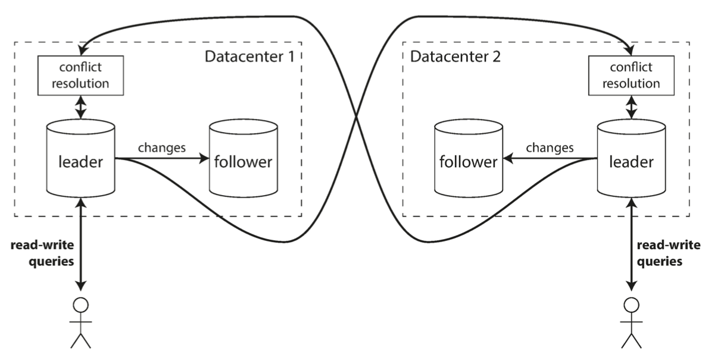
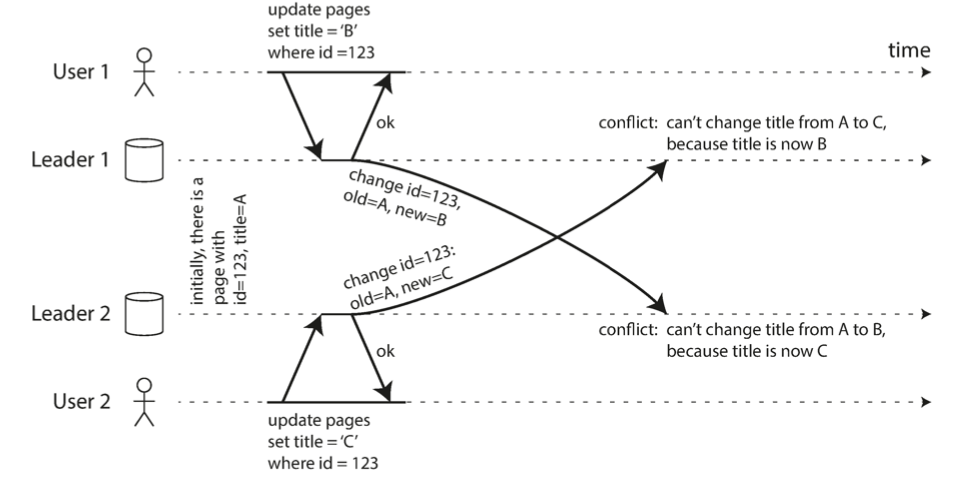
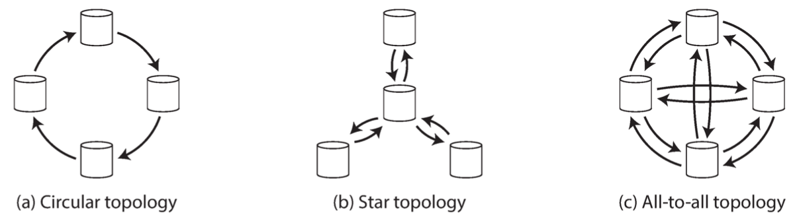
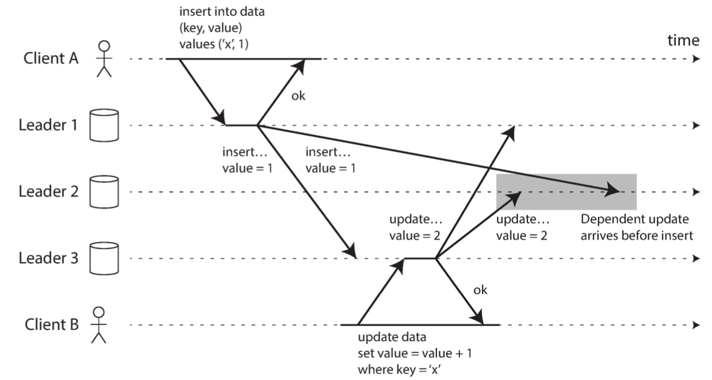
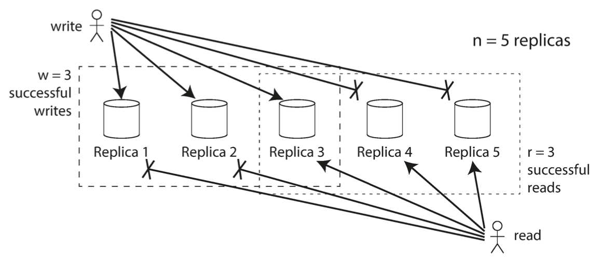
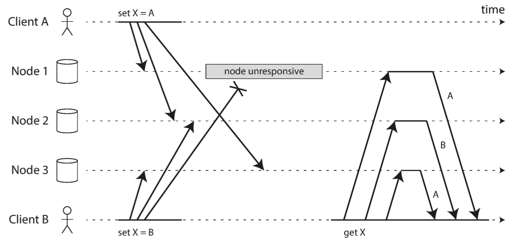
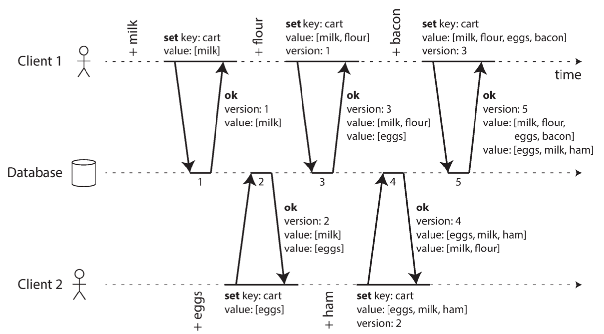
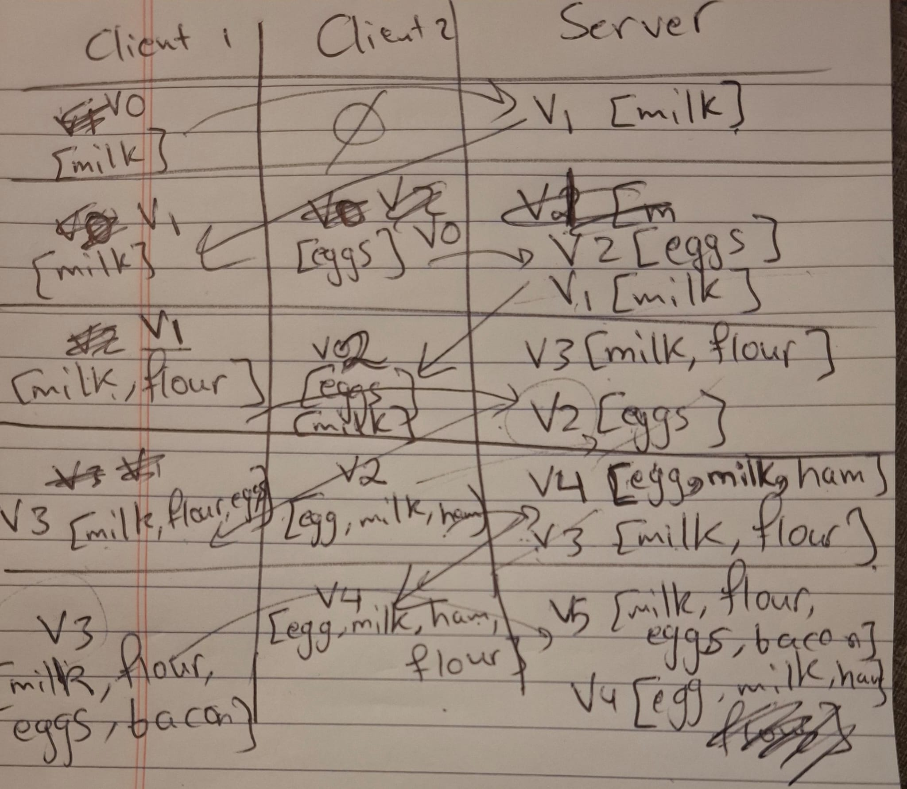

## Table of Contents
- [Table of Contents](#table-of-contents)
- [Common Terms](#common-terms)
- [Introduction](#introduction)
- [Challenge with data replication](#challenge-with-data-replication)
- [Leaders and Followers](#leaders-and-followers)
  - [Asynchronous vs Synchronous Replication](#asynchronous-vs-synchronous-replication)
  - [Setting Up New Followers](#setting-up-new-followers)
  - [Handling Node Outages](#handling-node-outages)
    - [Follower Failure: Catch-up Recovery](#follower-failure-catch-up-recovery)
    - [Leader  failure: Failover](#leader--failure-failover)
      - [What can go wrong](#what-can-go-wrong)
  - [Implementation of Replication Log](#implementation-of-replication-log)
    - [Statement-based replication](#statement-based-replication)
    - [Write-ahead log (WAL) shipping](#write-ahead-log-wal-shipping)
    - [Logical (row-based) log replication](#logical-row-based-log-replication)
    - [Trigger-based replication](#trigger-based-replication)
  - [Problems with Replication Lag](#problems-with-replication-lag)
    - [Reading Your Own Writes](#reading-your-own-writes)
    - [Monotonic Reads](#monotonic-reads)
    - [Consistent Prefix Reads](#consistent-prefix-reads)
  - [Solution for Replication Lag](#solution-for-replication-lag)
- [Multi-Leader Replication](#multi-leader-replication)
  - [Why we need more than one leader](#why-we-need-more-than-one-leader)
  - [Use cases for multi leader setup](#use-cases-for-multi-leader-setup)
    - [Multi-datacenter operation](#multi-datacenter-operation)
    - [Clients with offline operation](#clients-with-offline-operation)
    - [Collaborative editing](#collaborative-editing)
  - [Handling Write Conflicts](#handling-write-conflicts)
    - [Synchronous vs Asynchronous conflict detection](#synchronous-vs-asynchronous-conflict-detection)
    - [Conflict Avoidance](#conflict-avoidance)
    - [Converging toward a consistent state](#converging-toward-a-consistent-state)
    - [Custom conflict resolution logic](#custom-conflict-resolution-logic)
  - [Mutli-Leader Replication Topologies](#mutli-leader-replication-topologies)
- [Leaderless Replication](#leaderless-replication)
  - [What happens if a node is down?](#what-happens-if-a-node-is-down)
    - [Read Repair](#read-repair)
    - [Anti-Entropy process](#anti-entropy-process)
    - [Quorums for reading and writing](#quorums-for-reading-and-writing)
  - [Limitations of Quorum Consistency](#limitations-of-quorum-consistency)
    - [Monitoring Staleness](#monitoring-staleness)
  - [Sloppy Quoroms and Hinted Handoff](#sloppy-quoroms-and-hinted-handoff)
    - [Sloppy Quorum](#sloppy-quorum)
    - [Hinted Handoff](#hinted-handoff)
    - [Why use sloppy quorums?](#why-use-sloppy-quorums)
    - [Applying leaderless replication in multidatacenter setup](#applying-leaderless-replication-in-multidatacenter-setup)
  - [Detecting Concurrent Writes](#detecting-concurrent-writes)
    - [LWW](#lww)
    - [Happens-before relationship and concurrency](#happens-before-relationship-and-concurrency)
    - [Capturing the happens-before relationship](#capturing-the-happens-before-relationship)
      - [Merging Concurrently Written Values](#merging-concurrently-written-values)
      - [Version Vectors](#version-vectors)

## Common Terms

* replication
* replica
* leader
* active/passive replication
* master/slave replication
* synchronous and asynchronous followers
* replication log sequence number
* catch-up recovery
* leader failover
* split brain
* statement-based replication
* WAL shipping
* logical (row-based) replication
* trigger-based replication
* eventual consistency
* read-after-write consistency
* read-your-writes consistency
* logical timestamp
* cross-device read-after-write consistency
* monotonic reads
* strong consistency
* consistent prefix reads
* master-master / active-active
* LWW (last write wins)
* Replication Topologies
* Dynamo-style database
* Read Repair
* Anti-entropy
* quorum reads and writes ( `w + r > n`)
* Sloppy quorums
* Hinted handoff
* Version Vectors

## Introduction

**Replication** means keeping a copy of the same data on multiple machines that are connected via a network.

We do replication for the following reasons:

* Reduce latency: keeping data geographically closer to users
* Increase availability: keeping system working even when some of its parts fail
* Increase read throughput: scale out the number of machines that can serve read requests.

**NOTE:** In all what follows, we assume that the data is small enough to fit on a single machine. In the next chapter we will discuss splitting data into multiple partitions.

## Challenge with data replication

The main challenge with data replication is handling data change. If a record changes on one replica, it should be changed on all other replicas as soon as possible. This should be done in a way that preserves the consistency of the system behaviour with respect to each user.

There are 3 main algorithms to deal with these challenges:

* **single-leader**
* **multi-leader**
* **leaderless replication**

Each approach has its pros and cons.

## Leaders and Followers

In this approach, **one** node is considered the **leader node,** and is responsible for processing write requests. This is also known as **master** or **primary**.

All other nodes are considered **followers**, and are used to serve read requests. They are also known as **read replicas, slaves, secondaries** or **hot standbys.**

Each time the leader writes/updates a record to its local storage, it replicates the same operation to all other replicas so that all nodes end up having the same state of data.

Read requests can be served by any node, regardless of whether it is the leader or a follower node.

### Asynchronous vs Synchronous Replication

The leader can replicate changes to followers either synchronously or asynchronously.

In synchronous replication, the leader returns response to the client's write request only after the write operation is replicated on the follower. Such a follower is called **synchronous follower**.

In asynchronous replication, the leader sends the message to the follower, but doesn't wait for the follower's response. Such a follower is called an **asynchronous follower.**

Synchronous replication guarantees the follower to have an up-to-date copy of the data that is consistent with the leader. This makes leader failure recovery very easy since any replica can take over the leadership role. However, the downside is that if a synchronous follower is not responding, the write cannot be processed, and the leader will have to block all writes until the replica is available again.

In practice, one of the followers is synchronous and others are asynchronous. If the synchronous follower becomes unavailable, another replica can be made synchronous. This configuration is often called **semi-synchronous**.

If replication is fully asynchronous, then leader failures are not recoverable and this risks data loss. However, this has the advantage that the leader can still process write requests even if all its followers have fallen behind.

### Setting Up New Followers

In order to add a new follower or replace an old one, it is not sufficient to simply copy data files from one node to another because clients might still be sending write requests, so data files can change at different points in time. 

Locking data files while copying them reduces service availability.

To setup a new follower, we can use a snapshot of the leader's data at some point in time. This might be possible without taking a lock on the entire database. We copy the snapshot to the new follower. 

Once the follower gets the snapshot, it requests from the leader to send all operations that have occurred since the snapshot taken. The snapshot is usually associated with an exact position in the leader's replication log, often called log sequence number or binlog coordinates.

### Handling Node Outages

We should make sure that system as a whole can continue to run despite individual node failures and to keep the impact of a node outage as small as possible.

#### Follower Failure: Catch-up Recovery

In this case, we can use an approach similar to what is described in the previous section. Once the follower is up again, it can connect to the leader and share the most recent replication log sequence number that it has, and ask the leader to send all events that occurred after that point in the log sequence. 

#### Leader  failure: Failover

In this case, one of the followers need to be promoted to be the new leader, and clients need to be reconfigured to connect to the new leader when sending write requests. Additionally, other followers need to start consuming data changes from the new leader. This process is called *failover.*

Failover can happen manually or automatically. 

The steps are usually as follows:

* Determining that the leader has failed:
  * no fool-proof way to detect this.
  * most systems use a timeout: if a node doesn't respond for the duration of the timeout, it is considered dead.
* Choosing a new leader:
  * can be done using an election process
  * we need to choose the follower that has the most recent state of the data.
* Reconfiguring the system to use the new leader
  * write requests need to be routed to the new leader
  * if the old leader becomes up again, it should transition to the follower state.

##### What can go wrong

* If asynchronous replication is used, data might be lost.
* It might happen that 2 nodes believe that they are the leader at the same time. This scenario is called *split brain.* If both of them process writes, then without proper write conflict resolution mechanism, data might be lost or corrupted. Some systems shut down one node if two nodes think they are leaders.
* It is tricky to calibrate the timeout.
  * A very high timeout can reduce system availability.
  * A very low timeout is more vulnerable to unnecessary failovers which can make the situation worse in case of load spike or network glitch.

### Implementation of Replication Log

#### Statement-based replication

The leader logs every write operation that it executes and sends that statement log to its followers. This means that every INSERT, UPDATE or DELETE statement is forwarded to followers. Followers then execute the received statements.

We should pay attention to:

* Nondeterministic functions such as `NOW()` or `RAND()`
* Autoincrementing fields depending on the exustubg data in the database.
* Triggers, stored procedures, user-defined functions may result in different side effects on different replicas, unless the side effect is deterministic.

The leader can replace nondeterministic function calls with a fixed return value. However, there are many edge cases that we should handle.

For these reasons, statement-based replication is not very widely used.

#### Write-ahead log (WAL) shipping

As discussed in chapter 3, storage engines usually append every write to a log:

* For log-structured storage engines (SSTABLE and LSM-Trees), log segments store data and they compacted, merged and garbage collected.
* For B-Tree, individual disk blocks are overridden. Every modification is first written to WAL so that the index can be restored to a consistent state after a crash.

The log is always an append only sequence of bytes containing all writes to the database. 

Besides writing the log to disk, the leader also sends it across the network to its followers. When the follower receives a log, it builds a copy of the exact same data structures as found on the leader.

This method is used in PostgreSQL and Oracle.

The disadvantage is that this makes the replication process coupled with the stoage engine. If the database changes its storage format from one version to another, it is not possible to run different versions of the database on the leader and the followers.

If the change in the storage engine version is backward compatible, then it is possible to do upgrade with 0 down time by upgrading the followers first and then make failover to make one of the upgraded followers the new leader. Else, upgrading the version with WAL shipping will require down time.

#### Logical (row-based) log replication

Replication log can be decoupled from the storage engine by using different log formats for replication and for the storage engine. This distinguishes between physical and logical data representation.

A logical row for a relational database is usually a sequence of records describing writes to database tables at the granularity of a row:

* for inserted row, the log contains the new values of all columns
* for a deleted row, the log contains enough information to uniquely identify the row that was deleted, typically the primary key
* for an updated row, the log contains enough information to uniquely identify the updated row and the new values of updated columns

A transaction modifying several rows generates several such log records, followed by a record indicating that the transaction was committed.

With this approach, leader and followers can run different versions of the database software or even the storage engine.

#### Trigger-based replication

In this approach, replication is moved to the application layer.

Some tools, such as Oracle GoldenGate, can make data changes available to an application by reading the database log. We can also use triggers and stored procedures.

A trigger can register custom application code that is automatically executed when a write transaction occurs on the database. The application code can log this change into a separate table, from which it can be read by an external process. The external process can decide how to replicate the data change to other followers.

This approach has greater overheads and is more prone to bugs and limitations that the database's builtin replication.

### Problems with Replication Lag

In order to reduce latency, we should not use a fully synchronous system, since the larger the system gets, the more likelier that a node will fall out, resulting in blocking all write requests.

Therefore, we should have mostly asynchronous followers, and synchronous followers should be as few as possible.

If read request is served from an asynchronous follower, then stale data might be returned in case the follower is not fully in sync with the leader. This scenario is called replication lag. 

If we stop writing to the database and wait for some time, all followers will catchup finally. This is referred to as *eventual consistency*.

Replication lag can be in the order of seconds or even minutes if the system is operating near capacity. This can cause serious problems:

#### Reading Your Own Writes

If the user sends a write request and then tries to view the written data instantly, then the user might not see the data that was written in case the read request was served from an asynchronous follower that hasn't yet caught up with the leader.

The guarantee that this scenario will never happen is referred to as *read-after-write consistency (or read-your-writes).*

There are various possible techniques to implement *read-after-write* consistency:

* when the user tries to read something that was just written by the same user, serve the read request from the leader. A simple rule is: always read user's data from the leader, and read other's data from any replica
* if most application data are potentially editable by the user, other criteria can be used to decide if the read request should be served by the leader or by a follower.
  * The client keep can track of the timestamp of the most recent write request, and for a minute after that timestamp, serve all read requests from the leader.
  * We can monitor the replication lag of each follower and never serve read requests from a replica with replication lag higher than a certain threshold.
* if the client is maintaining the timestamp of the most recent write, the system can ensure that the replica serving any reads for that user reflects updates at least until that timestamp. The timestamp can be a logical timestamp (e.g. the log sequence number) or the system clock.

If the user is using multiiple devices, this can become complex: if the user makes a write from one device, the write should be instantly visible on all other connected devices. Approaches described above can become inefficient since the timestamp should be maintained in a global centralized manner.

#### Monotonic Reads

This occurs when reading from asynchronous followers and users see things moving backward in time.

Monotonic reads is a guarantee that this kind of anomaly will never happen. It is a lesser guarantee than strong consistency, but a stroner guarantee than eventual consistency.

One way of implementing this is ensuring that read requests of a given user are always served from the same replica. Different users can have their requests served by different replicas. Users requests can be mapped onto nodes using a hash of the user id.

If the replica fails, the user requests should be routed to a new follower.

#### Consistent Prefix Reads

This kind of anomaly occurs when the user sees reads in a manner that violates causality. 

For example, if write transaction B depends on write transaction A, the user should not see B appearing before A in the read response.

As a concrete example, the comments and replies of users on a facebook should be returned in a way that respects causality. A user shouldn't see the reply to a comment before seeing the comment itself.

Preventing this anomaly requires consistent prefix reads. This guarantees that if a sequence of writes happens in a certain order, then anyone reading those writes will see them appear in the same order.

This is a particular problem in sharded (partitioned) databases as you can see in the figure below:

If we are using single-leader replication without partitioning, this anomaly can never happen because the leader always applies writes in the same order.

One way to provide this guarantee is to make sure that any writes that are causally related to each other are written to the same partition, but in some applications this can't be done efficiently. 

### Solution for Replication Lag

When working with eventually consistent systems, it is important to evaluate how problemetic it might become if the replication lag increases to several minutes.

If this can result in bad user experience, it's important to design the system to provide stringer guarantee such as read-after-write.

## Multi-Leader Replication

### Why we need more than one leader

Single-leader replication has a major downside: all writes need to go through the leader, so the leader is a single point of failure for write operations.

Multi-leader replication extends what we explained before by allowing more than one node to accept writes:

Replication still happens: each node that processes a write request should replicate the change to all other leaders. (known as *master-master* or *active-active*).

Each leader simultaneously acts as a follower to other leaders.

### Use cases for multi leader setup

#### Multi-datacenter operation
* each datacenter contains exactly one leader
* within each datacenter, normal leader-follower replication is done
* each leader replicates data to leaders of other datacenters.

This can be seen in the figure below:

Advantages:
* Lower latency: 
  * write requests can be served from any datacenter
  * inter-datacenter replication is handled asynchronously
* Better tolerance to datacenter outages:
  * each datacenter can continue to operate independently of other datacenters
  * replication catches up when the datacenter is available again

Disadvantages:
* write conflicts are possible: the same data might be modified in 2 different datacenters, resulting in a write conflict when performing replication.
* autoincrementing keys, triggers and integrity constraints can be problematic.

#### Clients with offline operation

Multi-leader setup can also be used in applications that need to continue while disconnected from the internet.

Calendar apps on mobile phones, laptop and other devices is a good example.

The app instance on each device has a local database that acts as a leader, and tries to replicate changes to all other devices.

Replication lag can reach minutes, hours or days.

Each device can be thought of as a separate datacenter with one replica.

#### Collaborative editing

Real-time collaborative editing applications also have a lot in common with multi-leader replication setups.

When one user edits a document, the changes are instantly applied to their local replica and asynchronously replicated to the server and any other users who are editing the same document.

Write conflicts can arise, and the application might use locks on document characters before the user can edit a character.

### Handling Write Conflicts

Write conflicts can occur in multi-leader setups.

An example is shown in the figure below:

#### Synchronous vs Asynchronous conflict detection

If leader-leader replication is done asynchronously, the conflict will not be detected synchronously.

To make conflict detection synchronous, the leader can synchronously replicate the change to other leaders before committing the write and returning successful response. However, this goes against the big advantage that each leader can operate independently.

For this reason, instead of forcing synchronous conflict detection, we can simply use single-leader replication.

#### Conflict Avoidance

A frequently recommended approach is to simply avoid write conflicts by forcing all writes for a particular record to always go through the same leader.

However, if we want to change the leader for a designated record in case of datacenter failure or a user has moved to another location, then conflict avoidance breaks and you have to deal with the possibility of concurrent wirtes on different leaders.

#### Converging toward a consistent state

In multi-leader setups, there is no defined ordering of writes that happen concurrently, so it's not clear what the final value of the record should be.

If each leader applies writes in the order they are received, we might end up with different values on different leaders.

Conflicts should be resolved in a convergent manner: all leader should arrive at the same final value when everything has been replicated.

There are several ways of achieving conflict resolution convergence:
* Last-Write-Wins (LWW): give each write a unique ID (timestamp, long random number, UUID, etc.), and pick the write with the highest ID as the winner. This approach is prone to data loss.
* Give each replica a unique ID, and prioritize writes originating from replicas having higher ID. This also implies data loss.
* If possible, merge values together (e.g. order them and concatenate them).
* Record conflict in an explicit data structure that preserves all information, and write application code that resolves the conflict at some later time.

#### Custom conflict resolution logic

Most multi-leader replication tools let you write conflict resolution logic using application code, which may be executed on write or on read:

* On write: when the database system detects a conflict in the log of replicated changes, it calls the conflict handler.
* On read: when a conflict is detected, all conflicting  writes are stored. The next time the data is read, all conflicting versions are provided to the application, which will be responsible to resolve the conflict and rewrite the reconciled value to the database.

Conflict resolution applies at the level of row or document, not at the level of a transaction.

### Mutli-Leader Replication Topologies

A replication topology describes the communication paths along which writes are propagated from one node to another.

Different topologies are shown in the figure below:

In circular topologies, infinite loops are avoided by maintaining on the replication operation an identifier of each replica that has processed the operation. When a replica receives an operation holding its identifier, it discards it.

The main issue with circular and star topologies is that the failure of a node can interrupt the replication process.

However, in all-to-all topology, it is possible to have causality issues because some network links might be faster than others, resulting in replications being transmitted out-of-order on some replicas as shown in the figure below.

## Leaderless Replication

In leaderless Replication, we don't have a leader that decides the order used to apply writes by all followers. Instead, any replica is allowed to directly accept write requests from clients.

This approach is adopted by amazon's dynamo-style database.

In some implementations, the client sends the write request to many nodes in parallel. In other implementations, the client sends the write request to a coordinator node which in turn diffuses the write request to multiple replicas. In both cases, no order is enforced.

### What happens if a node is down?

Consider 3 replicas that can all receive write requests.

If one of the 3 nodes is down, the client can still send the write requests as follows:
* the client sends the write requests to the 3 nodes
* only 2 nodes reply with success
* the client considers the result to be a success (it's sufficient for 2 out of 3 replicas to accept the write).

When the failing node recovers, 2 nodes will have the correct value of the key, and 1 node will have a stail value.

If the client wants to read the data, it sends 3 read requests (1 request/node).

The client will receive different values from different nodes.

It uses the value's version number to determine the most up-to-date value.

For this to work, we should enforce the following rule:
- a write operation is successful only if it is successfully processed by at least 2 replicas
- same applies to read operations

#### Read Repair 

Read repair is done by the client when it detects stale data in the response to a read request. 

When this happens, it sends the up-to-date value to the stale replica so it can be updated.

#### Anti-Entropy process

A background proces can constantly look for differences in the data between replicas and copy any missing data from one replica to another.

#### Quorums for reading and writing

If there are n replicas, every write must be confirmed by w nodes to be considered successful, and we must query at least r nodes for each read.

As long as `w+r>n`, we expect to get an up-to-date value when reading.

Reads and writes obeying this rule are called *quorum* reads and writes.

A common choice is to make n odd (typically 3 or 5), and set `w = r = (n+1)/2`

We can very w and r depending on the use case. For example, we can set `w=n` and `r=1` for a system with few writes and many reads.

The rule `w + r > n` allows the system to tolerate unavailable nodes as follows:
- if `w<n`: we can still process writes if a node is unavailable
- if `r<n`: we can still process reads if a node is unavailable

In fact, we can tolerate `max(0,n-w)` node failures for writes, and `max(0,n-r)` for reads.

Normally, reads and writes are sent to all nodes in parallel. However, we only wait for responses from `w` or `r` nodes to consider the operation successful.

The figure below explains the idea:

### Limitations of Quorum Consistency

Setting `w+r<=n` will more likely result in reading stale values, but has the advantage of providing better availability and lower latency.

However, even with `w+r>n` there are edge-cases where stale values are returned. Possible scenarios include:
* Using sloppy quoroms: write and reads might end up on different nodes so that there is no more an overlap between them.
* If two writes occur concurrently, we will need to resolve the conflict (e.g. by merging), else we will risk data loss.
* If write happens concurrently with a read, it might be reflected only on some replicas.
* If a write succeeds on less than w replicas, it is considered a failed operation globally. However, the value is not rolled-back on the replicas that successfully processed the request. Subsequent reads may or may not return the value from that write.
* If a node carrying the new value fails, and data is restored from a replica with a stale value, we might fall below the minimum of w nodes with up-to-date value.

Previously mentioned anomalies can appear in such databases:
- monotonic reads
- reading your writes
- consistent prefix reads

#### Monitoring Staleness

In leader-based replication, the database typically exposes metrics for the replication lag, which can be fed to the monitoring system. 

In leaderless replication, there is no fixed order in which writes are applied, which makes monitoring more difficult. If anti-entropy is not used, there is no limit on how old a value might become.

### Sloppy Quoroms and Hinted Handoff

Even with `w+r>n`, a network interruption can easily cut off a client from a large number of database nodes.

Although the nodes are alive, they are not reachable, so the client can't reach a quorum.

#### Sloppy Quorum

In a large cluster (significantly more than n nodes), the database might accept writes anyways if the user can't reach a quorum, and perform the writes on some nodes that are reachable but aren't among the n nodes on which the value usually lives. This is known as sloppy quorum.

#### Hinted Handoff

Once the unreachable nodes are reachable again, the value is copied over to the nodes that belong the n nodes that should hold the value.

This operation is called Hinted Handoff.

#### Why use sloppy quorums?

Sloppy quorums are useful to increase write availability: as long as any w nodes are available, the database can accept writes.

However, it means that even when `w+r>n`, we can't guarantee that the most up-to-date value is read.

#### Applying leaderless replication in multidatacenter setup

The number of replicas n includes nodes in all datacenters, and in the configuration you can specify how many of the n replicas you want to have in each datacenter.

Each write is sent to all replicas regardless of the datacenter, but waits only for an acknowledgement from a quorum of nodes within its local datacenter so that it is unaffected by delays and interruptions on the cross-datacenter link.

Cross-datacenter writes are often done asynchronously.

### Detecting Concurrent Writes

The problem is that events may arrive in a different order at different nodes, due to variable network delays and partial failure. 

The figure below gives an example:

As you can see, we end up with different values on different nodes.

We should make sure all replicas converge towards the same value.

#### LWW

Last Write Wins was already discussed. It achieves the goal of eventual consistency, but it comes at the cost of losing data durability.

In some applications, like caching, losing data is acceptable.

#### Happens-before relationship and concurrency

If two events are causally related, then they are not concurrent.

An operation A happens before another operation B if B knows about A, or depends on A, or builds upon A in some way.

As a rule of thumb, 2 operations are concurrent if neither happens before the other (i.e neither knows about the other).

For any two events A and B, we have only 3 cases:
- A happened before B
- B happened before A
- A and B are concurrent

If operations are concurrent, we have a conflict that needs to be resolved.

#### Capturing the happens-before relationship

There is an algorithm that determines whether 2 operations are concurrent or whether one happened before the other.

* The server maintains a version number for every key, increments the version number every time that key is writtem, and stores the new version number along with the value written.
* When a client reads a key, the server returns all values that have not been overwritten, as well as the latest version number. A client must read a key before writing.
* When a client writes a key, it should include the version number from the prior read, and it must merge together all values that it received in the prior read. The response from the server will be like a read, returning all current values, which allows us to chain several writes.
* When the server receives a write with a particular version number, it can overwrite all values with that version or below (since it knows they have been merged), but it must keep all values with a higher version number (because those values are concurrent with the incoming write).

In this algorithm, we made a simplification that we have only replica. Next sections will explain how version vectors can be used to generalise this idea.

When a write includes the version number from a prior read, that tells us which previous state the write is based on. A write with no version number will be concurrent with all existing writes.

An example is shown in the figure below:

The sketch below illustrates the state of each of the clients and the server at each transaction:

##### Merging Concurrently Written Values

The explained algorithm ensures no data is silently dropped, but it requires that the clients do somw extra work (i.e. merging concurrent data).

The merging logic depends on the application context.

There is some research to design data structures that support automatic merging for conflict resolution purposes.

##### Version Vectors

When having multiple replicas with no leader, the algorithm above doesn't work as it is.

A single version number was used to capture dependencies between operations on one replica.

To support tracking dependencies on multiple replicas, we need to maintain one version number per replica as well as per key.

This is known as *Version Vector*.

Each replica increments its own version number when processing a write, and also keeps track of the version numbers it has seen from each of the other replicas.

This information indicates which data should be over-written and which data should be kept as siblings.

Riak uses a variant of this idea valled *dotted version vector*.

Version vectors are sent from the database replicas to clients when values are read, and need to be sent back to the database when a value is written. This vector allows distinguishing between overwrites and concurrent writes.

