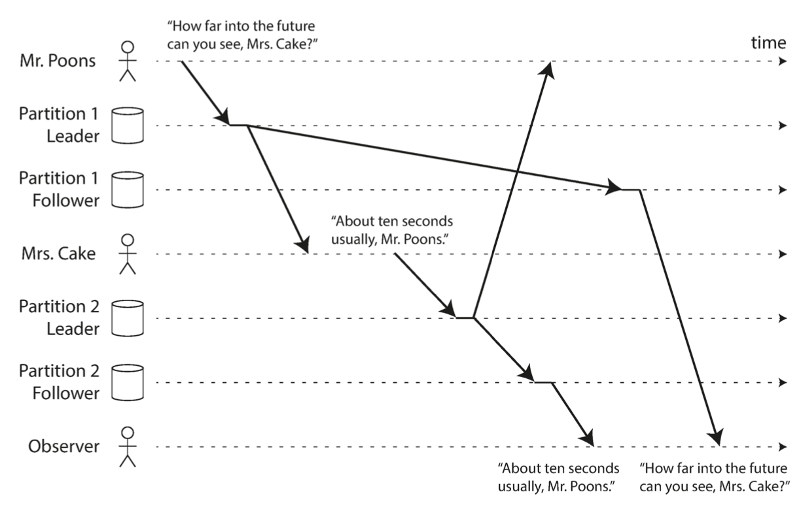

## Common Terms

* replication
* replica
* leader
* active/passive replication
* master/slave replication
* synchronous and asynchronous followers
* replication log sequence number
* catch-up recovery
* leader failover
* split brain
* statement-based replication
* WAL shipping
* logical (row-based) replication
* trigger-based replication
* eventual consistency
* read-after-write consistency
* read-your-writes consistency
* logical timestamp
* cross-device read-after-write consistency
* monotonic reads
* strong consistency
* consistent prefix reads

## Introduction

**Replication** means keeping a copy of the same data on multiple machines that are connected via a network.

We do replication for the following reasons:

* Reduce latency: keeping data geographically closer to users
* Increase availability: keeping system working even when some of its parts fail
* Increase read throughput: scale out the number of machines that can serve read requests.

**NOTE:** In all what follows, we assume that the data is small enough to fit on a single machine. In the next chapter we will discuss splitting data into multiple partitions.

## Challenge with data replication

The main challenge with data replication is handling data change. If a record changes on one replica, it should be changed on all other replicas as soon as possible. This should be done in a way that preserves the consistency of the system behaviour with respect to each user.

There are 3 main algorithms to deal with these challenges:

* **single-leader**
* **multi-leader**
* **leaderless replication**

Each approach has its pros and cons.

## Leaders and Followers

In this approach, **one** node is considered the **leader node,** and is responsible for processing write requests. This is also known as **master** or **primary**.

All other nodes are considered **followers**, and are used to serve read requests. They are also known as **read replicas, slaves, secondaries** or **hot standbys.**

Each time the leader writes/updates a record to its local storage, it replicates the same operation to all other replicas so that all nodes end up having the same state of data.

Read requests can be served by any node, regardless of whether it is the leader or a follower node.

### Asynchronous vs Synchronous Replication

The leader can replicate changes to followers either synchronously or asynchronously.

In synchronous replication, the leader returns response to the client's write request only after the write operation is replicated on the follower. Such a follower is called **synchronous follower**.

In asynchronous replication, the leader sends the message to the follower, but doesn't wait for the follower's response. Such a follower is called an **asynchronous follower.**

Synchronous replication guarantees the follower to have an up-to-date copy of the data that is consistent with the leader. This makes leader failure recovery very easy since any replica can take over the leadership role. However, the downside is that if a synchronous follower is not responding, the write cannot be processed, and the leader will have to block all writes until the replica is available again.

In practice, one of the followers is synchronous and others are asynchronous. If the synchronous follower becomes unavailable, another replica can be made synchronous. This configuration is often called **semi-synchronous**.

If replication is fully asynchronous, then leader failures are not recoverable and this risks data loss. However, this has the advantage that the leader can still process write requests even if all its followers have fallen behind.

### Setting Up New Followers

In order to add a new follower or replace an old one, it is not sufficient to simply copy data files from one node to another because clients might still be sending write requests, so data files can change at different points in time. 

Locking data files while copying them reduces service availability.

To setup a new follower, we can use a snapshot of the leader's data at some point in time. This might be possible without taking a lock on the entire database. We copy the snapshot to the new follower. 

Once the follower gets the snapshot, it requests from the leader to send all operations that have occurred since the snapshot taken. The snapshot is usually associated with an exact position in the leader's replication log, often called log sequence number or binlog coordinates.

### Handling Node Outages

We should make sure that system as a whole can continue to run despite individual node failures and to keep the impact of a node outage as small as possible.

#### Follower Failure: Catch-up Recovery

In this case, we can use an approach similar to what is described in the previous section. Once the follower is up again, it can connect to the leader and share the most recent replication log sequence number that it has, and ask the leader to send all events that occurred after that point in the log sequence. 

#### Leader  failure: Failover

In this case, one of the followers need to be promoted to be the new leader, and clients need to be reconfigured to connect to the new leader when sending write requests. Additionally, other followers need to start consuming data changes from the new leader. This process is called *failover.*

Failover can happen manually or automatically. 

The steps are usually as follows:

* Determining that the leader has failed:
  * no fool-proof way to detect this.
  * most systems use a timeout: if a node doesn't respond for the duration of the timeout, it is considered dead.
* Choosing a new leader:
  * can be done using an election process
  * we need to choose the follower that has the most recent state of the data.
* Reconfiguring the system to use the new leader
  * write requests need to be routed to the new leader
  * if the old leader becomes up again, it should transition to the follower state.

##### What can go wrong

* If asynchronous replication is used, data might be lost.
* It might happen that 2 nodes believe that they are the leader at the same time. This scenario is called *split brain.* If both of them process writes, then without proper write conflict resolution mechanism, data might be lost or corrupted. Some systems shut down one node if two nodes think they are leaders.
* It is tricky to calibrate the timeout.
  * A very high timeout can reduce system availability.
  * A very low timeout is more vulnerable to unnecessary failovers which can make the situation worse in case of load spike or network glitch.

### Implementation of Replication Log

#### Statement-based replication

The leader logs every write operation that it executes and sends that statement log to its followers. This means that every INSERT, UPDATE or DELETE statement is forwarded to followers. Followers then execute the received statements.

We should pay attention to:

* Nondeterministic functions such as `NOW()` or `RAND()`
* Autoincrementing fields depending on the exustubg data in the database.
* Triggers, stored procedures, user-defined functions may result in different side effects on different replicas, unless the side effect is deterministic.

The leader can replace nondeterministic function calls with a fixed return value. However, there are many edge cases that we should handle.

For these reasons, statement-based replication is not very widely used.

#### Write-ahead log (WAL) shipping

As discussed in chapter 3, storage engines usually append every write to a log:

* For log-structured storage engines (SSTABLE and LSM-Trees), log segments store data and they compacted, merged and garbage collected.
* For B-Tree, individual disk blocks are overridden. Every modification is first written to WAL so that the index can be restored to a consistent state after a crash.

The log is always an append only sequence of bytes containing all writes to the database. 

Besides writing the log to disk, the leader also sends it across the network to its followers. When the follower receives a log, it builds a copy of the exact same data structures as found on the leader.

This method is used in PostgreSQL and Oracle.

The disadvantage is that this makes the replication process coupled with the stoage engine. If the database changes its storage format from one version to another, it is not possible to run different versions of the database on the leader and the followers.

If the change in the storage engine version is backward compatible, then it is possible to do upgrade with 0 down time by upgrading the followers first and then make failover to make one of the upgraded followers the new leader. Else, upgrading the version with WAL shipping will require down time.

#### Logical (row-based) log replication

Replication log can be decoupled from the storage engine by using different log formats for replication and for the storage engine. This distinguishes between physical and logical data representation.

A logical row for a relational database is usually a sequence of records describing writes to database tables at the granularity of a row:

* for inserted row, the log contains the new values of all columns
* for a deleted row, the log contains enough information to uniquely identify the row that was deleted, typically the primary key
* for an updated row, the log contains enough information to uniquely identify the updated row and the new values of updated columns

A transaction modifying several rows generates several such log records, followed by a record indicating that the transaction was committed.

With this approach, leader and followers can run different versions of the database software or even the storage engine.

#### Trigger-based replication

In this approach, replication is moved to the application layer.

Some tools, such as Oracle GoldenGate, can make data changes available to an application by reading the database log. We can also use triggers and stored procedures.

A trigger can register custom application code that is automatically executed when a write transaction occurs on the database. The application code can log this change into a separate table, from which it can be read by an external process. The external process can decide how to replicate the data change to other followers.

This approach has greater overheads and is more prone to bugs and limitations that the database's builtin replication.

### Problems with Replication Lag

In order to reduce latency, we should not use a fully synchronous system, since the larger the system gets, the more likelier that a node will fall out, resulting in blocking all write requests.

Therefore, we should have mostly asynchronous followers, and synchronous followers should be as few as possible.

If read request is served from an asynchronous follower, then stale data might be returned in case the follower is not fully in sync with the leader. This scenario is called replication lag. 

If we stop writing to the database and wait for some time, all followers will catchup finally. This is referred to as *eventual consistency*.

Replication lag can be in the order of seconds or even minutes if the system is operating near capacity. This can cause serious problems:

#### Reading Your Own Writes

If the user sends a write request and then tries to view the written data instantly, then the user might not see the data that was written in case the read request was served from an asynchronous follower that hasn't yet caught up with the leader.

The guarantee that this scenario will never happen is referred to as *read-after-write consistency (or read-your-writes).*

There are various possible techniques to implement *read-after-write* consistency:

* when the user tries to read something that was just written by the same user, serve the read request from the leader. A simple rule is: always read user's data from the leader, and read other's data from any replica
* if most application data are potentially editable by the user, other criteria can be used to decide if the read request should be served by the leader or by a follower.
  * The client keep can track of the timestamp of the most recent write request, and for a minute after that timestamp, serve all read requests from the leader.
  * We can monitor the replication lag of each follower and never serve read requests from a replica with replication lag higher than a certain threshold.
* if the client is maintaining the timestamp of the most recent write, the system can ensure that the replica serving any reads for that user reflects updates at least until that timestamp. The timestamp can be a logical timestamp (e.g. the log sequence number) or the system clock.

If the user is using multiiple devices, this can become complex: if the user makes a write from one device, the write should be instantly visible on all other connected devices. Approaches described above can become inefficient since the timestamp should be maintained in a global centralized manner.

#### Monotonic Reads

This occurs when reading from asynchronous followers and users see things moving backward in time.

Monotonic reads is a guarantee that this kind of anomaly will never happen. It is a lesser guarantee than strong consistency, but a stroner guarantee than eventual consistency.

One way of implementing this is ensuring that read requests of a given user are always served from the same replica. Different users can have their requests served by different replicas. Users requests can be mapped onto nodes using a hash of the user id.

If the replica fails, the user requests should be routed to a new follower.

#### Consistent Prefix Reads

This kind of anomaly occurs when the user sees reads in a manner that violates causality. 

For example, if write transaction B depends on write transaction A, the user should not see B appearing before A in the read response.

As a concrete example, the comments and replies of users on a facebook should be returned in a way that respects causality. A user shouldn't see the reply to a comment before seeing the comment itself.

Preventing this anomaly requires consistent prefix reads. This guarantees that if a sequence of writes happens in a certain order, then anyone reading those writes will see them appear in the same order.

This is a particular problem in sharded (partitioned) databases as you can see in the figure below:

If we are using single-leader replication without partitioning, this anomaly can never happen because the leader always applies writes in the same order.

One way to provide this guarantee is to make sure that any writes that are causally related to each other are written to the same partition, but in some applications this can't be done efficiently. 

### Solution for Replication Lag

When working with eventually consistent systems, it is important to evaluate how problemetic it might become if the replication lag increases to several minutes.

If this can result in bad user experience, it's important to design the system to provide stringer guarantee such as read-after-write.

## Multi-Leader Replication