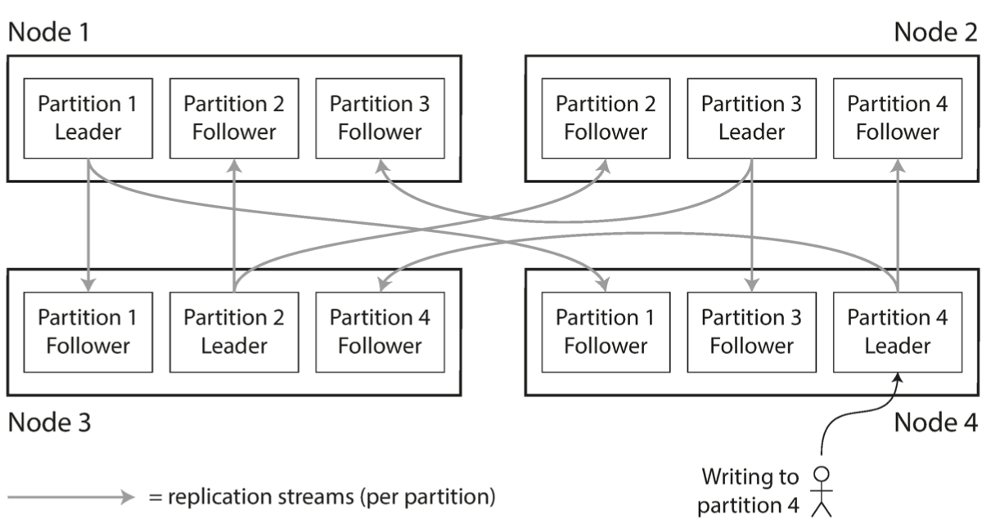
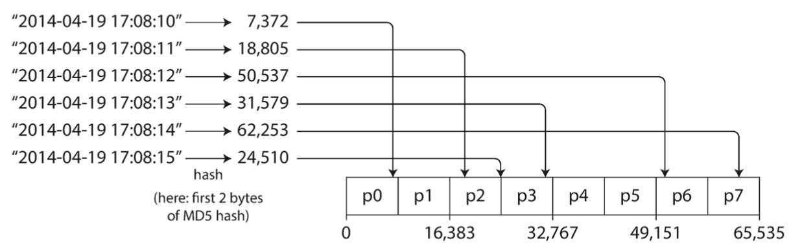
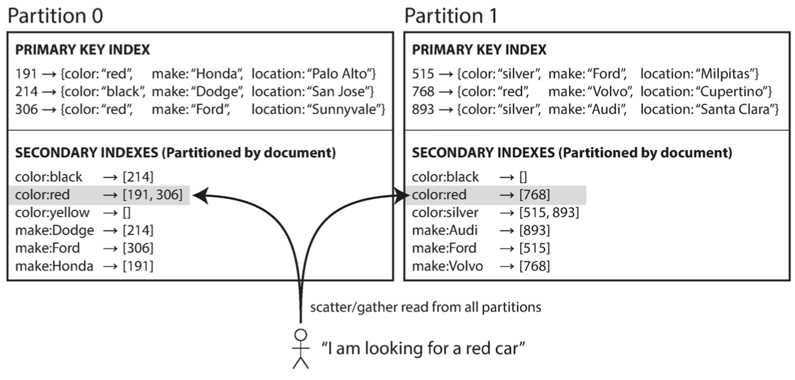
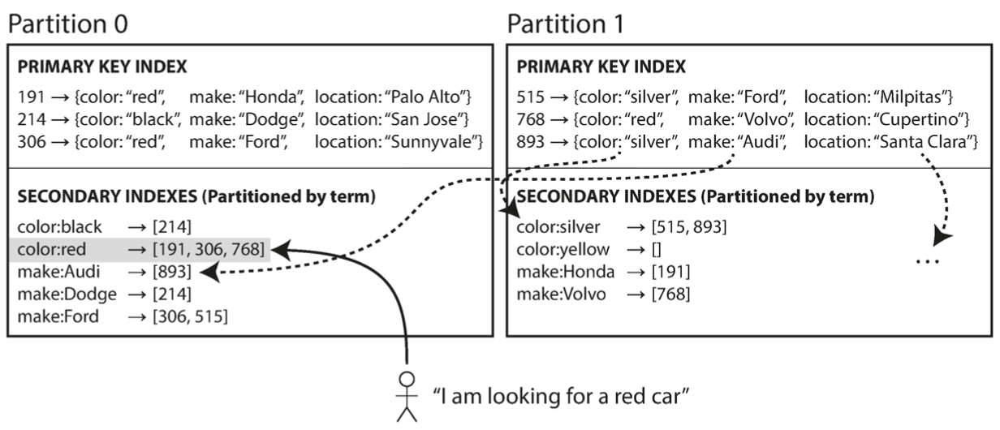
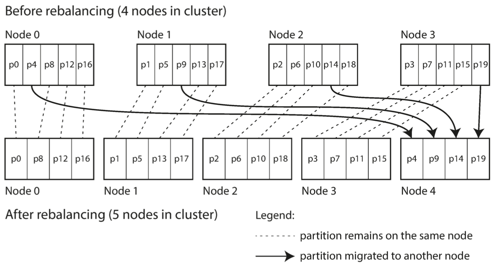
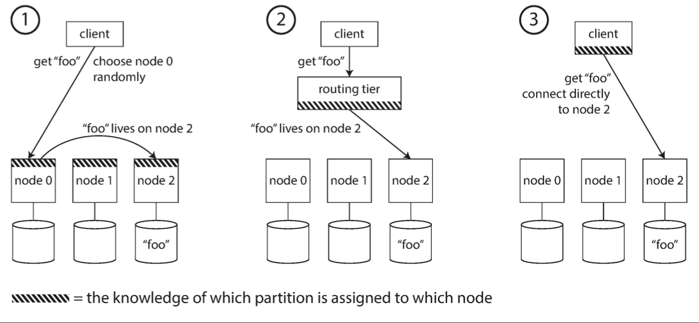
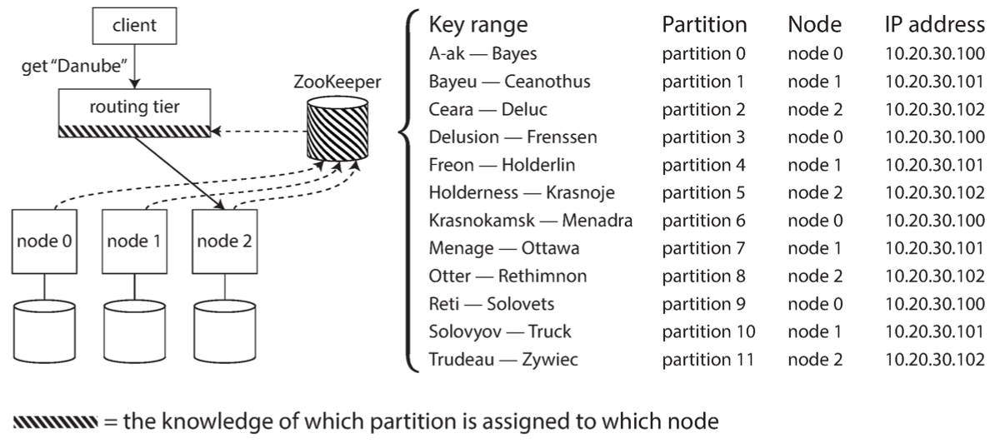

## Table of Contents
- [Table of Contents](#table-of-contents)
- [Common Terms](#common-terms)
- [Introduction](#introduction)
- [Partitioning or Replication](#partitioning-or-replication)
- [Partitioning of Key-Value Data](#partitioning-of-key-value-data)
  - [Random Partitioning](#random-partitioning)
    - [Advantage](#advantage)
    - [Disadvantage](#disadvantage)
  - [Paritioning By Key Range](#paritioning-by-key-range)
    - [Advantages](#advantages)
    - [Disadvantages](#disadvantages)
  - [Partitioning By Hash Key](#partitioning-by-hash-key)
    - [Advantages](#advantages-1)
    - [Disadvantages](#disadvantages-1)
  - [A compromise between the 2 strategies](#a-compromise-between-the-2-strategies)
- [Skewed Data and Relieving Hot Spots](#skewed-data-and-relieving-hot-spots)
- [Partioning and Secondary Indexes](#partioning-and-secondary-indexes)
  - [Document-Based partitioning (local index)](#document-based-partitioning-local-index)
  - [Term-Based partitioning (global index)](#term-based-partitioning-global-index)
- [Rebalancing Partitions](#rebalancing-partitions)
  - [Minimum Expected Requirements](#minimum-expected-requirements)
  - [Rebalancing Strategies](#rebalancing-strategies)
    - [hash mod N (BAD APPROACH)](#hash-mod-n-bad-approach)
    - [Fixed Number of Partitions](#fixed-number-of-partitions)
    - [Dynamic Partitioning](#dynamic-partitioning)
    - [Partitioning Proportionally to nodes](#partitioning-proportionally-to-nodes)
- [Automatic vs Manual Rebalancing](#automatic-vs-manual-rebalancing)
- [Request Routing](#request-routing)
- [Parallel Query Execution](#parallel-query-execution)

## Common Terms
* sharding
* scalability
* skewed partitioning
* hot spot
* consistent hashing
* scatter/gather reads
* document-based partitioning of secondary index (local index)
* term-based partitioning of secondary index (global index)
* rebalancing
* pre-splitting
* service discovery
* zookeeper
* request routing
* MPP: massively parallel processing

## Introduction

The main reason to partition a database is scalability.

Different partitions can be placed on different nodes in a share-nothing cluster.

Partitions are pairwisely disjoint.

Large datasets can be distributed across many disks, and the query load can be distributed across many processors.

## Partitioning or Replication

Partitioning is usually combined with replication so that copies of each partition are stored on multiple nodes. This is done for fault-tolerance.

If leader-follower replication model is used, each partition will be replicated across several nodes, and only one of these nodes will be designated the leader for that specific partition.

The choice of partitioning scheme is mostly independent of the choice of replication scheme.

**For this, replication is ignored in this chapter.**

An example is shown in the figure below:

## Partitioning of Key-Value Data

Our goal is to spread the data and the query load evenly across nodes.

Unfair partitioning can happen if some partitions have much more data or queries than others. We call this *skewed partitioning*. In this case, it might happen that most of the load goes to only one node while all other nodes are idle. The partition with disproportionately high load is called a hot spot.

We have several approaches to partition data across nodes:

### Random Partitioning

Records can be assigned to nodes randomly.

#### Advantage
avoids hot spots.

#### Disadvantage
when reading a record, we need to query all nodes.

### Paritioning By Key Range

In this approach, we assign a continuous range of keys (from some min to some max) to each partition.

The ranges are not necessarily evenly spaced, because data may not be evenly distributed.

Partition boundaries might be chosen manually by an administrator, or the database can choose automatically.

Within each partition, keys are kept in sorted order using SSTables and LSM-Trees.

#### Advantages
- for a given key, it is easy to guess which partition contains it
- if the node that each partition belongs to, we can make quick read queries to the relevant node only
- range scans are easy

#### Disadvantages
- certain access patterns can lead to hot spots (E.g. writes done by sensors with timestamp primary key will all end up on the same partion during a long period of time).
- considering that the writers (sensors) are known, we can avoid hot spots by append the source id as a prefix to the primary key so that writes coming from different sources don't end up on the same partition. However, with this, we will often need to make queries to several nodes to make range queries.

### Partitioning By Hash Key

In order to avoid the risk of skew and hot spots, we may use a hash function to determine the partition of a given key.

The hash function takes skewed data and makes it uniformly distributed.

The hash function doesn't need to be cryptographically strong, but it should not produce different hashes for the same key when running in different processes.

Each partition is assigned a range of hashes, and every key whose hash falls within a partition's range will be stored in that partition.

The partition boundaries can be evenly spaced, or they can be chosen pseudorandomly (in which case the technique is sometimes known as *consistent hashing*)

#### Advantages
* Avoids hotspots and skews

#### Disadvantages
* Difficult to do range queries because consecutive keys (in the sorted order) are no more guaranteed to be placed on the same partition. We need to send multiple requests and reassemble the result.

### A compromise between the 2 strategies

A compromise between the two strategies can be done by using a compound primary key consisting of several columns. The hash is computed only based on the first column of the primary key, and other columns are used as a concatenated index for sorting the data in every nodes SSTable. This compromise allows performing efficient range scan over key columns if the first column is fixed. 

An example of such key is `(user_id, timestamp)`. Updates by different users are stored on different nodes.
However, it is possible to do range scan over timestamp for a given user.

## Skewed Data and Relieving Hot Spots

As discussed, hasing a key to determine its partition can help reduce hot spots. 

However, in some extreme cases, we might still have hot spots. An example is the case of posts done by a famous celebrity on twitter: shortly after a post, we will have a huge number of requests targetting the same post (same key).

Currently, systems aren't capable of automatically compensating for such a highly skewed workload, so it's the responsibility of the application to reduce the skew. 

A common technique is to add a random 2-digit number as a prefix to the primary keys that can cause hot spots. This will split writes across 100 different keys. However, by doing this, each subsequent user read request will be amplified by a factor of 100 (we will need to query the 100 keys and merge the results).

We also need to keep track of keys that are split. Keys with low write throughput don't need to be split.

## Partioning and Secondary Indexes

The approaches discussed above only deal with primary keys and don't take secondary indexes into consideration.

Secondary indexes need to be treated differently because they don't identify a record uniquely.

Consequently, secondary indexes don't map neatly to partitions.

There are 2 main approaches to partitioning a database with secondary indexes:

### Document-Based partitioning (local index)

In document-based partitioning of secondary indexes, each partition maintains an index of its own data.

This is illustrated in the figure below:

With this approach, write requests can be processed easily because only one partition needs to update its index.

However, read requests now need to be sent to all partitions so we can merge the data at the end. This is known as scatter/gather read request.

Scatter/gather is prone to tail latency amplification.

### Term-Based partitioning (global index)

An alternative approach is to construct a global index that covers data in all partitions.

The global index can be quite huge, so it also needs to be partitioned.

We can partition the global index differently from the primary key index. (We could maybe use partitioning by key range or by using a hash of the term).

Partitioning by the term itself provides efficient range scans (e.g. on a numeric property, such as the asking price of the car).

Partitioning on a hash of the term gives a more even distribution of load.

This is illustrated in the figure below:

The advantage of global index is that is that it can make reads more efficient, rather than doing scatter/gather over all partitions.

The downside is that writes are sower and more complicated, because a write to a single document may now affect multiple partitions of the index. We also need to perform a distributed transaction across all index partitions affected by a write in order to guarantee consistency, which is not supported in all databases.

In practice, updates to global secondary indexes are often asynchronous.

## Rebalancing Partitions

The process of moving load from one node in the cluster to another is called rebalancing.

This might be done in order to add a new node (scaling out), add more cpu, add more disk, replace failing node, etc.

### Minimum Expected Requirements
* After rebalancing, the load should be shared fairly between the nodes in the cluster.
* While rebalancing is happening, the database should continue accepting reads and writes
* No more data than necessary hould be moved between nodes, to make rebalancing fast and to minimize the network and disk I/O load.

### Rebalancing Strategies

#### hash mod N (BAD APPROACH)

If we are partitioning by the hash of a key, we should give each partition a conitguous range of hashes.

We don't use `hash % n` to assign hashes to partitions because this will result in moving over almost all partitions in case of rebalancing if the number of nodes changes.

This approach should be always avoided.

#### Fixed Number of Partitions

We can create many more partitions than there are nodes, and assign several partitions to each node.

For example: a database with 10 nodes can hold 1000 partitions, so that we have 100 partitions per node on average.

If a node is added to the cluster, the new node can steal a few partitions from existing nodes until partitions are fairly distributed again.

If a node is removed, the same happens in reverse.

Only entire partitions are moved around. Assignment of keys to partitions is kept untouched.
The only thing changing is the assigment of partitions onto nodes.

The old assignment of partitions is used to serve any reads and writes that happen while the transfer is in progress.

This is illustrated in the figure below:

The higher the number of partitions, the more scalable our cluster is, but the more overhead we add to manage individual partitions.

Therefore, the number of partitions should be neither too high, nor too low.

If the size of the dataset is highly variable, it is difficult to choose the right value for the number of partitions.

The size of partition grows proportionally to the total amount of data in the cluser, and doesn't depend on the size of the cluster. If the dataset grows a lot, then repalancing and failure recovery become very expensive.
But if partitions are too small, they incur too much overhead.

Note that this approach is not very suitable for databases using key range partitioning, because we might end up having all data in one partition and all other partitions remain empty.

#### Dynamic Partitioning

When a partition grows to exceed a configured size, it is split into 2 partitions so that approximately half of the data ends up on each side of the split.

If lots of data is deleted and a partition shrinks below some threshold, it can be merged with an adjacent partition.

Each partition is assigned to one node, and each node can handle multiple partitions.

Once a partition is split, one of its 2 halves can be transferred to another node to balance the load.

With this, the number of partitions adapts to the total data volume. If we have small amount of data, small number of partitions are obtained, and thus overhead will be limited. If there is huge amount of data, the size of each individual partition is limited to a configurable maximum.

However, an empty database starts off with a single partition. While the data is small, or requests are served from the same partition. This can be mitigated by allowing configuring an initial set of partitions on an empty database (pre-splitting). Pre-splitting requires that we already know the distribution of our data in case of key-range partitioning.

This approach is suitable for both key-range partitioned and key-hash partitioned databases.

#### Partitioning Proportionally to nodes

In both aforementioned approaches, the number of partitions is independent of the number of nodes.

In this approach, we make the number of partitions proportional to the number of nodes (impose having a fixed number of partitions per node).

The size of each partition grows proportionally to the dataset size while the number of nodes remains unchanged, but when the number of nodes changes, the size of partitions varies in the opposite direction.

Since larger data volume requires larger number of nodes, then the size of each partition will remain relatively stable.

When a new node joins the cluster, it randomly chooses a fixed number of existing partitions to split, and then takes ownership of one half of each of those split partitions while leaving the other half of each partition in place. The randomization can produce unfair splits, but when averaged over a larger number of partitions, the new node ends up taking a fair share of the load from the existing nodes.

Picking partition boundaries randomly requires that hash-based partitioning is used.

## Automatic vs Manual Rebalancing

Rebalancing can either be done automatically or manually.

Fully automated rebalancing can be convenient, because there is less operational work to do for normal maintenance. However, it can be unpredictable.

Rebalancing is an expensive operation because it requires rerouting requests and moving a large amount of data from one node to another. For example, say one node is overloaded and is temporarily slow to respond to requests. The other nodes conclude that the overloaded node is dead, and automatically rebalance the cluster to move load away from it. This puts additional load on the overloaded node, other nodes, and the network making the situation worse and potentially causing a cascading failure.

Some systems can generate the rebalancing decision automatically, but require an administrator to commit it.

## Request Routing

Over time, partitions are added, removed or rebalanced. Therefore, the assignment of partitions onto nodes is changing continuously.

Request routing is the approach we use to tell which nodes contain a given partition.

Basically, this answers the following question: if I want to read or write the key "foo", which IP address and port number do I need to connect to? (This is commonly a known part of a *service discovery* problem).

There are few different approaches to this problem:
* Allow clients to contact any node (via round-robin load balancer). If the receiver node doesn't have the partition, it can relay the request to the node that has the partition, and then return the response back when it receives it.
* Send all requests from clients to a routing tier first, which determines the node that should handle each request and forwards it accordingly. 
* Require that clients be aware of the partitioning assignment of partitions to nodes.

These approaches can be seen in the figure below:

In all these approaches, we need a way for the component making the routing decision to learn about changes in the assigment of partitions to nodes.

Usually, distributed systems rely on a separate coordination service such as ZooKeeper.

Each node registers itself in ZooKeeper, and ZooKeeper maintains the mapping of partitions to nodes.

The component that needs to be aware of the mapping state can subscribe to ZooKeeper.

An example is illustrated in the figure below:

## Parallel Query Execution

Massively parallel processing (MPP) relational database products are much more sophisticated in the types of queries they support, usually for analytics usecases.

This might include several join, filtering, groupin, and aggregation operations.

The MPP query optimizer breaks this complex query into a number of execution stages and partitions, many of which can be executed in parallel on different nodes of the cluster.

