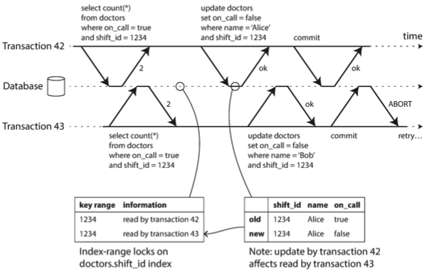

## Table of contents
- [Table of contents](#table-of-contents)
- [Common Terms](#common-terms)
- [General Idea of Transactions](#general-idea-of-transactions)
- [ACID](#acid)
  - [Atomicity](#atomicity)
  - [Consistency](#consistency)
  - [Isolation](#isolation)
  - [Durability](#durability)
- [Single-Object and Multi-Object Operations](#single-object-and-multi-object-operations)
  - [Multi-Object Writes](#multi-object-writes)
  - [Single-Object Writes](#single-object-writes)
  - [The need for multi-object transactions](#the-need-for-multi-object-transactions)
  - [Handling Errors and Aborts](#handling-errors-and-aborts)
- [Weak Isolation Levels](#weak-isolation-levels)
  - [Read Committed](#read-committed)
    - [Dirty Writes](#dirty-writes)
    - [Dirty Reads](#dirty-reads)
  - [Snapshot Isolation and Repeatable Read](#snapshot-isolation-and-repeatable-read)
    - [Implementation](#implementation)
      - [Visibility Rules](#visibility-rules)
      - [Index and snapshot isolation](#index-and-snapshot-isolation)
  - [Lost Updates Problem](#lost-updates-problem)
    - [Atomic Write Operations](#atomic-write-operations)
    - [Explicit Locking](#explicit-locking)
    - [Automatically Detecting Lost Updates](#automatically-detecting-lost-updates)
    - [Compare-and-Set](#compare-and-set)
    - [Conflict Resolution and Replication](#conflict-resolution-and-replication)
  - [Write Skew and Phantoms](#write-skew-and-phantoms)
    - [Dealing with write skew](#dealing-with-write-skew)
    - [More examples of write skew](#more-examples-of-write-skew)
    - [Phantoms Causing Write-Skew](#phantoms-causing-write-skew)
    - [Materializing Conflicts](#materializing-conflicts)
- [Serializability](#serializability)
  - [Actual Serial Execution](#actual-serial-execution)
    - [Encapsulating Transactions in Stored Procedures](#encapsulating-transactions-in-stored-procedures)
    - [Partitioning](#partitioning)
  - [2PL (Two-Phase Locking)](#2pl-two-phase-locking)
    - [Implementation](#implementation-1)
    - [performance](#performance)
    - [Predicate Locks](#predicate-locks)
      - [Index-Range Locks](#index-range-locks)
  - [Serializable Snapshot Isolation (SSI)](#serializable-snapshot-isolation-ssi)
    - [Pessimistic vs Optimistic Concurrency Control](#pessimistic-vs-optimistic-concurrency-control)
    - [Decisions based on an outdated premise](#decisions-based-on-an-outdated-premise)
      - [Detecting stale MVCC reads](#detecting-stale-mvcc-reads)
      - [Detecting writes that affect prior reads](#detecting-writes-that-affect-prior-reads)
    - [Performance](#performance-1)
      - [Comparing with 2PL](#comparing-with-2pl)
      - [Comparing with Serial Execution](#comparing-with-serial-execution)
      - [Abort Rate](#abort-rate)


## Common Terms
- ACID
- atomicity
- consistency
- isolation
- durability
- abortability
- serializability
- weak isolation levels
- dirty reads
- dirty writes
- read committed
- snapshot isolation
- repeatable reads
- read skew / non repeatable reads
- write skew
- MVCC: multi-version concurrency control
- copy-on-write
- read-modify-write cycle
- lost updates problem
- Atomic write operations
- Explicit Locking
- Phantoms
- Write Skew
- Materializing Conflicts
- 2PL (Two-Phase Locking)
- predicate locks
- serializable snapshot isolation (SSI)
- pessimistic / optimistic locking
- abort rate


## General Idea of Transactions

Conceptually, all the reads and writes in a transaction are executed as one operation: either the entire transaction succeeds (commit) or it fails (abort, rollback). If it fails, the application can safely retry.

## ACID

Guarantees provided by transactions are described by the acronym ACID which stands for atomicity, consistency, isolation and durability.

In practice, implementations of ACID vary from one database vendor to another because there is a lot of ambiguity around what Isolation means in ACID.

### Atomicity

In this context, atomicity has nothing to do with multithreading. Instead, a set of operations are called *atomic* if either they are all applied or all aborted.

This guarantees that if a fault happens midway, we don't end up in some operations being committed and other not applied at all.

In case a fault occurs, the transaction is *aborted*, meaning that all its operations are reverted. Else, the transaction is committed.

### Consistency

This is more of a property of the application rather than of a database.

In this context, consistency refers to certain invariants (or conditions) that should always apply on the data at every point in time. For example, the total sum of balances of 2 bank accounts should remain the same before and after performing money transaction from one account to the other.

ACID compliant databases guarantees that if you use transactions correctly, you will be guaranteed to preserve the consistency of data. However, it is the responsibility of the application to interact with the database in a way that preserves consistency. If the application makes a write that violates its consistency constraints, the database will do nothing about it.

### Isolation

Isolation here refers to how the database behaves in case of concurrent transactions trying to modify the same records in the database.

Isolation in the sense of ACID means that concurrently executing transactions are isolated from each other: they cannot step on each other's toes. This is commonly referred to as *serializability* which means that two concurrent transactions will run as if they were executed serially.

Serializability comes at a performance cost, so a lot of database systems don't provide it.

### Durability

Durability refers to the guarantee that once a transaction is committed, we can be sure that the data will be safe even if the machine fails or some fault occurs. For example, this might include persisting the commit results on disk to avoid it if stored in-memory only in case of a fault. This also includes having WAL (write ahead log) or similar techniques.

It is important to note that 100% durability is not something that can be achieved in any condition.

## Single-Object and Multi-Object Operations

### Multi-Object Writes
Atomicity and isolation have a strong meaning when we want modify multiple objects in one transaction. Multi-objects transactions are often needed when multiple objects need to be kept in sync.

To determine which reads and writes belong to the same transaction, we use `BEGIN TRANSACTION` and `COMMIT` keywords to encapsulate a set of operations that should be considered as a transaction. This is done at the TCP layer.

### Single-Object Writes

Atomicity and Isolation might also apply when a single object is being changed.

As an example, writing a 20KB JSON document to a database can result in partially updated state in case of network connection interruption, power failure, concurrent read happening after the write operation started but before it is committed.

For this reasons, normally all database engines aim to provide single-object atomicity and isolation.

Atomicity can be implemented using a log for crash recovery, and isolation can be implemented using object-level locks.

Some databases provide object-level atomic operations such as:
- atomic increment
- compare-and-set operations

However, a transaction is not intended to describe object-level operation, but rather operations touching multiple objects at the same time.

### The need for multi-object transactions

It is difficult to rely only on single-object transactions in many cases.

For example:
- preserving consistency of foreign keys in relational databases.
- preserving consistency of denormalized data in document models
- preserving secondary index consistency

### Handling Errors and Aborts

Not all systems retry aborted transactions. For example, popular ORMs like Django don't retry an aborted transaction, but rather raises an exception that bubbles up the stack. Developers should make sure to handle such exceptions and only retry aborted transactions when it makes sense.

Retrying aborted transactions is not always the best choice, and we should pay attention to the following points:
- the transaction might actually succeed, but the network failed while trying to acknowledge the successful commit to the client. In this case, the client will have no idea if the transaction was committed or not.
- If the error is due to overload, retrying the transaction will make the situation worse.
- Retrying after permanent errors is pointless (such as violation of integrity constraints).
- Transaction side effects might end up repeated every time a transaction is retried (Resending an email multiple times).
- if the client fails while retrying, any data it was trying to write to the database is lost.

## Weak Isolation Levels

In practice, transaction isolation is not as simple as pretending serializability of transactions. Serializable isolation has a performance cost and many databases can't afford that price.

For this reasons, systems usually provide weaker isolation levels, which protect against some concurrency issues, but not all. However, these weak isolation levels can cause subtle bugs.

As a rule of thumb, for critical systems handling financial data, we should be sure the tool we are using provides strong serialization guarantees, and not rely only on the marketing term "ACID".

### Read Committed

This level provides 2 guarantees:
- when reading data from the database, you will only see data that has been committed (no dirty reads).
- when writing data to a database, you will only overwrite data that has been committed (no dirty writes).

In summary, this can be thought of as follows:

Any writes that a transaction does should be done on a draft paper that is only visible to itself. This draft will only be published once the transaction has committed.

#### Dirty Writes

If two writes from 2 transaction are being executed concurrently, the write operation from the latter transaction should not overwrite data written by the former transaction before it commits. 

If this is not respected, we might get bad outcome as shown in the figure below:


Preventing dirty writes is commonly implemented by using row-level exclusive locks: when a transaction wants to modify or write a row, it should acquire a lock on that row and maintain the lock until the transaction commits.

#### Dirty Reads
No dirty reads means that any writes by a transaction only become visible to others when that transaction commits. This is illustrated in the figure below:


To implement this, we can either use an exclusive lock on the row that the transaction reads (as explained in preventing dirty writes). However, this implementation doesn't scale well because one long-running write transactions can block a large number of readonly-only transactions.

To prevent such degradation in performance and response time, dirty reads are prevented by maintaining for every locked-for-write row 2 versions as long as the lock is not released: the old committed version and the uncommitted version.

### Snapshot Isolation and Repeatable Read

Although read committed isolation level prevents dirty reads and dirty writes, it still suffers from potential concurrency bugs.

A major one is known as *read skew*, and is illustrated in the figure below 


The issue here is that for a transient duration, we might see the data in an inconsistent state. However, if we wait a few seconds and refresh the page, we get the correct consistent data. This is commonly known as read skew or nonrepeatable read.

Read skews can be a serious problem in some cases such as constructing backups or executing analytic queries and integrity checks.

Snapshot isolation solves this problem.

Snapshot isolation ensures that a transaction sees the databases as one consistent snapshot and is not affected by any other commits that happen to the database as long as the transaction is still in progress.

#### Implementation

From a performance point of view, a key principle of snapshot isolation is: *readers never block writers and writers never block readers*.

This allows the database to continue handling long-running read queries on a consistent snapshot at the same time as processing writes normally.

Transactions performing writes to rows should still acquire locks. However, read queries don't require locks.

Snapshot isolation is implemented using MVCC (multi-version concurrency control).

Instead of maintaining only 2 versions of each locked row, we need to keep different committed versions of an object, because various in-progress transactions may need to see the state of the database at different points in time.

Another way of thinking about this is the following:
Read-committed isolation uses a separate snapshot for each query of the transaction, but a snapshot isolation uses the same snapshot for all queries of the transaction.

The figure below illustrates how this is implemented:


When a transaction is started, it is given a unique, always-increasing transaction id (txid). Whenever a transaction writes anything to the database, the data that it writes is tagged with the transaction ID of the writer.

Each row maintains a *created_by* and *deleted_by* field.

These fields refer to the transaction id that inserted, deleted, updated a row.

If a transaction deletes a row, it doesn't actually get deleted, but rather the deleted_by field is set to the id of the transaction deleting the object.

An update is internally translated into a delete and a create. 

##### Visibility Rules

When a transaction reads from the database, the transaction IDs are used to decide which objects it can see and which are invisible by following the visibility rules:
* At the start of each transaction, the database makes a list of all other transactions that are in progress at that time. Any writes that those transactions have made are ignored, even if the transactions subsequently commits.
* Any writes made by aborted commits are ignored.
* Any writes made by transaction with a later txid are ignored.
* all other writes are visible to the application's queries

##### Index and snapshot isolation

To include indexes in this process, one option is to have the index simply point to all versions of an object and require the index query to filter out any object versions that are not visible to the current transaction. The garbage collector can remove index references to garbage collected rows.

If using B-trees, another approach is to use append-only/copy-on-write variant that does not overwrite pages of the tree when they are updated, but rather creates a new copy of each modified page. Parent pages, up to the root of the tree, are copied and updated to point tot the new versions of their child pages. Any pages that are not affected by a write do not dneed to be copied and remain immutable.

With append-only B-trees, every write transaction creates a new B-tree root, and a particular root is consistent snapshot of the database. With this approach, there is no need to filter out objects based on transaction IDs because subsequent writes cannot modify an existing B-tree, they can only create new tree roots. However, this approach requires a background process for compaction and garbage collection.

### Lost Updates Problem

Lost update problem can occur if an application reads some value from the database, modifies it, and writes back the modified value (a read-modify-write cycle).

Examples include:
- Incrementing a counter or updating an account balance
- Making a local change to a complex value (e.g. adding an element to a list within a JSON document)
- Two users editing a wiki page at the same time, where each user saves their changes by sending the entire page contents to the server, overwriting whatever is currently in the database

A variety of solutions are already developed:

#### Atomic Write Operations

Many databases provide atomic update operations such as:

```
UPDATE counters SET value = value + 1 WHERE key = 'foo';
```

You should dwell on these solutions if they exist in the database you use and fit well for your use case.

These solutions are usually implemented by taking an exclusive lock on the objects when it is read so that no other transaction can read it until the update has been applied. This technique is known as *cursor stability*.

#### Explicit Locking

If the needed operation can't be satisfied with atomic write operations, explicit locking can be used to acquire exclusive locks on a set of rows that need to be updated.

Example:

```
BEGIN TRANSACTION;

SELECT * FROM figures
WHERE name = 'robot' AND game_id = 222
FOR UPDATE;

-- Check whether move is valid, then update the position
-- of the piece that was returned by the previous SELECT.
UPDATE figures SET position = 'c4' WHERE id = 1234;

COMMIT;
```

#### Automatically Detecting Lost Updates

Atomic operations and explicit locking force concurrent writes to happen sequentially. An alternative is to allow them to happen concurrently, and once a lost update is detected, the transaction is aborted and forced to retry the *read-modify-write* cycle instead.

The advantage of this approach is that it can be used in conjunction with snapshot isolation. It is also less error-prone because it is handled by the database instead by the application.

#### Compare-and-Set

This is provided as part of Single-object writes as discussed before.

This is also an example of preventing lost updates.

An example:

```
-- This may or may not be safe, depending on the database implementation
UPDATE wiki_pages SET content = 'new content'
WHERE id = 1234 AND content = 'old content';
```

The `WHERE` clause might be checked on an old snapshot, so we need to check whether the database's compare-and-set operation is safe before relying on it.

#### Conflict Resolution and Replication

Locks and compare-and-set operations assume that there is a single up-to-date copy of the data. However, in multi-leader or leaderless replication we allow several writes to happen concurrently and replicate them asynchronously, so they can't guarantee that there is a single up-to-date copy of data. 

Therefore, techniques based on locks or compare-and-set do not apply in this context. Instead, algorithms of concurrent writes detection should be used.

As for atomic operations, they can work well in a replicated context, especially if they are commutative (incrementing a counter or adding an element to a set).

### Write Skew and Phantoms

In previous sections, 2 types of race conditions were explained in case of having two concurrent transactions:
- dirty writes
- lost updates

A third race condition is called write skew.

The figure below illustrates write skew.


Write skew is a generalization of the lost update problem. It follows the following pattern:
- two transactions read the same objects
- they update some of those objects (different transactions may update different objects).

In the special case were the same object is updated, it results in a lost update or a dirty write depending on the timing.

#### Dealing with write skew

* atomic single-object operations don't help because multiple objects are involved
* write skew is not automatically detected by databases (automatic detection requires actual serialization)
* constraints involving multiple objects are not supported in most databases (as an example, most databases don't allow having a constraint on the total number of doctors that are on-call)

If serialization is not an option, the best solution is probably to explicitly lock the rows that the transaction depends on.

Example:

```
BEGIN TRANSACTION;

SELECT * FROM doctors
    WHERE on_call = true
    AND shift_id = 1234 FOR UPDATE;

UPDATE doctors
    SET on_call = false
    WHERE name = 'Alice'
    AND shift_id = 1234;

COMMIT;
```


#### More examples of write skew

* Meeting room booking system: if we want to enforce that there cannot be 2 bookings for the same meeting room at the same time, when someone wants to make a booking, you first check for ay conflicting bookings, and if none are found, you create the meeting. However, snapshot isolation doesn't prevent a concurrent transaction from inserting a conflicting meeting. To prevent such scenarios, you again need to use serialization.
* Multiplayer game: Say you have multiplayer game where players can move objects around. We can use explicit locking to avoid having two players modifying the position of the same object concurrently. However, locks can't prevent having two players moving two different objects to the same exact position.
* Claiming a username: if a user needs to choose a unique username, we need first to check if the username exists, and if it doesn't, we insert the new username. However, nothing prevents a concurrent transaction from inserting the username into the database just after we performed the uniqueness check but before writing our record. Fortunately, this can be solved using uniqueness integrity constraints which is supported by almost all databases.

#### Phantoms Causing Write-Skew

All the examples mentioned above follow the same pattern:
- A SELECT query cehcks if some requirement is satisfied by searching for rows matching a certain condition
- Depending on the result of the first query, the transaction makes the decision to make a write to the database
- The effect of the write changes the result of the initial requirement check done (i.e. repeating the read after this write will result in an opposite decision).
- A concurrent transaction makes such a write before the current transaction makes its write.

Consequently, the transaction will end up doing the write despite the fact the prerequisite that it thought is satisfied has just been negated by a concurrent write.

In some cases, we can solve the issue by making the write first and placing a lock (using `FOR UPDATE`), and then check if the condition is satisfied, and decide whether to abort or commit. This works in the case of doctors shown in the previous figure.

However, in the other examples details about write skew, this is not possible. The difference here is that these examples check for the absence of a condition, rather than the existence of it. In other words, in doctors on-call schedule, we need to check if we have other doctors on-call, but in meeting room booking, we need to check for the absence of an overlapping reservation.

This effect, where a write in one transaction changes the result of a search query in another transaction, is called a phantom.

#### Materializing Conflicts

One solution for write skew and phantoms is to have a separate table for possible conflicts ahead of time.

For example, in the case of meeting room booking system, we can create a table of all possible reservations for the next 6 months
and acquire a lock on rows from that table before making a reservation (using SELECT FOR UPDATE).

The new table is purely a table of locks, and doesn't store any useful information.

This is known as *materializing conflicts*.

This approach is not always easily viable, and is not very clean from an application point of view.

This should be avoided as much as possible.

## Serializability

The problems that arise when using weak isolation levels can be solved by using serializable isolation, which is the strongest isolation level.
This isolation level guarantees that even though transaction may run in parallel, the end result is the same as if they had executed one at a time, serially, without any concurrency.

This prevents all possible race conditions.

There are 3 common approaches to implement serializable isolation:

### Actual Serial Execution

This approach removes concurrency fully by executing only one transaction at a time, in serial order, on a single thread.

This might come at a performace cost, but can be more feasible now with:
- RAM developments (more possibility to keep active dataset in memory).
- OLTP transactions are usually short and only make a small number of reads and writes (in contrast to OLAP).

Pros: might perform better due to elimination of concurrency control overhead (managing locks, etc.)

Cons: limits throughput to that of a single CPU core.

#### Encapsulating Transactions in Stored Procedures

Due to the throughput limit imposed on such design, transactions can't span a long period of time.

Transactions can't be bound anymore to user input.

To solve this problem, transactions can be encapsulated in stored procedures which can run all at once when all user input is available.

This is illusatrated in the figure below:


Cons:
- different databases have different language for stored proceduces, which are mostly not up to date with developments in general-purpose programming languages.
- difficulty to manage coe running in database: hard to debug, version control, tests, integrate with monitoring tools
- a badly written stored procedure can drastically impact the database performance

Pros:
- modern implementations of stored procedures use general-purpose programming languages (java, closure, etc.).
- possibility of running transactions serially on a single thread


#### Partitioning

As discussed before, running transactions serially makes concurrency control simpler but limits the write throughput to the power of a single CPU core on one machine.

In order to scale to multiple CPU cores, we need to partition the data as explained in the previous chapter.

This works well for transactions that read and write from the same partition. However, for transactions that need to access multiple partitions, we must coordinate the transaction across all partitions it touches.
The stored procedure needs to be performed in lock-step across all partitions to ensure serialization across the whole system.

Thus, multi-partition transaction have additional coordination overhead and are much slower than single-partition transactions.

### 2PL (Two-Phase Locking)

2PL reuses locks as we used them before to avoid dirty writes. But it adds a tighter constraint:

- reads can block writes
- writes can block reads

This was not acceptable in snapshot isolation which mandated that readers never block writers and writers never block readers.

#### Implementation

We define 2 types of locks:
- shared lock: can be obtained by multiple readers at the same time, but, if acquired by a writer, it can't be held by any other reader or writer.
- exclusive lock: can not be acquired by more than one actor (whether it is a writer or a reader).

If a transaction wants to read an object, it must first acquire a shared lock. Sevelal transactions can hold the lock in shared mode, but if another transaction holds the lock in exclusive mode, they should wait.

If a transaction wants to write to an object, it must first acquire the lock in exclusive mode. If there is any lock already on the object (shared or exclusive), the transaction must wait.

If a transaction first reads and then writes an object, it may upgrade its shared lock to exclusive mode (previous point applies here during upgrade).

After a transaction has acquired a lock, it must continue to hold the lock until it is committed or aborted.

The database automatically detects deadlocks and aborts one of the transactions to break the deadlock. The aborted transaction can then be retried.

#### performance
Transaction throughput and response times of queries are significantly worse under 2PL than under weaker isolation.

This is due to:
- reduced concurrency
- overhead of acquiring and releasing all those locks
- when a transaction needs to wait for another, there is not limit on how long it must wait
- deadlcoks can occur much more frequently, so many transactions need to be retried.

#### Predicate Locks

Predicate locks are used to prevent phantoms causing write skew.

Predicate locks are acquired on the condition of a query, rather than on actual rows in the database.

A predicate lock restricts access as follows:

* If a transaction A wants to read objects matching some condition, like than in a SELECT query, it must acquire a shared-mode predicate lock on the conditions of the query. If another transaction B currently has an exclusive lock on any object matching the query conditions, transaction A must wait.
* If transaction A wants to insert, update, or delete any object, it must first check whether the old or the new value matches any existing predicate lock. If the lock is held by another transaction B, A needs to wait for B to commit or abort first.

Predicate locks apply even to objects that do not yet exist in the database, but which might be added in the future.

If 2PL includes predicate locks, it can prevent all possible forms of write skew and other race conditions.


##### Index-Range Locks

Predicate locks don't perform well because if there are many locks by active transactions, checking for matching locks becomes time-consuming.

An alternative is to use index-range locks, which locks all objects within a given index-range.

For example, if you have a predicate lock for bookings of room 123 between noon and 1 p.m., you can approximate it by locking bookings for room 123 at any time, or by locking all rooms (not just room 123) between noon and 1 p.m.

In practice, if we had an index on room_id, we lock all bookings with room_id 123. If we are using time-based index fo find existing bookings, we can attach a shared lock to a range of values in that index.

If another transaction wants to insert, update, or delete a booking for the same room and/or an overlapping time period, it will have to update the same part of the index. In this process, it will encounter the shared lock, and will be forced to wait until the lock is released.

This is not as precise as predicate locks, but they have lower overheads, so they are a good compromise.

If there is no suitable index that we can use here, we can simply lock the entire table, but this will have a performance impact.

### Serializable Snapshot Isolation (SSI)

#### Pessimistic vs Optimistic Concurrency Control

2PL is also called pessimistic concurrency control mechanism because it is based on the principle that if anything might possibly go wrong, it's better to wait until the situation is safe again before doing anything. It is like mutual exclusion which is used to protect data structures in multi-threaded programming.
This is very pessimistic, it is equivalent to each transaction having an exclusive lock on the whole database (or a specific partition) for the duration of the transaction.

SSI is an optimistic concurrency control technique which allows transactions to run concurrently and, when a transaction wants to commit, the database checks whether anything bad happened (i.e. isolation is violated), and if so, it aborts it and it has to be retried.

This performs badly if there is high contention as this aborts a big number of transactions. If there is enough spare capacity, and if contention between transactions is not too high, optimistic concurrency control techniques tend to perform better than pessimistic ones.

With SSI, all reads within a transaction are made from a consistent snapshot of the database.

#### Decisions based on an outdated premise

We've seen before a common pattern causing write skew:
- a transaction reads some data and verifies a condition is satisfied
- based on this, it decides to make specific writes

The database needs to know if a query result might have changed so that it can avoid write skews. It should consider 2 cases:
* Detecting reads of stale MVCC object version (uncommitted write occurred before the read).
* Detecting writes that affect prior reads (the write occurs after the read)

##### Detecting stale MVCC reads

With snapshot isolation, when a transaction reads from a consistent snapshot in an MVCC database, it ignores writes that were made by any other transactions that hadn't yet committed at the time when the snapshot was taken.

If the uncommitted transaction commits before the current transaction, the data read by the current transaction becomes stale and the transaction should be aborted.

This is illustrated in the figure below:


When the transaction wants to commit, the database checks whether any of the ignored writes have now been committed. If so, the transaction must be aborted.

We don't abort instantly, but rather wait until we want to commit, because we don't yet know if the current transaction is going to later perform a write. Moreover, the previous transaction may end up aborting or may still be uncommitted when the current transaction wants to commit.

##### Detecting writes that affect prior reads

The second case to consider is when another transaction modifies data after it has been read.

This is illustrated in the figure below:



We use a technique similar to 2PL except that SSI doesn't block other transactions.

The database keeps track of which transactions read each index entry. If the transaction has finished, and all concurrent transactions have finishd, the database can forget what data it read.

When a transaction writes to the database, it must look in the indexes for any other transactions that have recently read the affected data. Instead of blocking until readers have committed, it simply notifies the transactions that data they read may no longer be up to date.

#### Performance

One trade-off is the granularity at which transactions' reads and writes are tracked:
* if we keep track of each transaction's activity in great detail: 
  * it can be precise about which transactions need to abort
  * the bookkeeping oberhead can become significant
* with less detailed tracking:
  * it is faster
  * may leader to more transactions being aborted than strictly necessary

##### Comparing with 2PL
Compared to 2PL, the big advantage of SSI is that one transaction doesn't need to block waiting for locks held by another transaction, like in snapshot isolation: writers don't block reader, and vice versa.

This provides beteer latency; read-only queries can always continue reading from the same snapshot without requiring any locks.

##### Comparing with Serial Execution

SSI is not limited to throughput of a single CPU core, allowing it to scale to very high throughput. 

Even when data is partitioned across multiple machines, transactions can read and write multiple partitions while ensuring serializable isolation.

##### Abort Rate 

The rate of aborts significantly the overall performance.

A transaction that reads and writes data over a long period of time is likely to run into conflicts and abort, so SSI requires read-write transactions be fairly short.

However, SSI is probably less sensitive to slow transactions than 2PL and serial execution.