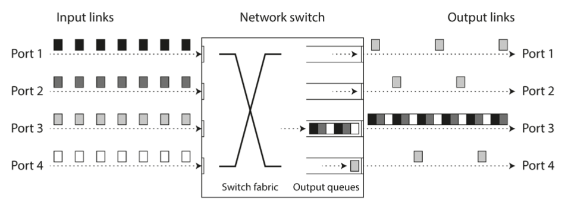
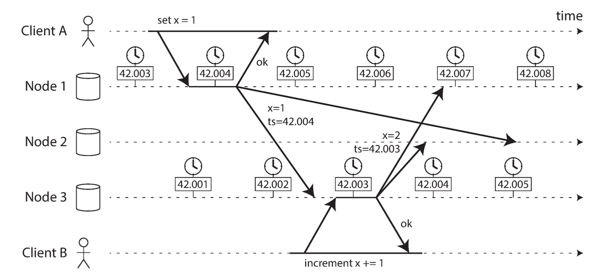
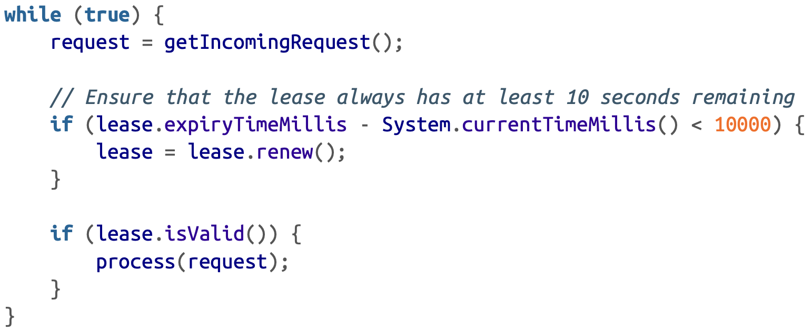
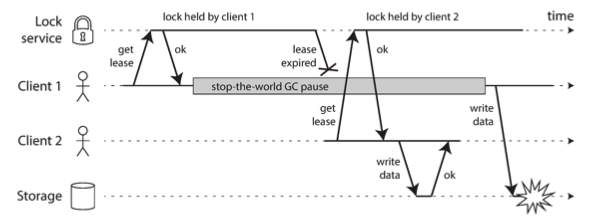
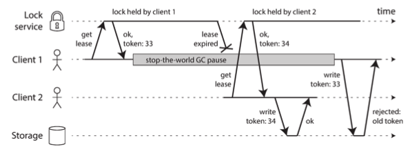

## Table of Contents

- [Table of Contents](#table-of-contents)
- [Common Terms](#common-terms)
- [Unreliable Networks](#unreliable-networks)
- [Timeouts and Unbounded Delays](#timeouts-and-unbounded-delays)
- [Network Congestion and Queueing](#network-congestion-and-queueing)
  - [Network Congestion](#network-congestion)
  - [Queueing](#queueing)
- [UDP](#udp)
- [Synchronous vs Asynchronous Networks](#synchronous-vs-asynchronous-networks)
- [Latency and Resource Utilisation](#latency-and-resource-utilisation)
- [Unreliable Clocks](#unreliable-clocks)
  - [Time-of-the-day Clocks](#time-of-the-day-clocks)
  - [Monotonic Clocks](#monotonic-clocks)
- [Clock Synchronization](#clock-synchronization)
- [Relying on Clock Synchronization](#relying-on-clock-synchronization)
  - [Timestamps for ordering events](#timestamps-for-ordering-events)
  - [Clock Readings Confidence Interval](#clock-readings-confidence-interval)
  - [Synchronized Clocks for Global Snapshots](#synchronized-clocks-for-global-snapshots)
- [Process Pauses](#process-pauses)
- [Dealing with Process Pauses](#dealing-with-process-pauses)
- [Truth is Defined by the Majority](#truth-is-defined-by-the-majority)
  - [The leader and the lock](#the-leader-and-the-lock)
  - [Fencing Tokens](#fencing-tokens)
- [Byzantine Faults](#byzantine-faults)
- [System Models](#system-models)
  - [Synchronous Model](#synchronous-model)
  - [Partially-Synchronous Model](#partially-synchronous-model)
  - [Asynchronous Model](#asynchronous-model)
  - [Crash-stop faults](#crash-stop-faults)
  - [Crash-recovery faults](#crash-recovery-faults)
  - [Byzantine faults](#byzantine-faults-1)
- [Algorithm Correctness](#algorithm-correctness)
- [Safety and Liveness](#safety-and-liveness)

## Common Terms
- unbounded delays
- timeouts
- round-trip time
- congestion
- TCP/UDP
- Sync/Async networks
- Bursty Traffic
- Unreliable Clocks
- NTP/GPS
- epoch
- Monotonic Clocks
- Time Of the Day Clocks
- Logical Clocks
- Google's TrueTime Spanner API
- Stop-the-world GC pause
- Thrashing
- Paging
- Quorum
- Fencing Tokens
- Byzantine Faults
- Byzantine Generals Problem
- System models
- Synchronous model
- Partially-synchronous model
- Asynchronous Model
- Crash-stop faults
- Crash-recovery faults
- Safety properties
- Liveness properties

## Unreliable Networks

The internet and most internal networks in datacenters (often Ethernet) are asynchronous packet networks.

When a node sends a message (a packet) to another node, it has no guarantees when, or even whether, the message will arrive.

Many things can go wrong:
* Message lost (cable unplugged).
* Message waiting in a queue because the recepient is overloaded
* Remote node have failed.
* Remote node temporarily failed responding.
* Remote node processed the request, but the response was lost or delayed

All these issues are indistinguishable in an asynchronous network; it is impossible to tell what happened in all cases.

Such scenarios are usually handled with timeouts, but even when a timeout occurs, we still don't know what happened.

## Timeouts and Unbounded Delays

It is hard to get timeout right:
* If we wait to long, users will have to wait a long time before they see useful error message
* If we don't wait enough, we will mistakenly declare nodes dead, and operations might be done multiple times.

When a node is declared dead, its responsibilities need to be transferred to a new node. This might make the situation worse if the node was already slow to respond due to spike in workload. This might lead to taking the whole cluster down.

Asynchronous networks have unbounded delays, so it is not sufficient for the system to be fast "most of the time" because, having a small timeout, it takes a transient spike in round-trip time to take your system off-balance.

## Network Congestion and Queueing

### Network Congestion 
Network switch queues requests received from different links and feed requests one by one on destination links as shown in the figure below.

On a busy network link, a packet may have to wait a while until it can get a slot (this is called network congestion). If there is so much incoming data that the switch queue fills up, the packet is dropped, so it needs to be resent—even though the network is functioning fine.

### Queueing

* The recepient's OS might queue the request internally if all CPU cores are busy.
* In virtualised environments, the virtual machine monitor queues requests targetting virtual machines that are in paused state.
* TCP performs flow control (congestion avoidance) by limiting the rate of sending in order to avoid overloading network links or receiver nodes, but this results in more queueing at the sender side.
* TCP considers a packet as lost if it is not acknowledged during some timeout, and in this case it retransmits the packet.

## UDP

UDP is:
* used in latency-sensitive applications (VoIP, video conferencing)
* no packet retransmission in case of loss
* no flow control
* less reliable
* less variability of delays

## Synchronous vs Asynchronous Networks

Synchronous Networks:
* Bounded delays
* Each sender has a reserved bandwidth
* Does not suffer from queueing
* The maximum end-to-end latency is fixed (bounded delays)
* transfer a fairly constant number of bits per second for the duration of the communication
* Example: fixed phone line, each caller gets 16 bits reserved in each sent frame.

Asynchronous Networks:
* Unbounded delays
* Opportunistically allows any sender to consume the available bandwidth so that the request is transmitted as quickly as possible
* Different senders fight over the bandwidth
* Susceptible to congestion and queueing
* While it is empty, it doesn't consume any bandwidth except for keep-alive.
* Optimized for bursty traffic.
* Useful for general use case with no specific bandwidth requirements (sending an email, sending a file, etc.)
* Example: basically... the internet 

## Latency and Resource Utilisation

You can think of variable delays as a consequence of dynamic resource partitioning.

In synchronous networks, we have a static partitioning of resources (reserved bandwidth), which makes latency bounded and predictible, but resource utilisation is not optimal.

In asynchronous networks, the inverse happens: resources are partitioned dynamically and all parties race to get more bandwidth, giving better resource utilisation, but resulting in unbounded latency.

## Unreliable Clocks

Dealing with time in distributed systems is tricky because communication is not instantaneous: it takes time for a message to go from the sender to the receiver. The message journey time is unpredictable. 

Each machine has its own clock (a hardware crystal oscillator), but these clocks are never fully in sync. They are also not perfectly accurate.

These clocks can be somewhat synchronized using NTP, which allows the computer clock to be adjusted according to the time reported by a group of
servers. The servers in turn get their time from a more accurate time source,such as a GPS receiver.

### Time-of-the-day Clocks

* Returns the current date and time according to some calendar
* Usually, its represented by the UTC *epoch*: number of seconds since midnight UTC on January 1, 1970 not counting leap seconds.
* Usually synchronized with NTP
* Unsuitable for measuring elapsed time: Might be forcibly reset and appear to jump back to a previous point in time in case the NTP server finds that it's too far ahead of NTP server time

### Monotonic Clocks

* Suitable for measuring duration (e.g. timeout, response time, et.c)
* Always move forward (can never jump back as time-of-the-day clocks do)
* The difference between two monotonic timestamps represents duration
* The absolute value of one timestamp is meaningless.
* Can't compare timestamps from different computers.
* Computers with multiple CPUs have different clock for each CPU, but the OS might try to compensate for any difference.
* NTP server can control the speed of the monotic clock: if it is moving faster or slower than the NTP clock, it can force it to slow down or up, but can't force it to jump forward or backward.

## Clock Synchronization

Monotonic clocks don't need synchronisation

Time-of-day clocks need to be set according to an NTP server or other external time source in order to be useful. However, it is very hard to get such clocks into a reliable and accurate state:
* Quartz clock varies depending on temperature of the machine
* It might be reset if it drifts too much compared to the NTP server
* NTP synchronisation is directly impacted by network delays

Very good clock accuracy can be achieved using GPS receivers, PTP (precision time protocol), and careful deployment and monitoring. However, this requires significant effort and expertise.

## Relying on Clock Synchronization

### Timestamps for ordering events

Timestamps on different nodes on a cluster can easily be out of sync. Relying on them might be tempting, but is dangerous.

This is illustrated by the figure below:

In this example, the clock skew is very low (~ 3ms).

Despite this, as you can see in the figure, the events timestamps are not relatively correct as received by Node 2, as it thinks that x=1 is more recent than x=2.

Using NTP's synchronisation in this case  won't work either because its accuracy is itself limited by the network round-trip time in addition to other errors like quartz drift.

### Clock Readings Confidence Interval

Even when synchronising with NTP, the time read is not 100% accurate.

Thus, clock reading should not be thought of as a point in time, but rather as a range of times with a confidence interval (e.g. a system may be 95% sure that time is between 10.3 and 10.5).

Uncertainty bound is calculated based on the time source. Using GPS receiver or atomic clocks directly attached to the computer, the expected error range is reported by the manufacturer.

Most systems don't expose this uncertainty.

Google's TrueTime API in Spanner explicitly reports the confidence interval on the local clock. It returns time as an interval `[earliest, latest]`. Based on its uncertainty calculations, the clock knows the actual current time is somewhere within that interval.

### Synchronized Clocks for Global Snapshots

The most common implementation of snapshot isolation requires a monotically increasing transaction id.

On single node database, a simple counter is sufficient for generating txid's.

On distributed databases, a global monotonically increasing transaction ID (across all partitions) is difficult to generate, because it requires coordination. 

The txid must reflect causality: if transaction B reads a value that was written by transaction A, then txid of B should be higher than that of A.

Spanner implements snapshot isolation across datacenters by using TrueTime API. If we have 2 confidence intervals `A = [A_earliest, A_latest]` and `B = [B_earliest, B_latest]`, then if `A_latest < B_earliest`, then B definitely happened after A - there can be no doubt. If there is an overlap, then we are not sure.

To ensure causality, we deliberately wait for the length of the confidence interval before committing a read-write transaction. This ensures that any transaction that may read the data is at a sufficiently later time, so their confidence intervals do not overlap.

## Process Pauses

Consider the following code:

This code is relying on synchronized clocks: the lease expiry time is set by a different machine, but is compared to the local machine clock.

Additionally, `process(request)` should be able to to run within 10s so that we are sure the lease doesn't expire while we are processing the request.

However, if there is an expected pause in the thread that leasts longer than 10 seconds, the lease will have expired by the time the request is processed, and another node has already taken over as leader. However, there is nothing to tell this thread that it was paused for so long, so the code won't notice that the lease has expired until the next iteration.

Generally, a thread can be paused for multiple reasons:
* GC (garbage collector) might occasionally need to stop all running threads. This is known as "stop-the-world" GC pauses. This may last several minutes.
* In virtualised environments, virtual machines can be suspended and resumed.
* On end user devices such as laptops, execution may also be suspended and resumed arbitrarily.
* Context-switching between threads, or switching between different virtual machines, the currently running thread can be paused at any point in the code.
* If the app performs synchronous disk access, a thread may be paused waiting for a slow disk I/O operation to complete. Disk access can happen surprisingly even if the code doesn't explicitly mention file access, for example to lazily load some code modules.
* If the OS is configured to allow swapping to disk (paging), a simple memory access may result in a page fault that requires a page from disk to be loaded into memory. The thread is paused during this I/O operation. If memory pressure is high, we will have an increase in page faults, and thus an increase in pause time. The OS might spend most of its time swapping pages and getting little actual work done (thrashing). To avoid this problem, paging is often disabled on server machines.
* A UNIX process can be paused by sending it the SIGSTOP signal, for example by pressing Ctrl-Z.

These problems are similar to multithreading on a single machine: we can't assume anything about time, because everything is asynchronous. That's why we use tools like mutexes and semaphores.

However, such tools don't translate to distributed systems because of the lack of shared memory.

In short, a node in a distributed system must assume that its execution can be paused for a significant length of time at any point, even in the middle of a function. During the pause, the rest of the world keeps moving.

## Dealing with Process Pauses

It is possible to design a system that provides bounded process pauses and guarantees an upper limit (RTOS: real-time operating system). However, such systems are very costly, and they are only used in critical usecases such as aircrafts.

Alternatively, we can trat GC pauses like brief planned outages of a node, and to let other nodes handle requests from clients while one node is collecting is garbage. The runtime can warn the application that a node soon requires a GC pause, and the app can stop sending new requests to that node and wait for it to finish processing outstanding requests, and then perform GC. This can mitigate the negative effects of process pauses.

## Truth is Defined by the Majority

In a distributed system, a node can't decide what state another node is in if it can't exchange messages with it. If a remote node doesn't respond, problems in the network cannot reliably be distinguished from problems at a node.

For this reason, the truth should be defined by the majority, not by one node. Usually, systems rely on a quorum; voting among nodes.

Most commonly, the quorum is the absolute majority of more than half the nodes. This allows the system to continue working if individual nodes have failed.

### The leader and the lock

A common use case is having a requirement that only one component holds a lock exclusively (single leader, single writer, etc.).

Even if a node believes it is the chosen one, it doesn't necessarily mean it is true, unless the quorum agrees.

If a node was previously the leader, but then it pauses and, meanwhile, other nodes declare it dead, then when it resumes it will still think it is the leader, but it is not true anymore, and another leader will have been chosen.

It is important that the paused node doesn't continue to behave as the leader after it resumes, else we will have 2 leaders at the same time (split-brain).

If not handled correctly, this might result in bugs, as you can see in the figure below:

### Fencing Tokens

To solve the aforementioned issue, we can use fencing tokens.

Basically, every time the lock server grants a lock or lease, it also returns a fencing token, which is a number that increases every time a lock is granted. We can require that every client sends the fencing token with its write requests. If the fencing token doesn't match the most recently provided token, it can directly know that this request is coming from a stale leader, and the request is rejected.

This is illustrated in the figure below:

## Byzantine Faults

Fencing tokens can detect and block a node that is inadvertently acting in error because it hasn't yet found out that its lease has expired. However, if the node deliberately wanted to subvert the system's guarantees, it could easily do so by sending messages with a fake fencing token.

In all the remaining parts, we assume that nodes are unreliable but honest: each node is telling the truth to the best of its knowledge; it's playing by the rules of the protocol.

If there is a risk that nodes may lie, distributed systems problems becomes much harder. Such behaviour is known as a Byzantine fault, and the problem of reaching consensus in this untrusting environment is known as the Byzantine Generals Problem.

A system that can continue to operate despite the presence of byzantine faults is described as byzantine fault-tolerant.

In the kinds of systems that we discuss, we can safely assume there are no Byzantine faults since we usually control the datacenters ourselves.

## System Models

Algorithms need to be written in a way that does not depend too heavily on the details of the hardware and software configuration on which they run. For this, we need to formalize the kinds of faults that we expect to happen in a system.

Thus, we define system models, which is an abstraction that describes what things an algorithm can assume.

In the context of timing asumptions, we have 3 commonly known system models:

### Synchronous Model

This model assumes bounded network delay, bounded process pauses, and bounded clock error.

This is not a realistic model of most practical systems.

### Partially-Synchronous Model

This model behaves like the synchronous system "most of the time", but sometimes exceeds the bounds for network delay, process pauses and clock drift. This is a more realistic model of many system.

But we must pay attention that this model still accepts that when something bad happens, the delays, pauses and skews may become arbitrarily large.

### Asynchronous Model

This model doesn't allow the algorithm to make any assumptions about timing; it doesn't even have a clock or timeouts. This model is very restrictive and limits the algorithms that can be developed.

We also have 3 common node failures:

### Crash-stop faults

An algorithm may assume that a node can fail in only one way: by crashing. When this happens, we can assume that the node is gone forever.

### Crash-recovery faults

We assume that nodes may crash at any moment and perhaps start responding again after an unknown time. Nodes are assumed to have stable storage that is preserved across crashes, while the in-memory state is assumed to be lost.

### Byzantine faults

We assume nodes may do absolutely anything...

## Algorithm Correctness

An algorithm's correctness can be explained by describing its properties under a given system model.

For example, we can describe the correctness of fencing tokens generation algorithm by the following:
* Uniqueness: no 2 requests for a fencing token return the same value
* Monotonic sequence
* Availability: a node that requests a fencing token and does not crash eventually receives a response.

A system is correct in some system model if it always satisfies its properties in all the situations that we assume may occur in the chosen system model.

## Safety and Liveness

We distinguish between 2 algorithm properties:
* Safety property: is a guarantee that nothing bad happens
* Liveness property: is a guarantee that something good eventually happens

More formally, if a safety property is violated, we can point at a particular point in time at which it was broken (e.g. the uniqueness property of fencing token generation algorithm). After this happens, the violation can't be undone.

A liveness property may not hold at some point in time, but there is always hope that it may be satisfied in the future (e.g. availability property of fencing token generation algorithm).

it is common to require that safety properties always hold even if the whole system crashes. However, with liveness properties, we are allowed to make caveats: for example, we could say that a request needs to receive a response if a majority of the nodes have not crashed and only if the network eventually recovers from an outage.