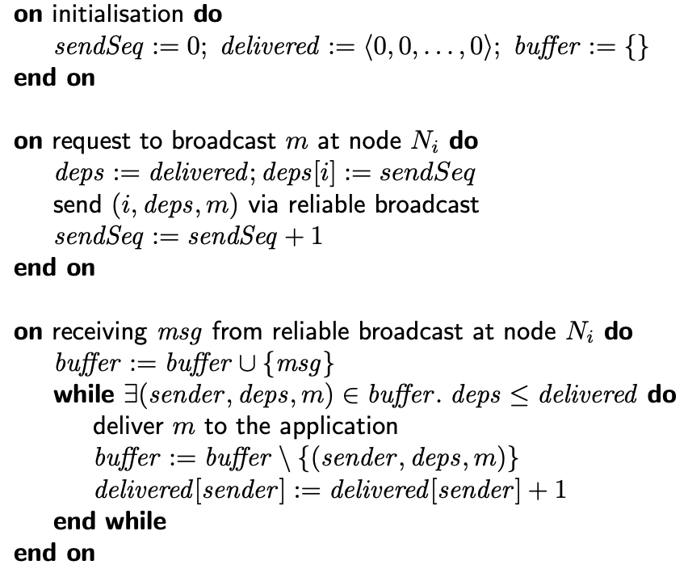

## Table of Contents
- [Table of Contents](#table-of-contents)
- [Common Terms](#common-terms)
- [Consistency Guarantees](#consistency-guarantees)
- [Linearizability](#linearizability)
- [Linearizability vs Serializability](#linearizability-vs-serializability)
- [Applications of Linearizability](#applications-of-linearizability)
  - [Locking and Leader Election](#locking-and-leader-election)
  - [Constraints and Uniqueness Guarantees](#constraints-and-uniqueness-guarantees)
  - [Cross-channel timing dependencies](#cross-channel-timing-dependencies)
- [Implementing Linearizable Systems](#implementing-linearizable-systems)
- [The Cost of Linearizability](#the-cost-of-linearizability)
  - [Availability](#availability)
  - [Performance](#performance)
- [Ordering Guarantees](#ordering-guarantees)
  - [Causality vs Linearizability](#causality-vs-linearizability)
  - [Capturing Causal Dependencies](#capturing-causal-dependencies)
- [Sequence Number Ordering](#sequence-number-ordering)
  - [Lamport Timestamps](#lamport-timestamps)
    - [Concept](#concept)
    - [Limitation of Lamport Timestamps](#limitation-of-lamport-timestamps)
  - [Vector Clocks](#vector-clocks)
    - [Concept](#concept-1)
    - [Limitation of Vector Clocks](#limitation-of-vector-clocks)
  - [Sequence number ordering is not enough!](#sequence-number-ordering-is-not-enough)
    - [Not enough for respecting causality when processing messages](#not-enough-for-respecting-causality-when-processing-messages)
    - [Not enough to guarantee uniqueness constraints](#not-enough-to-guarantee-uniqueness-constraints)
- [Broadcasting Protocols](#broadcasting-protocols)
  - [Receiving vs Delivering](#receiving-vs-delivering)
  - [Forms of reliable broadcast](#forms-of-reliable-broadcast)
    - [Best-Effort Broadcast](#best-effort-broadcast)
    - [Reliable Broadcast](#reliable-broadcast)
    - [FIFO Broadcast](#fifo-broadcast)
    - [Causal Broadcast](#causal-broadcast)
    - [Total Order Broadcast](#total-order-broadcast)
    - [FIFO-total order broadcast](#fifo-total-order-broadcast)
  - [Relationships between broadcast models](#relationships-between-broadcast-models)
  - [Safety Properties](#safety-properties)
  - [Broadcast Algorithms](#broadcast-algorithms)
    - [Implementing Reliable Broadcast](#implementing-reliable-broadcast)
      - [Peer-to-Peer Broadcast](#peer-to-peer-broadcast)
      - [Eager Reliable Broadcast](#eager-reliable-broadcast)
      - [Gossip Protocols Broadcast](#gossip-protocols-broadcast)
    - [Implementing FIFO Broadcast](#implementing-fifo-broadcast)
    - [Implementing Causal Broadcast](#implementing-causal-broadcast)
    - [Implementing Total order Broadcast Algorithms](#implementing-total-order-broadcast-algorithms)
      - [Single Leader Approach](#single-leader-approach)
      - [Lamport Clocks Approach (in leaderlesss systems)](#lamport-clocks-approach-in-leaderlesss-systems)
      - [Fault Tolerance](#fault-tolerance)
  - [Using Total Order Broadcast](#using-total-order-broadcast)
  - [Total Order Broadcast As Append-Only Log](#total-order-broadcast-as-append-only-log)
  - [Total Order vs Linearizability](#total-order-vs-linearizability)
    - [Implementing linearizable storage using total order broadcast](#implementing-linearizable-storage-using-total-order-broadcast)
    - [Implementing total order broadcast using linearizable storage](#implementing-total-order-broadcast-using-linearizable-storage)
    - [Equivalence to Consensus](#equivalence-to-consensus)
- [Consensus](#consensus)
  - [Formulation of Consensus](#formulation-of-consensus)
  - [Common consensus algorithms](#common-consensus-algorithms)
  - [Consensus System Models and FLP](#consensus-system-models-and-flp)
  - [Raft - General Idea](#raft---general-idea)
  - [Raft - Implementation](#raft---implementation)
- [Atomic Commit Problem](#atomic-commit-problem)
  - [How it works](#how-it-works)
  - [What if a node fails?](#what-if-a-node-fails)
    - [Participant Failure](#participant-failure)
    - [Coordinator Failure](#coordinator-failure)
- [Distributed Transactions in Practice](#distributed-transactions-in-practice)
  - [Database-Internal Transactions](#database-internal-transactions)
  - [Heterogeneous Distributed Transactions](#heterogeneous-distributed-transactions)
    - [Exactly-once message processing](#exactly-once-message-processing)
    - [XA/Transactions](#xatransactions)
    - [Holding Locks while in doubt](#holding-locks-while-in-doubt)
  - [Limitations of distributed transactions](#limitations-of-distributed-transactions)
- [Membership and Coordination Services](#membership-and-coordination-services)
  - [Allocating work to nodes](#allocating-work-to-nodes)
  - [Service Discovery](#service-discovery)
  - [Membership Services](#membership-services)

## Common Terms
- consistency guarantees
- recency guarantee
- atomic consistency
- immediate consistency
- external consistency
- strict serialisation
- CAP theorem
- Total order
- Ordering Guarantees
- causal dependency
- logical clocks
- Lamport timestamps
- Vector Clocks
- Broadcast Protocols
- Best-Effort
- FIFO
- Causal Broadcast
- Total Order
- FIFO Total Order
- State machine replication
- Sequential Consistency/Timeline Consistency
- FLP result
- Paxos, Multi-Paxos
- Raft
- Term
- 2PC (2-phase-commit)
- Atomic Commit Problem
- coordinator, participant
- prepare, commit, abort
- commit point
- uncertain transactions
- in doubt transactions
- XA transactions
- Ephemeral nodes
- ZooKeeper
- etcd
- Service Discovery
- Membership services

## Consistency Guarantees

We have seen several consistency guarantees so far.

The major one is eventual consistency, which guarantees that if we stop writing to the database and wait for some unspecified length of time, then eventually all read requests will return the same value.

This is a weak guarantee which makes application development in distributed systems very complex.

There are systems with stronger consistency guarantees, but this comes at the cost of performance. We will discuss such systems in this chapter.

## Linearizability

Linearizability means that we can think of the database as a single node in the sense that if we check the sequence of results of write and read operations, we get a consistent sequence with full order.

In other words, when a write is processed, then as soon as some reader reads the updated value, it is not possible that other readers read the old value.

Linearizability can be considered as a recency guarantee, atomic consistency, immediate consistency or external consistency.

The figure below illustrates this point:

It is expensive to test whether a system's behavior is linearizable by recording the timings of all requests and responses and checking whether they can be arranged into a valid sequential order. However, this is an expensive operation.

## Linearizability vs Serializability

Linearizability:
* A recency guarantee on reads and writes of a register (an individual object)
* No grouping of operations into transactions
* Does not prevent problems such as write skew

Serializability:
* An isolation property of transactions where every transaction may read and write multiple objects.
* It guarantees that the behavior will be the same as if they had executed in some serial order.

Systems that combine both properties are described as *strictly serializable*. 2 Phase Locking and actual serialization are usually strictly serializable. 

However, serializable snapshot isolation is not linearizable.

## Applications of Linearizability

### Locking and Leader Election

A system using single-leader replication needs to ensure that there is indeed only one leader, not several (split brain). To detect the leader, we can use a lock that every node tries to acquire on startup, but only one node ends up acquiring it.

This lock must be linearizable, otherwise it is useless.

### Constraints and Uniqueness Guarantees

To enforce uniqueness contraints, for example on a username or email address, or on file names in a storage service, we need linearizability.

This is similar to the previous situation: we also need a lock.

This can be implemented using atomic compare and set on usernames (setting username register to the user id).

Another example is guaranteeing that a bank account balance never goes negative or that we don't sell more items than what we have in the warehouse.

All these cases require having only one up-to-date value.

### Cross-channel timing dependencies 

Sometimes linearizability is violated because there is an external communication channel between 2 components as shown in the figure below:

If the file storage is linearizable, then this architecture should work fine. If it is not, there is a risk of a race condition: the message queue might be faster than the internal replication inside the storage service. In this cae, when the resizer fetches the image, it might see an old version of the image, or nothing at all. If it processes an old version, the full-size and resized images in the file stoage become permanently inconsistent.

Such race conditions might be avoided by multiple ways, but linearizability is the easiest to understand.

## Implementing Linearizable Systems

In distributed systems, we design systems that are fault-tolerant. Thus, replication is a must:
* Single-leader replication
  * potentially linearizable by reading only from the leader and synchronous replicas
  * snapshot isolation violates linearizability of the system
  * concurrency bugs might also violate linearizability
  * split brain violates linearizability, and is not easy to avoid
  * if we are using asynchronous replication, failover may lose committed writes, violating durability and linearizability
* Consensus Algorithms
  * contains measures to prevent split brain and stale replicas
  * thanks to those details, they can implement linearizable storage safely
* Multi-leader replication
  * not linearizable
  * they concurrently process writes on multiple nodes and asynchronously replicate them to other nodes.
  * they can produce conflicting writes
* Leaderless Replication
  * probably not linearizable
  * LWW conflict resolution methods, sloppy quorums and hinted handoffs are certainly not linearizable
  * Even if everything seems to work fine, network delays can easily make the system non-linearizable even if the quorum condition (w + r > n) is satisfied. An example is shown in the figure below
  * We can make Dynamo-style quorums linearizable at the cost of performance by requiring a reader to perform read repair synchronously before returning results to the application, and a writer must read the latest state of a quorum of nodes before sending its writes. This can be used to achieve linearizable reads and writes, but not linearizable compare-and-set, because this latter needs consensus.

## The Cost of Linearizability

### Availability

Linearizability often comes at the cost of availability in case of network partition.

This is commonly known as CAP theorem.

* If an application requires linearizability, and some replicas are disconnected from the other replicas due to a network problem, then some replicas can't process requests while they are disconnected: they must either wait until the network problem is fixed, or return an error (becoming unavailable).
* If an application doesn't require linearizability, then it can be written in a way that each replica can process requests independently, even if it is disconnected from other replicas (e.g. multi-leader).. In this case the application can remain available, but it becomes not linearizable.

This applies regardless of whether we are using single-leader or multi-leader replication.

### Performance

Most systems decide to drop linearizability because of the significant drop on performance.

Linearizability is slow, and this is true all the time, not only during a network fault.

## Ordering Guarantees

### Causality vs Linearizability

Linearizability:
- defines a total order of operations
- behaves like there is a single copy of the data
- every operation is atomic
- stronger than causul consistency
- implies causality preservation

Causality:
- defines a partial order
- 2 operations are concurrent if neither happened before the other. 
- 2 operations are ordered if they are causally related (e.g. question happens before the answer)

A system can be causally consistent without incurring the performance hit of making it linearizable.

Causal consistency is the strongest possible consistency model that doesn't slow down due to network delays and remains available in the face of network failure.

### Capturing Causal Dependencies

To determine causal dependencies, we need some way of describing the "knowledge" of a node in the system. If a node had already seen the value X when it issued the write Y, then X and Y may be causally related.

We need to detect causal dependency across the whole database, not only for a single key.

## Sequence Number Ordering

We can use timestamps or sequence numbers to order events.

Using timestamps can suffer from synchronisation issues, clock skew, etc.

For this reason, logical clocks are used instead.

Logical clocks give each event a distinct order number which creates a total order on events which preserves consistency.

Example: in a single-leader replication, the replication log defines a total order of write operations that is consistent with causality.

### Lamport Timestamps

#### Concept

It is a simple method for generating sequence numbers that is consistent with causality.

Each node has a unique identifier, and each node keeps a counter of the number of operations it has processed. This counter is initialised to 0 on each node.

The lamport timestamp is a pair of `(counter, node ID)`.

The rules are as follows:
* Each node increments its counter for every event that happens locally.
* When a node sends a message to another node, it increements its current counter and attaches it on the message.
* When a node receives a message, it sets its counter as follows: `nodeCounter = 1 + max(nodeCounter, message_timestamp.counter)`.

This means that every lamport timestamp is unique.

As long as the maximum counter value is carried along with every operation, this scheme ensures that the ordering is consistent with causality.

With Lamport timestamps, if event B is causally dependent on event A, then `L(A) < L(B)`, where `L(E)` is the lamport timestamp of event `E`.

#### Limitation of Lamport Timestamps

Lamport timestamp provides us with a total order that preserves causality, but it can't tell us whether 2 events are causally dependent or concurrent.

In particular, given two different lamport timestamps `L(A)` and `L(B)`, whether `L(A) < L(B)` or `L(A) > L(B)` it is not possible to determine if `A` and `B` are causally related or not.

The only exception is when the counters of both timestamps are equal. In this case we know for sure that the events are concurrent.

### Vector Clocks

#### Concept

Vector clocks are an extension of lamport timestamp that provide us with partial order that is consistent with causality.

The advantage of vector clocks is that it can tell us whether 2 events are causally related or concurrent.

Let's suppose that the number of nodes in the cluster is N.

Each node will maintain a vector V of N items, initialized to 0 vector.

On a given node N, the ith item of the vector clock represents the number of events that node N has seen from the ith node in the cluster.

The algorithm progresses as follows for each node m (m goes from 0 to N-1):
* When an event occurs locally, the node increments `V[m]`
* When sending a message to another node, it should first increment `V[m]`, then it attaches a copy of its local vector clock `V` on the message being sent.
* When receiving a message from another node, it merge its local vector clock with the vector clock associated with the message by taking the element-wise max of each vector item, then it should increment `V[m]`. (i.e. set `V[i] = max(V[i], V_message[i])`, then increment `V[m]`).

We can define the following partial order on vector clocks:
* `V = V'` iff `V[i] == V'[i]` for every i.
* `V <= V'`iff `V[i] <= V'[i]` for every i.
* `V < V'` iff `V <= V'` and `V != V'`
* `V || V'` iff `!(V <= V) && !(V' <= V)`

Based on this partial order and the algorithm explained above, we can prove the following properties:
* `V_a < V_b` iff `b` causally depends on `a` (denoted as `a -> b`).
* `V_a || v_b` iff `a` and `b` are concurrent.
* `V_a == V_b` iff `a == b`

#### Limitation of Vector Clocks

It is true that vector clocks allow us to determine whether 2 events are concurrent or causally related, but this comes at a cost.

Each node needs to maintain a counter for each other node. 

The space complexity of this solution grows linearly with the size of the cluster.

Additionally, sending the full vector clock along with each message incurs extra networking overhead.

Needing to merge vector clocks when receiving messages has also computational overhead.

### Sequence number ordering is not enough!

#### Not enough for respecting causality when processing messages

Using lamport timestamps or vector clocks alone can't that messages are processed on each node in an order that respects causality.

The key problem is that when a node receives a message M, it is possible that there is some other message M' such that `M' -> M`, and M' is not yet received and processed by the current node.

Therefore, directly processing a received message can violate causality.

Additionally, with all that's mentioned, nothing guarantees that messages sent by a certain node are always received by other nodes in the same order that they were sent.

#### Not enough to guarantee uniqueness constraints

Lamport clocks can't guarantee uniqueness constraints:
* Two users may concurrently claim the same username
* Lamport clock works for determining the winner at the end once the total order is established
* However, a node can't instantly decide whether the request should succeed or fail because it doesn't know whether another node is concurrently in the process of creating an account with the same username, and what the timestamp that other node may assign to the operation.

To solve these issues, we need to rely on broadcast ordering protocols, which will, at some point, use vector clocks or lamport clocks to provide message delivery ordering guarantees.

## Broadcasting Protocols

Broadcasting protocols are multicast group communication protocols where one node sends a message and all nodes in the group deliver it.

This constitutes a group of members which may be static or dynamic.

If one node is faulty, remaining group members carry on.

### Receiving vs Delivering

When a node decides to broadcast a message, it should send the message to a broadcast protocol.

The broadcast algorithm behaves as a middleware on which node to send, receive or deliver messages.

When the middleware receives a message from some node, the received message might not yet be ready to be processed/handled by the node, so the broadcast middleware might decide to place it in a buffer and wait for some time. Once the message is ready to be handled, the middleware delivers it to the recepient node.

This is illustrated in the figure below:

### Forms of reliable broadcast

#### Best-Effort Broadcast

No constraints are imposed. Anything can happen, and messages may be dropped/lost.

#### Reliable Broadcast

Enforces that messages are delivered (by retransmitting failing messages), but enforces no constraints on the order of delivery.

#### FIFO Broadcast

If m1 and m2 are broadcast by the same node, and `broadcast(m1) -> broadcast(m2)`, then m1 must be delivered before m2 on every node.

In other words, messages send by the same node must be delivered in the same order they were sent.

#### Causal Broadcast

If `broadcast(m1) -> broadcast(m2)` then m1 must be delivered before m2.

In other words, causally related messages must be delivered in causal order. Concurrent messages can be delivered in any order.

In the figure below, m1 and m2 are causally related, while m2 and m3 are concurrent.

#### Total Order Broadcast

If m1 is delivered before m2 on one node, then m1 must be delivered before m2 on all nodes.

In other words, all nodes must deliver messages in the same order, including a node's deliveries to itself.

#### FIFO-total order broadcast

Combination of FIFO and total order broadcast.

### Relationships between broadcast models

The figure below summarises the relationship between different models.

### Safety Properties

All reliable ordering broadcast algorithms (i.e. all except best-effort and reliable) must satisfy 2 safety properties:

* Reliable Delivery: if a message is delivered to one node, it is delivered to all nodes.
* Ordered delivery: the order of delivery of messages on each nodes respects the order defined by the algorithm

### Broadcast Algorithms

In order to implement the different ordering guarantees explained above, we need to establish a good broadcast algorithm that we can build upon.

In other words, we can make best-effort broadcast reliable by retransmitting dropped messages, and enforce delivery order on top of reliable broadcast.

#### Implementing Reliable Broadcast

We have 3 main algorithms:

##### Peer-to-Peer Broadcast

Idea is simple: Use reliable links with retry and deduplication (to avoid delivering the same message to the same node multiple times).

Major problem: If a node crashes before all messages are delivered, some nodes will end up delivering the message, and some potentially won't.

##### Eager Reliable Broadcast

This extends the previous algorithm: when a node receives a particular message for the first time, it re-broadcasts it to each other nodes via reliable links.

This ensures that even if some node dies, eventually, either all nodes (that don't crash) deliver the message, or none of them does.

The issue with this algorithm is the high overhead: up to `O(n^2)` messages for n nodes.

##### Gossip Protocols Broadcast

This algorithm provides a more light weight version of the previous algorithm: when a node receives a particular message for the very first time, it forwards it to a set of randomly selected nodes (e.g. 3 nodes). The number of randomly selected nodes is a parameter of the algorithm.

This ensures that, with high probability, the message will be delivered to all group members.

The probability can be controlled by tuning the number of randomly selected nodes.

To ensure convergence, some techniques are used such as anti-entropy: each node periodically selects a random set of nodes, and asks them for their current state. If a divergence is detected, the nodes can communicate directly to restore consistency.

#### Implementing FIFO Broadcast

Now that we have an algorithm for reliable broadcast (i.e. Gossip protocols), we can implement FIFO broadcast as follows:

#### Implementing Causal Broadcast

This builds on top of FIFO algorithm by tagging the the message with a dependencies vector representing the events from each node that the current message is causally dependent of.

This is illustrated in the pseudo-code below:

A message place in the buffer of a node can be consumed only when `deps <= delivered`. The comparison here is defined exactly as done with vector clocks.

This ensures that a message is delivered only after all its dependencies have been already delivered.

#### Implementing Total order Broadcast Algorithms

##### Single Leader Approach

Approach:
* One node is deignated as leader (Sequencer)
* To broadcast message, the sender sends the message to the leader using FIFO link
* The leader broadcasts the message using FIFO to all nodes.

Issues:
* If the leader crashes, no more messages are delivered
* Changing the leader safely is difficult (we need consensus).

##### Lamport Clocks Approach (in leaderlesss systems)

Approach:
* Attach lamport timestamp to every message
* Deliver messages in total order of timestamps

Issues:
* We need to know if we have seen all messages with timestamp < T
  * We need to use FIFO links and wait for message with timestamp >= T from every node

##### Fault Tolerance

The two approaches explained above are both not fault tolerant.

To implement fault-toleratn total order broadcast, we need consensus.

### Using Total Order Broadcast

Common usecases:
* Database replication: if every message represents a write to the database, and every replica processes the same writes in the same order, then the replicas will eventually remain consistent with each other. This is known as state machine replication.
* Serializable transactions: if every message represents a deterministic transaction to be executed as a stored procedure, and if every node processes those messages in the same order, then the partitions and replicas of the database are kept consistent with each other.
* Lock service with fencing tokens: every request to acquire the lock is broadcasted, and every request to release the lock is also broadcasted. Since the order of delivery is the same on all nodes, then we are guaranteed to have only one node holding the lock at each moment.

Total order broadcast is stronger than timestamp ordering because in total order broadcast message order is fixed at the time of delivery. In other words, a node is not allowed to insert a message at an earlier position.

### Total Order Broadcast As Append-Only Log

Another way of looking at total order broadcast is that it is a way of creating a log: delivering a message is like appending to the log.

Since all nodes must deliver the same messages in the same order, all nodes can read the log and see the same sequence of messages.

### Total Order vs Linearizability

Linearizable systems provide a total order of operations, but it is not exactly the same as total order broadcast:
* total order broadcast is asynchronous: messages are guaranteed to be delivered reliably in a fixed order, but there is no guarantee about when a message will be delivered (So one recepient may lag behind the others).
* Linearizability is a recency guarantee: a read is guaranteed to see the latest value written.

However, there is a connection between the two: if you have one, you can implement the other.

#### Implementing linearizable storage using total order broadcast

As an example, we can that usernames uniquely identify user accounts (uniqueness constraint).

Suppose that for every possible username we have a linearizable register with an atomic compare-and-set operation. Every register initially has the value `null`. When a user wants to create a username, you execute compare-and-set operation on the register for that username, setting it to the user account ID under the condition that the previous register value is null. If multiple users try to concurrently grab the username, only one of the compare-and-set operations will succeed, becaus the others will see a value other than `null` thanks to linearizability.

We can implement such a linearizable compare-and-set operation by using total order broadcast as an append-only log:
* Append a message to the log, tentatively indicating the username you want to claim
* Read the log, and wait for the message you appended to be delivered back to you
* Check for any messages claiming the username you want. If the first message for your desired username is your own message, then you are successful: you can commit the username claim by appending another message to the log, and acknowledge to the client. If the first message for your desired username is from another user, you abort the operation.

Since log entries are delivered to all node sin the same order, if there are several concurrent writes, all nodes will agree on which one came first.

This approach guarantees linearizable writes, but doesn't guarantee linearizable reads: with this approach, it is still possible that one node says that a username is available, while the username has been consumed on another node. The procedure described above provides sequential consistency, sometimes also known as timeline consistency.

To implement linearizable reads, we can:
* sequence reads through the log by appending a message, reading the log, and performing the actual read when the message is delivered back to us. The sequencing message defines the point in time at which the read happens.
* make read from a replica that is synchronously replicated

#### Implementing total order broadcast using linearizable storage

We assume we have a linearizable register that stores an integer and that has an atomic increment-and-get operation (we could have used compare-and-set operation too).

For every message that you want to send through total order broadcast, you increment-and-get the linearizable integerm and then attach the value you got from the register as a sequence number to the message. You can then broadcast the message to all nodes using reliable broadcast, and the recepients will deliver messages consecutively by sequence number.

Not that unlike Lamport timestamps, the number you get from incrementing the linearizable register form a sequence with no gaps. Thus, if a node has delivered message 4 and receives an incoming message with a sequence number of 6, it knows that it must wait for message 5 before it can deliver message 6. This is not true in lamport timestamps, and **this is the key difference between total order broadcast and timestamp ordering.**

#### Equivalence to Consensus

It can be proven that a linearizable compare-and-set register and total order broadcast are both equivalent to consensus. That is, if you can solve one of these problems, you can transform it into a solution for the others.

## Consensus

### Formulation of Consensus

Several nodes want to come to agreement about a single value.

Each node proposes a value, and the consensus algorithm should make sure only one identical value is picked by all nodes at the end.

In the context of total order broadcast, this value is the next message to deliver.

Once a node decides on a certain message order, all nodes will decide the same order.

Thus, consensus and total order broadcast are formally equivalent.

A consensus algorithm must satistfy the following properties:
* Uniform agreement: no 2 nodes decide differently
* Integrity: no node decides twice
* Validity: If a node decide a value v, the v was proposed by some node
* Termination: every node that does not crash eventually decides some value

Termination is livness property, whereas the other ones are safety properties.

### Common consensus algorithms
* Paxos: single-value consensus
* Multi-Paxos: generalisation to total order broadcast (agreement on a sequence of values)
* Raft, Viewstamped Replication, Zab: total order broadcast by default

### Consensus System Models and FLP

Paxos, Raft, etc. assume a **partially synchronous**, **crash-recovery** system model.

This is important because:
* It is not possible to have reliable consensus in a fully asynchronous system (this is known as FLP result, Fischer, Lynch and Paterson)
  * These cases can result in the algorithm never terminating (stops making process)
* It is not reasonable to assume a fully synchronous model because this is never the case in distributed systems.

Paxos, Raft, etc. use clocks for timeouts/failure detector to ensure progress.

Safety (correctness) doesn't depend on timing. But, timing can affect the time it takes for the algorithm to terminate.

### Raft - General Idea

We use a leader to sequence messages.

Once we can reliably have a single leader and avoid split-brain, we can use that leader to achieve total order broadcast and consensus.

Idea is this:
* Use a failure detector (timeout) to determine suspected crash or unavailability of leader
* On suspected leader crash, elect a new one
* Prevent having a split-brain

In Raft, we have the concept of *term*, which is an integer that is incremented every time a leader election is started.

Raft guarantees that there is at most one leader elected in a term.

To guarantee this, raft imposes that each node is allowed to vote once, and a quorum of nodes is required to elect a leader in a term.

However, we can still have multiple leaders from different terms. This can happen in case there is network partition that isolates the leader from the other members of the group. To guarantee that this never results in contradictory decisions coming from different leaders, we enforce that a leader can never make the decision to broadcast a message by itself, but the leader has to ask a quorum of nodes if it is allowed to deliver a message.

This is illutrated in the figure below:

### Raft - Implementation

NOTE: the implementation of RAFT is rather complex, but it is good to understand how and why it works because it develops a way of reasoning about state in a distributed system.

We will use a state machine where each node can be in one state per term:
* Follower
* Candidate
* Leader

The algorithm goes as follows:
* When a node starts for the first time, it starts with the follower state.
* After recovery from crash, the node becomes in the follower state.
* Initially, all cluster nodes are in the follower state.
* When a follower node suspects leader failure (receives nothing from a leader until some timeout):
  * it transitions to the candidate state
  * it requests voting from a quorum so that it can be elected as a leader in a specific term.
  * if it discovers a new term / leader, it steps back and gets back to the follower state.
  * if the election times out (Can't receive sufficient votes from quorum) => it falls again in candidate state and restarts election with a new term
* If the leader discovers there is a new term (new leader), it transitions to follower.

This state machine is illustrated in the figure below:

The actual implementation is relatively complex, and a pseudocode can be found [here](https://www.cl.cam.ac.uk/teaching/2122/ConcDisSys/dist-sys-notes.pdf) at slide 112.

## Atomic Commit Problem

In a database that supports transactions spanning several nodes or partitions, we have the problem that a transaction may fail on some nodes but succeed on others.

To maintain transaction atomicity in the sence of ACID, we have to get all nodes to agree on the outcome of the trasaction: either they all abort/roll-back or they all commit.

This is known as atomic commit problem.

2PC (2 phase commit) is the most common way to solve the atomic commit problem.

For transactions running on a single node only, atomicity can be guaranteed by the storage engine (by using WAL for example).

For transactions involving multiple nodes, 2 phase commit is required.

An example of this is when we have a multi-object transaction in a partitioned database, or a term-partitioned secondary index.

### How it works

2PC includes a component called a coordinator, or transaction manager.

The coordinator is usually implemented as a library within the same application process that is requesting the transaction, but it can also be a separate process or service.

A 2PC transaction starts with the app reading and writing data on multiple database node. We call these database nodes *participants* in the transaction.

When the app wants to begin a globally unique distributed transaction, it requests a transaction ID from the coordinator.

Each participant performs a single-node transaction and attaches the globally unique transaction ID.

When the application is ready to commit, the coordinator begins phase 1: it sends a *prepare* request tagged with the transaction id to each of the participants, asking them whether they are able to commit:
* When a participant receives a *prepare* request, it makes sure it can commit the transaction under all circumstances. 
* It does so by writing all transaction data to disk, and checking for any conflicts or constraint violations.
* By replying "yes", the participant surrenders the right to abort the transaction, but without actually committing it.

When the coordinator has received responses to all prepare requests, it makes a definitive decision:
* If all participants reply "yes", the coordinator sends a commit request in phase 2 and the commit actually takes place.
* If any participant replies "no", the coordinator sends an abort request to all nodes in phase 2.

The coordinator must write the decision to its transaction log on disk so that it knows which way it decided in case it subsequently crashes. (commit point).

The commit or abort decision is sent out to all participants. If this request fails or times out, the coordinator must retry forever until it succeeds. This decision can not be reverted.

2PC has two crucial "one-way door" decisions:
* A participant replying "YES" to the coordinator
* A coordinator making a decision whether to commit.

The figure below illustrates how 2PC works.

### What if a node fails?

#### Participant Failure

If one of the participants fail during the prepare phase, not responding the prepare request, the coordinator aborts the transaction.

If one of the participants replies "YES" in the prepare phase and then crashes, the coordinator needs to retry indefinitely until the participant is recovered and acknowledges the commit/abort request.

#### Coordinator Failure

If the coordinator fails before sending the prepare requests, the participant can safely abort the transaction.

However, once the participant has received the a prepare request and voted "yes", it can no longer abort. It must wait to hear back from the coordinator whether the transaction was committed or aborted. If the coordinator has crashed, the participant can do nothing but wait.
A transaction in this state is called *in doubt* or *uncertain*.

This is illustrated in the figure below:

## Distributed Transactions in Practice

Distributed transactions implemented with 2PC provide important safety guarantee, but this comes at the cost of potentially killing performance and causing operational problems.

For this reasons, many cloud services choose not to implement distributed transactions.

In practice, there are 2 types of distributed transactions

### Database-Internal Transactions

In database-internal distributed transactions, all nodes participating in the transaction are running the same database software.

Database-internal transactions need not be compatible with any other system, so they can use any protocol and apply implementation-specific optimisations. Therefore, they work quite well in practice.

### Heterogeneous Distributed Transactions

Heterogeneous distributed transactions: participants are two or more different technologies. Examples:
* databases from different vendors
* non-database systems such as message brokers

Heterogeneous distributed transactions allow diverse systems to be integrated in powerful ways. 

#### Exactly-once message processing
For example, a message from a message queue can be acknowledged as processed if and only if the database transaction for processing the message was successfully committed.

Such transaction is only possible if all systems affected by the transaction are able to use the same atomic commit protocol. For example, if the side effect of processing a message is to send an email, and the email server doesn't support 2PC, it could happen that the email is sent 2 or more times if message processing fails and is retried. But if all side effects of processing are rolled back on transaction abort, then the processing step can safely be retried as if nothing had happened.

#### XA/Transactions

X/Open XA (eXtended Architecture) is a standard for implementing 2PC across heterogeneous technologies.

XA is not a network protocol, but a C API for interfacing with a transaction coordinator. Bindings for this API exist in other languages.

#### Holding Locks while in doubt

When the coordinator crashes after the prepare phase but before the commit phase, transactions might get stuck in uncertain state on several participants.

These participants will continue to hold the locks created by the transaction on the different objects in the database. The database can't release these locks until the commit is committed or aborted.

While these locks are held, no other transaction can modify those rows.

### Limitations of distributed transactions

XA transactions solve the real and important problem of keeping several participant data systems consistent with each other, but they also introduce major operational problems.

For this reason, it should be approached with care:
* The coordinator should be replicated, instead of running on a single machine, else it is a single point of failure for the entire systems.
* When the coordinator is part of the application server, the application can no longer be stateless.
* XA can't detect deadlocks across different systens unless there is a standardized protocol for systems to exchange information on the locks that each transaction is waiting for
* XA doesn't work with SSI (Serializable Snapshot Isolation) since that would require a protocol for identifying conflicts across different systems.

For database-internal systems, the limitations are not so great (for example, SSI is still possible). However, we still have the problem that for 2PC to successfully commit a transaction, all participants must respond.
As a result, if any part of the system is broken, the transaction also fails. This makes distributed transactions a good candidate for amplifying failures.

There are other methods that allow us to keep several systems consistent with each other without incurring so much pain. We will revisit these in the future.

## Membership and Coordination Services

Proejcts like Zookeeper or etcd are distributed key-value stores or coordination and configuration services.

Their API look very similar to that of a usual key-value database.

The difference is that they are designed to hold small amounts of data that can fit entirely in memory (though data is still written to disk for durability).

Thus, they are not suitable to store all the application data.

That small amount of data is replicated across all the nodes using a fault-tolerant total order broadcast algorithm.

Zookeeper implements other useful features:
* Linearizable atomic operations (atomic compare-and-set)
* Total ordering of operations: operations are totally ordered by giving each operation a monotonically increasing transaction ID (zxid) and version number (cversion)
* Failure detection: clients maintain a long-lived session with zookeeper servers, and the client and server periodically exchange heartbeats to check that the other node is still alive. Even if the connection is temporarily interrupted, or a ZooKeeper node fails, the session remains active. However, if the hearbeats cease for a duration that is longer than the session timeout, ZooKeeper declares the session dead. Any locks held by a session can be configured to be automatically released when the session times out (ephemeral nodes).
* Change notifications: clients can subscribe to watch for data changes. Thus, a client can find out when another client joins the cluster, or if another client fails. This allows avoiding to have to poll the server to find out about changes.

Zookeeper can be useful in many usecases:

### Allocating work to nodes

ZooKeeper is useful for job schedulures and similar stateful systems.

An example is when having a partitioned resource and need to decide which partition to assign to which node.

As new nodes join the cluster, some of the partitions need to be moved from existing nodes to the new nodes in order to rebalance the load.

As node are removed or fail, other nodes need to take over the failed nodes' work.

These kinds of tasks can be achieved using Zookeeper's atomic operations, ephemeral nodes and notifications.

### Service Discovery

Zookeeper and its similars are also often used for service discovery, that is to find out which IP address you need to connect to in order to reach a particular service.

Services can be configured such that when they start up they register their network endpoints in a service registry, where they can then be found by other services.

### Membership Services

Finally, such tools can be helpful to implement membership services.

Membership service determine which nodes are currently active and live members of the cluster.

Due to unbounded network delays, it's not possible to reliably detect whether another node has failed. However, if you couple failure detection with consensus, nodes can come to an agreement about which nodes should be considered alive or not.